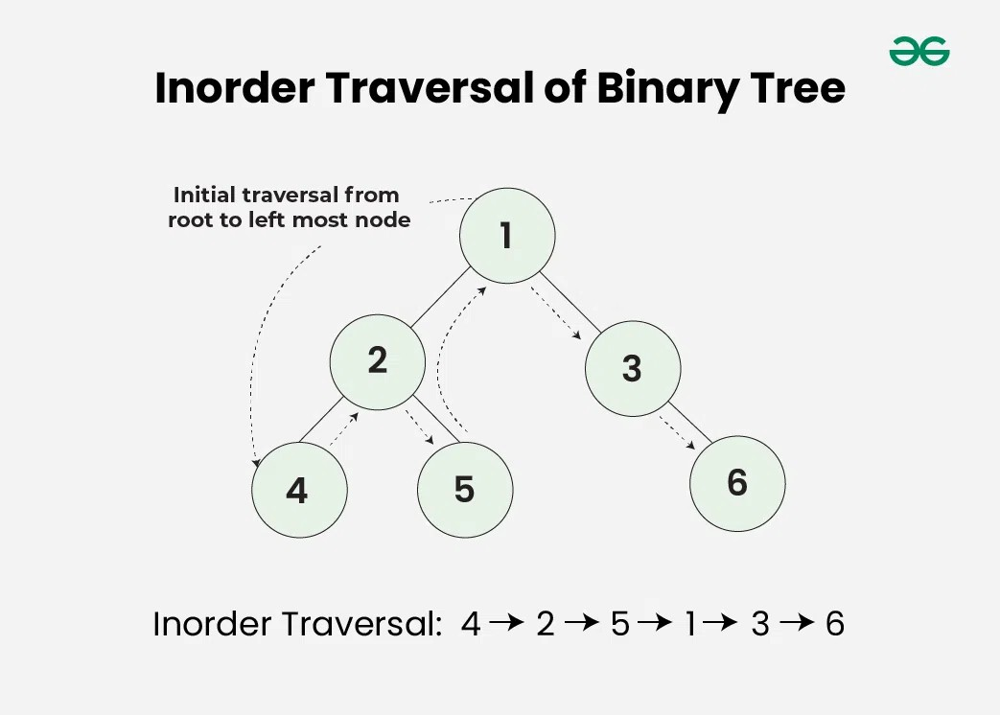

A data structure is a collection of data values, the relationships among them, the operations that can be applied to the data and the representation which describes how a computer –together with its peripheral devices– handles data in its memory, on magnetic media (and in optical devices).

Data structures serve as the basis for **abstract data types**.

- The **abstract data type** defines the **logical** form of the data type.
- The **data structure** implements the **physical** form of the data type.

## Classification of Data Structures

**1. According to Components types:**

- **Homogenous/Solid** &mdash; all components are from the same type
- **Heterogenous** &mdash; components are not from the same type

**2. According to Operation Executed with the Data Structure:**

- **Without a structure** &mdash; no relationship between elements of the data structure *(e.g. Set)*.
- **Associative** &mdash; no essential relationship between elements of the data structure, each element is individually addressable *(e.g. Array)*.
- **Sequential** &mdash; in a data structure every element –except the first and the last ones– are attainable exactly from another element and from every element exactly one element can be attainable. Only the two highlighted elements are the exceptions, because there is no element of the data structure which the first or the last element would be attainable *(e.g.: Simple List)*.
- **Hierarchial** &mdash; : in the data structure there is a highlighted element (the root) which giving equals the giving of the data structure. Every element, except the root can be attainable from exactly one other element, but from one element arbitrary (finite) number of additional elements can be attainable. Exceptions to this are the endpoints of the data structure *(e.g.: Binary Tree)*.
- **Lattice/Net** &mdash; the elements of the data structure can be attainable from several other elements and from a given element more further elements can be attainable *(e.g.: Graph)*.

**3. According to Number of Elements:**

- **Static** &mdash; constant number of elements, size of the used space does not change during operations.
- **Dynamic** &mdash; finite number of elements (because of space limitations) but with possibility of expansion. Number of elements can change during operations. The specialty of this type of data structure is that in case of an augment of a new element we have to reserve a proper space for that element and if an element goes useless we have to make the free space ready to reverse again.

**4. According to Storage Location:**

- **Continual** &mdash; in case of a representation, that smallest, contiguous space, this includes all elements of the data structure, and no other elements.
- **Diffused/Linked**: in case of a representation, the elements of the data structure can be on the arbitrary part of the space, the information needed to reach certain elements are stored by other elements.

----

# Abstract Data Types

## Set

A set is a collection of distinguishable objects, called its members or elements. If an object $x$ is a member of a set $S$, we write $x \in S$. If x is not a member of $S$, we write $x \notin S$. We can describe a set by explicitly listing its members as a list inside braces. For example, $S = \lbrace 1,2,3 \rbrace$.

### Operations

- Intersection [`AND`]
- Union [`OR`]
- Difference [`A AND (NOT B)`]

### Properties

- Solid
- Without structure
- Dynamic
- Continuously represented

### Implemented Operations

- **Create** data structure &mdash; continuous (vector) representation
- **Modify** data structure
  - add elements &mdash; union (singleton then union)
  - delete elements &mdash; difference (singleton then difference)
  - change elements &mdash; difference and union
- **Access** elements &mdash; $\in$

----

## Multiset

In mathematics, a multiset is a modification of the concept of a set that, unlike a set, allows for multiple instances for each of its elements. The positive integer number of instances, given for each element is called the multiplicity of this element in the multiset.

### Operations

- **Union:** $A \cup B$ is a multiset where multiplicity of each element is $\max \left\{\nu_A, \nu_B\right\}$.
  - For example, $\{1,1,2\} \cup\{2,2,3\}=\{1,1,2,2,3\}$.

- **Intersection:** $A \cap B$ is a multiset where multiplicity of each element is $\min \left\{\nu_A, \nu_B\right\}$.
  - For example, $\{1,1,2\} \cap\{2,2,3\}=\{2\}$.

- **Sum:** $A+B$ is a multiset where multiplicity of each element is $\nu_A+\nu_B$.
  - For example, $\{1,1,2\}+\{2,2,3\}=\{1,1,2,2,2,3\}$.

- **Difference:** $A-B$ is a multiset where multiplicity of each element is $\max \left\{\nu_A-\nu_B, 0\right\}$.
  - For example, $\{1,1,2\}-\{2,2,3\}=\{1,1\}$ and $\{2,2,3\}-\{1,1,2\}=\{2,3\}$.

- **Complement:** $A^c$ is a defined to be $U-A$, where $U$ is the universal set.
  - For example, if $U=\{1,1,1,2,2,3\}, A=\{1,2,3\}$, then $A^c=\{1,1,2\}$.

----

## Array

An array is a data type consisting of fix number of elements, each identified by a sequence of integers. The one dimensional array is called **vector**, and its elements are identified by one integer called "index", which is the position of the element in the vector. (e.g. `int A[5];` reserved memory for 5 integers consecutively)

The two dimensional array is called **matrix**, and its elements are identified by two integers, these numbers show the position of the element in the matrix. Can be in a row major order or column major order, both of which supports *direct access*.

There are higher dimensional arrays too, for example, the elements of a 4 dimensional array is identified by a sequence of 4 integers. Represented with a **Sparse Matrix**.

**Sparse Matrix** is a matrix in which most of the elements are zero and has a 3-row representation (row, column, value), this does not support direct access.

### Properties

- Solid
- Associative
- Static
- Continuously represented

----

## Stack

A stack is an abstract data type that serves as a collection of elements, with two principal operations:

- `PUSH` &mdash; adds an element to the collection
- `POP` &mdash; accesses and removes the most recently added element

The order in which elements come off a stack gives rise to its alternative name, **LIFO** (last in, first out).

### Properties

- Solid
- Sequential
- Dynamic
- Continuously represented

### Representation

- Represented as an array with an attribute `S.top` which indexes the most recently inserted element.
- If `S.top = 0`, the stack is **empty**
  - Popping an empty stack will result in an **underflow**.
- If `S.top > n` the stack **overflows**.

----

## Queue

A queue is an abstract data type that serves as a collection of elements, with two principal operations:

- `Enqueue` &mdash; adds an element.
- `Dequeue` &mdash; accesses and removes the first element.

The order in which elements come off a queue gives rise to its alternative name, **FIFO** (first in, first out).

The queue has a **head** and a **tail**. When an element is enqueued, it takes its place at the tail of the queue.

### Properties

- Solid
- Sequential
- Dynamic
- Continuously represented

### Representation

- Standard queue &mdash; not effective
- Walking queue &mdash; better with more memory
- Cyclic queue

### Cyclic Queue

Uses an array with at most `n - 1` elements with two attributes: `Q.head` and `Q.tail`

- `Q.head` = `Q.tail` (the queue is empty)
- Initially, `Q.head = Q.tail = 1`
- **Underflow** - dequeue from empty queue.
- **Overflow** - `Q.head = Q.tail + 1`, queue is full.

----

## Linked Lists

A linked list is a linear collection of data elements, whose order is not given by their physical placement in memory. Instead, each element points to the next. Its complex
elements contain:

- Value
- Pointer &mdash; stores a memory address of another element.

An attribute `head` points to the first element of the list.

If `head = NULL`, the list is empty.

Possible linked lists include: standard, circular, doubly linked list and multilists. 

### Properties

- Solid
- Sequential
- Dynamic
- Represented by pointers (linked representation)

### Doubly Linked List

- Each element of a doubly linked list `L` is an object with an attribute `key` and two other pointer attributes: `next` and `prev`.
- Given an element `x` in the list, `x.next` points to its successor in the linked list, and `x.prev` points to its predecessor.
- An attribute `L.head` points to the first element of the list.
- If `x.prev = NULL`, the element `x` has no predecessor and is therefore the first element. If `x.next = NULL`, the element `x` has no successor and is therefore the last element.

#### Operations

**`LIST-SEARCH(L,k)`:** finds first element `k` in list `L`, returning a pointer to this element. Returns `NULL` if not found.

**`LIST-INSERT`:** puts `x` into the front of the linked list.

**`LIST-DELETE`:**  removes `x` and updates pointers.

----

## Tree

A tree consists of a set of nodes and a set of edges (connecting pairs of nodes), satisfying the following properties:

- A tree has the property that there is exactly one path (no more, no less) between any pair of nodes, where a path is a connected sequence of edges.
- In a rooted tree, one distinguished node is called the root.

### Properties

- Solid
- Hierarchial
- Dynamic
- Sometimes continuously represented, sometimes represented by pointers

### Traversal

Tree traversal (also known as tree search) is a form of graph traversal and refers to the process of visiting (checking and/or updating) each node in a tree exactly once. Such traversals are classified by the order in which the nodes are visited.

**Inorder Traversal:** visits the node in the order: **Left -> Root -> Right**

**Preorder Traversal:** visits the node in the order: **Root -> Left -> Right**

**Postorder Traversal:** visits the node in the order: **Left -> Right -> Root**

### Types of Trees

**Binary Tree:** Each node has at most two children, which are referred to as the left child and the right child. We **can not reconstruct** the binary tree from preorder, inorder or postorder traversal.

**Expression Tree**: A binary tree in which each internal node corresponds to operator and each leaf node corresponds to operand. We can reconstruct the expression tree from prefix expression and postfix expression.

**Binary Search Tree:** A binary tree satisfying the binary-search-tree property:

- Let `x` be a node in a binary search tree. If `y` is a node in the left subtree of `x`, then `y.key < x.key`. If `y` is a node in the right subtree of `x`, then `y.key > x.key`.

### Operations

Demonstrated on Binary Search Trees. Operations include **Search**, **Insert**, or **Delete**.

Basic operations on a binary search tree take time proportional to the height of the tree. For a complete binary tree with $n$ nodes, such operations run in $\Theta\left(\log _2 n\right)$ worst-case time. If the tree is a linear chain of $n$ nodes, however, the same operations take $\Theta(n)$ worst-case time.

#### Search

To search for the key 13 in the tree, we follow the path $15 \rightarrow 6 \rightarrow 7 \rightarrow 13$ from the root.

#### Insert

#### Delete

The overall strategy for deleting a node $z$ from a binary search tree $T$ has three basic cases but, as we shall see, one of the cases is a bit tricky.

- If $z$ has no children, then we simply remove it by modifying its parent to replace $z$ with `NULL` as its child.
- If $z$ has just one child, then we elevate that child to take $z$ 's position in the tree by modifying $z$ 's parent to replace $z$ by $z$ 's child.
- If $z$ has two children, then we find $z$ 's successor $y$-which must be in $z$ 's right subtree-and have $y$ take $z$ 's position in the tree. The rest of $z$ 's original right subtree becomes $y$ 's new right subtree, and $z$ 's left subtree becomes $y$ 's new left subtree. This case is the tricky one because, as we shall see, it matters whether $y$ is $z$ 's right child.

Deleting a node $z$ from a binary search tree. Node $z$ may be the root, a left child of node $q$, or a right child of $q$.

(a) Node $z$ has no left child. We replace $z$ by its right child $r$, which may or may not be NIL.

(b) Node $z$ has a left child $l$ but no right child. We replace $z$ by $l$.

(c) Node $z$ has two children; its left child is node $l$, its right child is its successor $y$, and $y$ 's right child is node $x$. We replace $z$ by $y$, updating $y$ 's left child to become $l$, but leaving $x$ as $y$ 's right child.

(d) Node $z$ has two children (left child $l$ and right child $r$), and its successor $y \neq r$ lies within the subtree rooted at $r$. We replace $y$ by its own right child $x$, and we set $y$ to be $r$ 's parent. Then, we set $y$ to be $q$ 's child and the parent of $l$.