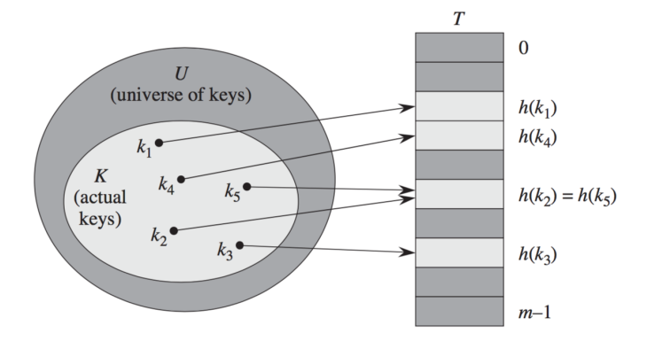

## Searching

### Linear Search

Consider the following algorithm:

```C
#include <stdio.h>
int linear_search(int A[], int n, int x) {
    int i;
    for(i = 0; i < n; i++) {
        if(A[i] == x) {
            return i;
        }
    }
    return -1;
}
int main() {
    int A[5] = {1, 2, 3, 4, 5};
    printf("%d", linear_search(A, 5, 3));
}
```

- **Input:** Vector `A[n]`, number `x`.
- **Output:** Index of `x` in `A` if it exists.
- **Number of Steps:**
  - Average-case: $(n + 1) / 2$
  - Worst-case: $n$

----

### Binary Search

```C
#include <stdio.h>
int binary_search(int arr[], int low, int high, int x)
{
    while (low <= high) {
        int mid = low + (high - low) / 2;

        // Check if x is present at mid
        if (arr[mid] == x)
            return mid;

        // If x greater, ignore left half
        if (arr[mid] < x)
            low = mid + 1;

        // If x is smaller, ignore right half
        else
            high = mid - 1;
    }

    // If we reach here, then element was not present
    return -1;
}
int main() {
    int n = 5;
    int A[n] = {1, 2, 3, 4, 5};
    printf("%d", binary_search(A, 0, n - 1, 3));
}
```

Binary search is the search technique that works efficiently on **sorted lists**.

Binary search follows the divide and conquer approach in which the list is divided into two halves, and the item is compared with the middle element of the list.

- **Input:** Vector `A[n]`, number `x`.
- **Output:** Index of `x` in `A` if it exists.
- **Number of Steps:**
  - Worst-case: $\log_2(n) + 1$


----

## Sorting

The problem is as follows:

- **Input:** A sequence of numbers $n$ (keys) in the form on an array.
- **Output:** A permutation (reordering) of input sequence that $a'_1 \leq a'_2 \leq ... \leq a'_n$, i.e. sorted.

### Insertion Sort

The basic idea is like sorting playing cards in your hand.

To achieve insertion sort, follow these steps:

- We have to start with second element of the array as first element in the array is assumed to be sorted.
- Compare second element with the first element and check if the second element is smaller then swap them.
- Move to the third element and compare it with the second element, then the first element and swap as necessary to put it in the correct position among the first three elements.
- Continue this process, comparing each element with the ones before it and swapping as needed to place it in the correct position among the sorted elements.
- Repeat until the entire array is sorted.


```C
void insertionSort(int arr[], int n)
{
    int i, key, j;
    for (i = 1; i < n; i++) {
        key = arr[i];
        j = i - 1;

        /* Move elements of arr[0..i-1], that are
          greater than key, to one position ahead
          of their current position */
        while (j >= 0 && arr[j] > key) {
            arr[j + 1] = arr[j];
            j = j - 1;
        }
        arr[j + 1] = key;
    }
}
```

#### Complexity

**Time:**

- **Best-case**: $O(n)$ &mdash; the list is already sorted.
- **Average-case**: $O(n^2)$ &mdash; list is randomly ordered.
- **Worst-case**: $O(n^2)$ &mdash; list is reversely ordered.

**Space:** $O(1)$ &mdash; space efficient.

----

## Asymptotic Notations

### Upper Bound - The $O$-notation

Represents the worst case. For a given function $g(n)$, we denote by $O(g(n))$ the set of functions

$O(g(n)) = \{f(n) : \text{there exist positive constants } c \text{ and } n_0 \text{ such that }$ 
$0 \leq f(n) \leq cg(n) \text{ for all } n \geq n_0 \}$

### Lower Bound - The $\Omega$-notation

Represents the best case. For a given function $g(n)$, we denote by $O(g(n))$ the set of functions

$O(g(n)) = \{f(n) : \text{there exist positive constants } c \text{ and } n_0 \text{ such that }$ 
$0 \leq c\,g(n) \leq f(n) \text{ for all } n \geq n_0 \}$

### The $\Theta$-notation

Represents the average case. For a given function $g(n)$, we denote by $\Theta(g(n))$ the set of functions

$\Theta(g(n)) = \{f(n) : \text{there exist positive constants } c_1, c_2 \text{ and } n_0 \text{ such that }$ 
$0 \leq c_1g(n) \leq f(n) \leq c_2g(n) \text{ for all } n \geq n_0 \}$


----

## Time Complexities


----

## Table

a table is a collection of data elements, whose complex elements contain:

- **key**, must be unique to identify the elements.
- **value**, can be complex itself.

### Properties

- Solid
- Associative
- Dynamic
- Sometimes continuously represented, sometimes represented by pointers

## Possible Tables

### Self-ordering Table

- Effective if the **accessing frequency** of the elements are highly different
- When using `Search`, we move the element found to the first position. The more frequently used elements will be at the beginning of the table.
- Can use **linked representation** and **serial search**. Because it is easy to move the elements to the front, and serial search is effective if the more frequently used elements are at the beginning of the table.
- Reacts very fast if the accessing frequency of the elements changes.

### Direct-address Table

- Direct addressing is a simple technique that works well for tables when the universe $\mathrm{U}$ of keys is reasonably small.
- Suppose that an application needs a table in which each element has a unique key drawn from the universe $\mathrm{U}=\{0,1, \ldots, \mathrm{m}-1\}$, where $\mathrm{m}$ is not too large.
- To represent the table, we use an array, or direct-address table, denoted by $\mathrm{T}[0 \ldots m-1]$, in which each position, or slot, corresponds to a key in the universe U.


### Hash Table

- The downside of direct addressing is obvious: if the universe $\mathrm{U}$ is large, storing a table $\mathrm{T}$ of size $|\mathrm{U}|$ may be impractical, or even impossible, given the memory available on a typical computer. Furthermore, the set $\mathrm{K}$ of keys actually stored may be so small relative to $U$ that most of the space allocated for T would be wasted.
- With direct addressing, an element with key $\mathrm{k}$ is stored in slot k. With hashing, this element is stored in slot $h(k)$; that is, we use a hash function $\mathrm{h}$ to compute the slot from the key $\mathrm{k}$.
- Hash function $\mathrm{h}$ maps the universe $\mathrm{U}$ of keys into the slots of a hash table $\mathrm{T}[0 \ldots m-1]$.
- $\mathrm{h}: \mathrm{U} \rightarrow\{0,1, \ldots, \mathrm{m}-1\}$, where the size $\mathrm{m}$ of the hash table is typically much less than $|\mathrm{U}|$.
- There is one hitch: two keys may hash to the same slot. We call this situation a collision.
- In the figure below, keys $k_2$ and $k_5$ have the same hash value.
- Fortunately, we have effective techniques for resolving the conflict created by collisions.



### Hash Function

#### The Division Method

- In the division method for creating hash functions, we map a key $\mathrm{k}$ into one of $\mathrm{m}$ slots by taking the remainder of $\mathrm{k}$ divided by $\mathrm{m}$.
- The hash function is $h(k)=k \operatorname{mod} m$.
- For example, if the hash table has size $m=12$, then the possible hash values are between 0 and 11 .
- If the hash table has size $m=12$ and the key is $k=100$, then $h(k)=4$.

#### Collision Resolution by Chaining

- In chaining, we place all the elements that hash to the same slot into the same linked list.
- Slot $j$ contains a pointer to the head of the list of all stored elements that hash to $j$; if there are no such elements, slot $j$ contains `NULL`.


#### Collision Resolution by Open Addressing

- In open addressing, all elements occupy the hash table itself. That is, each table entry contains either an element or `NULL`.
- When searching for an element, we systematically examine table slots until either we find the desired element or we have ascertained that the element is not in the table.
- No lists and no elements are stored outside the table, unlike in chaining.
- The advantage of open addressing is that it avoids pointers altogether.
- Uses linear probing, quadratic probing and double hashing.

----

## Undirected Graph

An undirected graph data structure consists of a finite set of vertices (also called nodes), together with a set of **unordered pairs** of these vertices. These pairs are known as edges.

$$
\begin{aligned} & G=(V, E), \text { where } V=\{1,2,3,4,5,6,7,8,9\}, \text { and } \\ & E=\{(1,2),(1,5),(1,9),(2,3),(2,5),(3,4),(3,7),(4,6),(8,9)\} .\end{aligned}
$$


### Representation


For the adjacency-matrix representation of a graph $G=(V, E)$, we assume that the vertices are numbered $1,2, \ldots,|V|$ in some arbitrary manner. Then the adjacency-matrix representation of a graph $G$ consists of a $|V| \times|V|$ matrix $A=\left(a_{i j}\right)$ such that
$$
a_{i j}= \begin{cases}1 & \text { if }(i, j) \in E \\ 0 & \text { otherwise }\end{cases}
$$

## Directed Graph

A directed graph data structure consists of a finite set of vertices (also called nodes), together with a set of **ordered pairs** of these vertices. These pairs are known as edges, and for a directed graph are also known as arrows.


$$
\begin{aligned} & G=(V, E), \text { where } \\ & V=\{1,2,3,4,5,6,7,8,9\}, \text { and } \\ & E=\{(1,2),(2,3),(2,5),(3,2),(3,4),(4,3),(4,5),(5,1),(5,2),(5,4),(6,4),(7,3),(8,9),(9,1)\} .\end{aligned}
$$

### Representation


For the adjacency-matrix representation of a graph $G=(V, E)$, we assume that the vertices are numbered $1,2, \ldots,|V|$ in some arbitrary manner. Then the adjacency-matrix representation of a graph $G$ consists of a $|V| \times|V|$ matrix $A=\left(a_{i j}\right)$ such that
$$
a_{i j}= \begin{cases}1 & \text { if }(i, j) \in E \\ 0 & \text { otherwise }\end{cases}
$$

## Adjacency-list vs Adjacency-matrix

**How many elements they have?**

- adjacency-list: depends on the number of edges
- adjacency-matrix: $|V|^2$

For **sparse graphs** - those for which $|E|$ is much less than $|V|^2$ - **adjacency-list** is recommended.

For **dense graphs** - those for which $|E|$ is close to $|V|^2-$ **adjacency-matrix** is recommended.

**How long it takes to find an edge or all edges?**

- adjacency-matrix: it is fast to lookup and check for presence or absence of a specific edge between any two nodes.
- adjacency-list: it is fast to iterate over all edges because you can access any node neighbors directly.

----

## Breadth-first Search

- Colors each vertex:
  - white
  - gray
  - black
- Uses a Queue to manage the set of gray vertices.
- The attribute `u.d` holds the distance from the source `s` to vertex `u`.


The overhead for initialization is $\mathcal{O}(|V|)$, the total time spent in scanning adjacency lists is $\mathcal{O}(|E|)$, and thus the total running time of the BFS procedure is $\mathcal{O}(|V|+|E|)$. Thus, breadth-first search runs in time linear in the size of the adjacency-list representation of G.

----

## Depth-first Search

- Colors each vertex:
  - white
  - gray
  - black
- Uses a Stack to manage the set of gray vertices.

The total running time of the DFS procedure is also $\mathcal{O}(|V|+|E|)$

