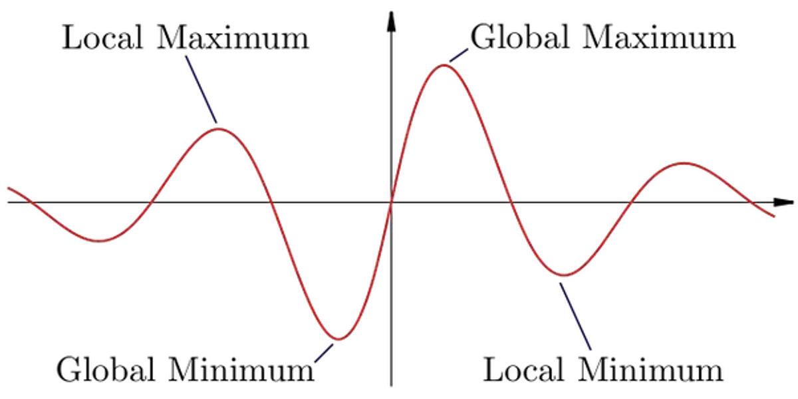
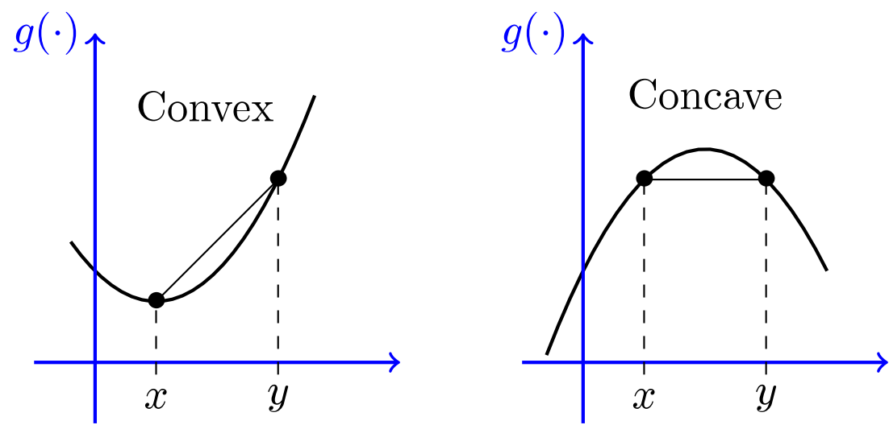

## Summary of Important Concepts

- **Domain:** Determine where the function is defined.
- **Intercepts:** Find where the function crosses the x-axis and y-axis.
- **Symmetry:** Check if the function is even, odd, or periodic.
- **Asymptotes:** Identify vertical, horizontal, or oblique asymptotes.
- **Intervals of Increase/Decrease:** Use the first derivative $f^{'}(x)$ to determine where the function is increasing o-decreasing.
- **Concavity and Points of Inflection:** Use the second derivative $f^{''}(x)$ to determine where the function is concave up or dow-and find points of inflection.
- **Extrema:** Find local and global maxima and minima.

## Monotonicity of Real Functions

**Definition:** Let $I \subseteq \mathbb{R}$ be a nonempty open interval.

A real function $f: I \rightarrow \mathbb{R}$ is decreasing or increasing if, for all $x, y \in I$ with $x \leq y$, we have
$$
f(x) \geq f(y) \quad \text { or } \quad f(x) \leq f(y),
$$
respectively. If we have a strict inequality whenever $x$ and $y$ are different, we are speaking about a strictly decreasing or strictly increasing function, respectively.

The point of the domain where the function changes its monotonicity is called a critical point. More precisely, we have the following definition.

**Definition:** Let $f: I \rightarrow \mathbb{R}$ and $p \in I$.

- The point $p$ is called a place of a local minimum of the function $f$ if there exists $r>0$ such that $f(x) \geq f(p)$ if $x \in] p-r, p+r[\cap I$.
- The point $p$ is called a place of a local maximum of the function $f$ if there exists $r>0$ such that $f(x) \leq f(p)$ if $x \in] p-r, p+r[\cap I$.

The places of local minimum and maximum of the functions are called the critical points of the function.

**Remark:** It is easy to observe that, having a differentiable function, the derivative at $p$ is zero provided that $p$ is a place of a local minimum or a maximum. In general, the converse is not true.

**Theorem:** (Location of Absolute Extrema)

 Let $f$ be a continuous function over a closed, bounded interval $I$. The absolute maximum of $f$ over $I$ and the absolute minimum of $f$ over $I$ must occur at endpoints of $I$ or at critical points of $f$ in $I$.

## Monotonicity of Differentiable Functions

**Theorem** (Necessary condition for critical points):

Let $f: l \rightarrow \mathbb{R}$ be a differentiable function and $p \in I$ be a critical point. Then $f^{\prime}(p)=0$.

**Theorem** (First order sufficient condition for critical points):

Let $f: l \rightarrow \mathbb{R}$ be a differentiable function and $p \in I$ such that $f^{\prime}(p)=0$.

- If there exists $r>0$ such that $f^{\prime}(x)<0$ if $\left.x \in\right] p-r, p\left[\cap I \right.$ and $f^{\prime}(x)>0$ if $x \in] p, p+r[\cap I$, then $p$ is a place of a local minimum of $f$.
- If there exists $r>0$ such that $f^{\prime}(x)>0$ if $\left.x \in\right] p-r, p\left[\cap I\right.$ and $f^{\prime}(x)<0$ if $x \in] p, p+r[\cap I$, then $p$ is a place of a local maximum of $f$.

**Theorem** (Second order sufficient condition for critical points): 

Let the function $f: l \rightarrow \mathbb{R}$ be twice differentiable and $p \in I$ such that $f^{\prime}(p)=0$. If $f^{\prime \prime}(p) \neq 0$, then $p$ is a critical point of $f$ and

- $p$ is a place of local minimum if $f^{\prime \prime}(p)>0$ and
- $p$ is a place of local maximum if $f^{\prime \prime}(p)<0$.

## Convexity of Real Functions

**Definition.** We say that the function $f: I \rightarrow \mathbb{R}$ is convex or concave on its domain if, for all $t \in[0,1]$ and for all $x, y \in I$, we have
$$
f(t x+(1-t) y) \leq t f(x)+(1-t) f(y)
$$
or
$$
f(t x+(1-t) y) \geq t f(x)+(1-t) f(y),
$$
respectively.

The point of the domain where the function changes its convexity property is called a point of inflection.

**Definition:** Let $f: I \rightarrow \mathbb{R}$ and $p \in I$. The point $p$ is called a point of inflection if there exists $r>0$ such that

- $f$ is convex on the interval $] p-r, p[\cap I$ and concave on the interval ]$p, p+r[ \cap I$ or
- $f$ is concave on the interval $] p-r, p[\cap I$ and convex on the interval ]$p, p+r[ \cap I$

**Theorem (Necessary condition for point of inflection):**

Let $f: I \rightarrow \mathbb{R}$ be a twice-differentiable function and $p \in I$ be a point of inflection. Then $f^{\prime \prime}(p)=0$.

**Theorem (Second order sufficient condition for point of inflection):**

Let $f: I \rightarrow \mathbb{R}$ be a twice differentiable function and $p \in I$ such that $f^{\prime \prime}(p)=0$.

- If there exists $r>0$ such that $f^{\prime \prime}(x)<0$ if $\left.x \in\right] p-r, p\left[\cap I\right.$ and $f^{\prime \prime}(x)>0$ if $x \in] p, p+r[\cap I$, then $f$ changes from concave to convex at $p$.
- If there exists $r>0$ such that $f^{\prime \prime}(x)>0$ if $\left.x \in\right] p-r, p\left[\cap I\right.$ and $f^{\prime \prime}(x)<0$ if $x \in] p, p+r[\cap I$, then $f$ changes from convex to concave at $p$.

**Theorem (Third order sufficient condition for point of inflection):**

Let the function $f: I \rightarrow \mathbb{R}$ be three-times differentiable and $p \in I$ such that $f^{\prime \prime}(p)=0$. If $f^{\prime \prime \prime}(p) \neq 0$, then $p$ is a point of inflection and

- $f$ changes from concave to convex if $f^{\prime \prime \prime}(p)>0$ and
- $f$ changes from convex to concave if $f^{\prime \prime \prime}(p)<0$.

----

# Least Squares Method

- Least square method is the process of finding a regression line or best-fitted line for any data set that is described by an equation.
- This method requires reducing the sum of the squares of the residual parts of the points from the curve or line and the trend of outcomes is found quantitatively.

$$
\begin{aligned} & m=\frac{\left(n \sum x y-\sum y \sum x\right)}{\left[n \sum x^2-\left(\sum x\right)^2\right]} \\ & b=\left(\sum y-m \sum x\right) / n\end{aligned}
$$

**Advantages:**

- Easy to apply and understand
- Highlights relationship between two variables
- Can be used to make predictions about future performance

**Disadvantages:**

- Only highlights relationship between two variables
- Doesn't account for outliers
- May be skewed if data isn't evenly distributed