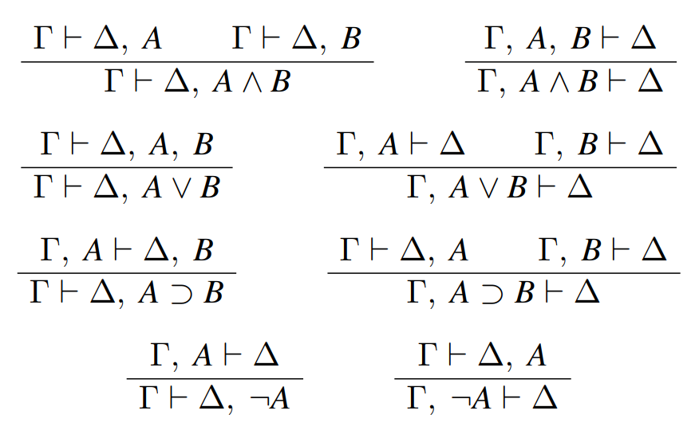

## First-order Language: The Language of Predicate Logic

**Definition 1:**

The language of first-order logic is a
$$
L^{(1)}=\langle LC, Var, \text {Con, Term, Form}\rangle
$$
ordered 5-tuple, where

1. $L C=\{\neg, \supset, \wedge, \vee, \equiv,=, \forall, \exists,()\}:$, (the set of logical constants).
2. $\operatorname{Var}\left(=\left\{x_n: n=0,1,2, \ldots\right\}\right):$ countable infinite set of variables
3. Con $=\bigcup_{n=0}^{\infty}(\mathcal{F}(n) \cup \mathcal{P}(n))$ the set of non-logical constants (at best countable infinite), where

    (a) $\mathcal{F}(0)$ : the set of name parameters,

    (b) $\mathcal{F}(n)$ : the set of $n$ argument function parameters,

    (c) $\mathcal{P}(0)$ : the set of proposition parameters,

    (d) $\mathcal{P}(n)$ : the set of predicate parameters.

4. The sets $L C, \operatorname{Var}, \mathcal{F}(n), \mathcal{P}(n)$ are pairwise disjoint $(n=0,1,2, \ldots)$.
5. The set of terms, i.e. the set Term is given by the following inductive definition:

    (a) $\operatorname{Var} \cup \mathcal{F}(0) \subseteq$ Term

    (b) If $f \in \mathcal{F}(n),(n=1,2, \ldots)$, and $t_1, t_2, \ldots, t_n \in$ Term, then $f\left(t_1, t_2, \ldots, t_n\right) \in$ Term.
6. The set of formulas, i.e. the set Form is given by the following inductive definition:

    (a) $\mathcal{P}(0) \subseteq$ Form

    (b) If $t_1, t_2 \in$ Term, then $\left(t_1=t_2\right) \in$ Form

    (c) If $P \in \mathcal{P}(n),(n \geq 1)$, and $t_1, t_2, \ldots, t_n \in$ Term, then $P\left(t_1, t_2, \ldots, t_n\right) \in$ Form.

    (d) If $A \in$ Form, then $\neg A \in$ Form.

    (e) If $A, B \in$ Form, then $(A \supset B),(A \wedge B),(A \vee B),(A \equiv B) \in$ Form.

    (f) If $x \in$ Var, $A \in$ Form, then $\forall x A, \exists x A \in$ Form.

**Definition 2:**

Let $L^{(1)}=\langle LC, Var, \text {Con, Term, Form}\rangle$ be a language of first-order logic Then the set of atomic formulas of $L^{(1)}$ (in notation AtForm) is the following:

1. $\mathcal{P}(0) \subseteq$ AtForm
2. If $t_1, t_2 \in$ Term, then $\left(t_1=t_2\right) \in$ AtForm
3. If $P \in \mathcal{P}(n),(n \geq 1)$, and $t_1, t_2, \ldots, t_n \in$ Term, then $P\left(t_1, t_2, \ldots, t_n\right) \in$ AtForm.

## Syntactical Properties of Variables: Free and Bound Variables

**Definition:**

Let $L^{(1)}=\langle LC, Var, \text {Con, Term, Form}\rangle$ be a first order language and $A \in$ Form be a formula. The set of free variables of the formula $A$ (in notation: $\operatorname{FreeVar}(A)$) is given by the following inductive definition:

1. If $A$ is an atomic formula (i.e. $A \in \text{AtForm}$), then the members of the set $\operatorname{FreeVar}(A)$ are the variables occuring in $A$.
2. If the formula $A$ is $\neg B$, then $\operatorname{FreeVar}(A)=$ $\operatorname{FreeVar}(B)$.
3. If the formula $A$ is $(B \supset C),(B \wedge C),(B \vee C)$ or $(B \equiv C)$, then $\operatorname{FreeVar}(A)= \operatorname{FreeVar}(B)\bigcup \operatorname{FreeVar}(C)$.
4. If the formula $A$ is $\forall x B$ or $\exists x B$, then $\operatorname{FreeVar}(A)=\operatorname{FreeVar}(B) \backslash\{x\}$.

**Definition:**

Let $L^{(1)}=\langle LC, Var, \text {Con, Term, Form}\rangle$ be a first order language and $A \in$ Form be a formula. The set of bound variables of the formula $A$ (in notation: $\operatorname{BoundVar}(A))$ is given by the following inductive definition:

1. If $A$ is an atomic formula (i.e. $A \in A t$ Form), then $\operatorname{BoundVar}(A)=\emptyset$.
2. If the formula $A$ is $\neg B$, then $\operatorname{BoundVar}(A)=\operatorname{FreeVar}(B)$.
3. If the formula $A$ is $(B \supset C),(B \wedge C),(B \vee C)$ or $(B \equiv C)$, then $\operatorname{BoundVar}(A)=\operatorname{BoundVar}(B) \cup \operatorname{BoundVar}(C)$.
4. If the formula $A$ is $\forall x B$ or $\exists x B$, then $\operatorname{BoundVar}(A)=\operatorname{BoundVar}(B) \cup\{x\}$.

----

## Syntactical Properties of Variables: Free and Bound Occurrences

**Definition:**

Let $L^{(1)}=\langle LC, Var, \text {Con, Term, Form}\rangle$ be a first order language, $A \in$ Form be a formula, and $x \in V a r$ be a variable.

1. A fixed occurrence of the variable $x$ in the formula $A$ is free if it is not in the subformulae $\forall x B$ or $\exists x B$ of the formula $A$.
2. A fixed occurrence of the variable $x$ in the formula $A$ is bound if it is not free.

**Remarks:**

1. If $x$ is a free variable of the formula $A$ (i.e. $x \in \operatorname{FreeVar}(A)$ ), then it has at least one free occurrence in $A$.
1. If $x$ is a bound variable of the formula $A$
(i.e. $x \in \operatorname{BoundVar}(A)$ ), then it has at least one bound occurrence in $A$.
1. A fixed occurrence of a variable $x$ in the formula $A$ is free if
   - it does not follow a universal or an existential quantifier, or
   - it is not in a scope of a $\forall x$ or a $\exists x$ quantification.
1. A variable $x$ may be a free and a bound variable of the formula $A$ : $(P(x) \wedge \exists x R(x))$

**Definition:**

Let $L^{(1)}=\langle LC, Var, \text {Con, Term, Form}\rangle$ be a first order language and $A \in$ Form be a formula.

1. If $\operatorname{FreeVar}(A) \neq \emptyset$, then the formula $A$ is an open formula.
2. If $\operatorname{FreeVar}(A)=\emptyset$, then the formula $A$ is a closed formula.

----

## Interpretation and Assignment in First-order Logic

The concept of interpretation is a crucial component of the semantics of any logical system. It shows the possibilities how to gives 'meanings' (semantic values) to parameters (nonlogical constants). In first-order logic

- name parameters (members of $\mathcal{F}(0))$ represent proper names;
- function parameters (members of $\mathcal{F}(n))$ represent operations;
- propositional parameters (members of $\mathcal{P}(0)$ ) represent propositions;
- one-argument predicate parameters (members of $\mathcal{P}(1))$ represent properties;
- $n$-argument predicate parameters (members of $\mathcal{P}(n), n \geq 1)$ represent $n$-argument relations.

**Definition:** (Interpretation of first-order logic)

The ordered pair $\langle U, \rho\rangle$ is an interpretation of the language $L^{(1)}$ if

1. $U \neq \emptyset$ (i.e. $U$ is a nonempty set);
2. $\operatorname{Dom}(\rho)=\operatorname{Con} ;$

    (a) If $a \in \mathcal{F}(0)$, then $\rho(a) \in U$;

    (b) If $f \in \mathcal{F}(n) \quad(n \neq 0)$, then $\rho(f)$ is a function from $U^{(n)}$ to $U$;

    (c) If $p \in \mathcal{P}(0)$, then $\rho(p) \in\{0,1\}$;

    (d) If $P \in \mathcal{P}(n) \quad(n \neq 0)$, then $\rho(P) \subseteq U^{(n)}$.

**Definition:** (Assignment in a given interpretation)

The function $v$ is an assignment relying on the interpretation $\langle U, \rho\rangle$ if the followings hold:

1. $\operatorname{Dom}(v)=$ Var;
2. If $x \in V a r$, then $v(x) \in U$.

**Definition:** (Modified assignment)

Let $v$ be an assignment relying on the interpretation $\langle U, \rho\rangle, x \in V a r$ and $u \in U$.
$$
v[x: u](y)= \begin{cases}u, & \text { if } y=x ; \\ v(y), & \text { otherwise. }\end{cases}
$$
for all $y \in V a r$.

----

**Definition:** (Semantic rules)

Let $\langle U, \rho\rangle$ be a given interpretation and $v$ be an assignment relying on $\langle U, \rho\rangle$.

1. If $a \in \mathcal{F}(0)$, then $|a|_v^{\langle U, \rho\rangle}=\rho(a)$.
2. If $x \in V a r$, then $|x|_v^{\langle U, \rho\rangle}=v(x)$.
3. If $f \in \mathcal{F}(n),(n=1,2, \ldots)$, and $t_1, t_2, \ldots, t_n \in$ Term, then $\left|f\left(t_1\right)\left(t_2\right) \ldots\left(t_n\right)\right|_v^{\langle U, \rho\rangle}=\rho(f)\left(\left\langle\left|t_1\right|_v^{\langle U, \rho\rangle},\left|t_2\right|_v^{\langle U, \rho\rangle}, \ldots,\left|t_n\right|^{\langle U, \rho\rangle_v}\right)\right.$
4. If $p \in \mathcal{P}(0)$, then $|p|_v^{\langle U, \rho\rangle}=\rho(p)$
5. If $t_1, t_2 \in$ Term, then $\left|\left(t_1=t_2\right)\right|_v^{\langle U, \rho\rangle}= \begin{cases}1, & \text { if }\left|t_1\right|_v^{\langle U, \rho\rangle}=\left|t_2\right|_v^{\langle U, \rho\rangle} \\ 0, & \text { otherwise. }\end{cases}$
6. If $P \in \mathcal{P}(n)(n \neq 0), t_1, \ldots, t_n \in$ Term,
   
   then $\left|P\left(t_1\right) \ldots\left(t_n\right)\right|_v^{\langle U, \rho\rangle}= \begin{cases}1, & \text { if }\left\langle\left|t_1\right| v_v^{\langle U, \rho\rangle}, \ldots,\left|t_n\right|_v^{\langle U, \rho\rangle}\right\rangle \in \rho(P) ; \\ 0, & \text { otherwise. }\end{cases}$
7. If $A \in$ Form, then $|\neg A|_v^{\langle U, \rho\rangle}=1-|A|_v^{\langle U, \rho\rangle}$.
8.  If $A, B \in$ Form, then
    $$
    \begin{gathered}
    |(A \supset B)|_v^{\langle U, \rho\rangle}= \begin{cases}0 & \text { if }|A|_v^{\langle U, \rho\rangle}=1, \text { and }|B|_v^{\langle U, \rho\rangle}=0 ; \\
    1, & \text { otherwise. }\end{cases} \\
    |(A \wedge B)|_v^{\langle U, \rho\rangle}= \begin{cases}1 & \text { if }|A|_v^{\langle U, \rho\rangle}=1, \text { and }|B|_v^{\langle U, \rho\rangle}=1 ; \\
    0, & \text { otherwise. }\end{cases} \\
    |(A \vee B)|_v^{\langle U, \rho\rangle}= \begin{cases}0 & \text { if }|A|_v^{\langle U, \rho\rangle}=0, \text { and }|B|_v^{\langle U, \rho\rangle}=0 ; \\
    1, & \text { otherwise. }\end{cases} \\
    |(A \equiv B)|_v^{\langle U, \rho\rangle}= \begin{cases}1 & \text { if }|A|_v^{\langle U, \rho\rangle}=|B|_v^{\langle U, \rho\rangle}=0 ; \\
    0, & \text { otherwise. }\end{cases}
    \end{gathered}
    $$
9.  If $A \in$ Form, $x \in V a r$, then

$$
\begin{aligned}
& |\forall x A|_v^{\langle U, \rho\rangle}= \begin{cases}0, & \text { if there is an } u \in U \text { such that }|A|_{v[x: u]}^{\langle U, \rho\rangle}=0 ; \\
1, & \text { otherwise. }\end{cases} \\
& |\exists x A|_v^{\langle U, \rho\rangle}= \begin{cases}1, & \text { if there is an } u \in U \text { such that }|A|_{v[x: u]}^{\langle U, \rho\rangle}=1 ; \\
0, & \text { otherwise. }\end{cases}
\end{aligned}
$$

The semantic value of an expression belonging to the set $\text{Term} \cup \text{Form}$ depends on the given interpretation and assignment, therefore the precise notation is the following: $|\langle\text {expression}\rangle|_v^{\langle U, \rho\rangle}$.

----

## Central Logical Concepts of Classical First-order Logic

**Definition:** (Model of a set of formulae)

Let $L^{(1)}=\langle LC, Var, \text {Con, Term, Form}\rangle$ be a first order language and $\Gamma \subseteq$ Form be a set of formulae. An ordered triple $\langle U, \rho, v\rangle$ is a model of the set $\Gamma$, if

1. $\langle U, \rho\rangle$ is an interpretation of $L^{(1)}$;
2. $v$ is an assignment relying on $\langle U, \rho\rangle$;
3. $|A|_v^{\langle U, \rho\rangle}=1$ for all $A \in \Gamma$.

**Definition:** (Model of a formula)

Let $L^{(1)}=\langle LC, Var, \text {Con, Term, Form}\rangle$ be a first order language and $A \in$ Form be a formula. A model of a formula $A$ is the model of the singleton $\{A\}$.

**Definition:** (Satisfiability of a set of formulae)

Let $L^{(1)}=\langle LC, Var, \text {Con, Term, Form}\rangle$ be a first order language and $\Gamma \subseteq$ Form be a set of formulae. $\Gamma \subseteq$ Form is satisfiable if it has a model. (If there is an interpretation and an assignment in which all members of the set $\Gamma$ are true.)

**Definition:** (Satisfiability of a formula)

Let $L^{(1)}=\langle LC, Var, \text {Con, Term, Form}\rangle$ be a first order language and $A \in$ Form be a formula. The formula $A$ is satisfiable, if the singleton $\{A\}$ is satisfiable. (If there is an interpretation and an assignment in which the formula $A$ is true.)

**Remarks:**

- A satisfiable set of formulas does not involve a logical contradiction; its formulae may be true together.
- A satisfiable formula may be true.
- If a set of formulas is satisfiable, then its members are satisfiable.
- But: all members of the set $\{P(a), \neg P(a)\}$ are satisfiable, and the set is not satisfiable.

**Definition:** (Unsatisfiability of a set of formulae)

Let $L^{(1)}=\langle LC, Var, \text {Con, Term, Form}\rangle$ be a first order language and $\Gamma \subseteq$ Form be a set of formulae. The set $\Gamma \subseteq$ Form is unsatisfiable if it is not satisfiable.

**Remark:**

An unsatisfiable set of formulae involves a logical contradiction. (Its members cannot be true together.)

**Definition:** (Unsatisfiability of a formula)

Let $L^{(1)}=\langle LC, Var, \text {Con, Term, Form}\rangle$ be a first order language and $A \in$ Form be a formula. The formula $A$ is unsatisfiable if the singleton $\{A\}$ is unsatisfiable.

**Remark:**

An unsatisfiable formula involves a logical contradiction. (It cannot be true, i.e. it is false with respect to all interpretations and assignment.)

**Definition:** (Logical consequence of a set of formulae)

Let $L^{(1)}=\langle LC, Var, \text {Con, Term, Form}\rangle$ be a first order language, $\Gamma, \subseteq$ Form be a set of formulae and $A \in$ Form be a formula.
The formula $A$ is the logical consequence of the set of formulae $\Gamma$ if the set $\Gamma \cup\{\neg A\}$ is unsatifiable. (Notation: $\Gamma \models A$ )

**Definition:** (Logical consequence of a formula)

Let $L^{(1)}=\langle LC, Var, \text {Con, Term, Form}\rangle$ be a first order language, and $A, B \in$ Form be formulae.
The formula $B$ is the logical consequence of the formula $A$ if $\{A\} \vDash B$. (Notation: $A \models B$ )

**Definition:** (Validity of a formula)

Let $L^{(1)}=\langle LC, Var, \text {Con, Term, Form}\rangle$ be a first order language, and $A \in$ Form be a formula.
The formula $A$ is valid if $\emptyset \models A$. (Notation: $\models A$ )

**Definition:** (Logical equivalence)

Let $L^{(1)}=\langle LC, Var, \text {Con, Term, Form}\rangle$ be a first order language, and $A, B \in$ Form be formulae.
The formulae $A$ and $B$ are logically equivalent if $A \vDash B$ and $B \vDash A$. (Notation: $A \Leftrightarrow B$ )

----

## Normal Forms

- A base is a set of truth functors whose members can express all truth functors.

  - For example: $\{\neg, \supset),\{\neg, \wedge\},\{\neg, \vee\}$
    1. $(p \wedge q) \Leftrightarrow \neg(p \supset \neg q)$
    2. $(p \vee q) \Leftrightarrow(\neg p \supset q)$
  - Truth functor Sheffer: $(p \mid q) \Leftrightarrow_{\text {def }} \neg(p \wedge q)$
  - Truth functor neither-nor: $(p \| q) \Leftrightarrow_{\text {def }}(\neg p \wedge \neg q)$
  - Remark: Singleton bases: $(p \mid q),(p \| q)$

**Definition:** Let $L^{(0)}=\langle L C$, Con, Form $\rangle$ be a language of propositional logic and $p \in$ Con a propositional parameter. Then the formulae $p, \neg p$ are literals (where $p$ is the base of the literals).

**Definition:** If the formula $A$ is a literal or a conjunction of literals, then $A$ is an elementary conjunction.

**Definition:** If the formula $A$ is a literal or a disjunction of literals, the $A$ is an elementary disjunction.

**Remark:** If the literals of an elementary conjunction/disjunction have different bases, then the elementary conjunction/disjunction represents an interpretation (or a family of interpretations).

**Definition:** A disjunction of elementary conjunctions is a disjunctive normal form.

**Definition:** A conjunction of elementary disjunctions is a conjunctive normal form.

**Definition:**

Let $L^{(1)}=\langle L C, V a r$, Con, Term,Form $\rangle$ be a first order language and $A \in$ Form be a formula.

The formula $A$ is prenex if

1. there is no quantifier in $A$ or
2. the formula $A$ is in the form $Q_1 x_1 Q_2 x_2 \ldots Q_n x_n B(n=1,2, \ldots)$, where

    (a) there is no quantifier in the formula $B \in$ Form;

    (b) $x_1, x_2 \ldots x_n \in$ Var are diffrent variables;

    (c) $Q_1, Q_2, \ldots, Q_n \in\{\forall, \exists\}$ are quantifiers.

----

## Sequent calculus

Truth tables can be used to determine valid formulas, but if we have too many non-logical constants, it is hard to construct these tables, even for computers. Let's consider a method based on syntax.

**Definition:**

If $\Gamma$ and $\Delta$ are two-possibly empty—set of formulae, then $\Gamma \vdash \Delta$ is a sequent.

The axioms of the sequent calculus are $\Gamma \cup\{A\} \vdash \Delta \cup\{A\}$, where $A$ is an atomic formula, $\Gamma$ and $\Delta$ are set of formulae.

Let $S$ be the sequent $\Gamma \vdash \Delta$, where $\Gamma=\left\{A_1, \ldots, A_n\right\}$ and $\Delta=\left\{B_1, \ldots, B_m\right\}$;

The sequent $S$ is valid, if for every interpretation $\varrho$ where
$\left|A_1\right|_{\varrho}=\cdots=\left|A_n\right|_{\varrho}=1$ then $\left|B_i\right|_{\varrho}=1$ for some $i$.

**Remark:**
If a sequent is not valid-i.e. falsifiable-then there exists an interpretation $\varrho$ for which $\left|A_1\right|_{\varrho}=\cdots=\left|A_n\right|_{\varrho}=1$, but $\left|B_1\right|_{\varrho} \cdots=\left|B_m\right|_{\varrho}=0$.

### Inference rules

For the sake of simplicity we write $, \Gamma, A "$ in the following instead of $\Gamma \cup\{A\}$. In the following rules the upper sequent(s) and the lower sequent are called the premise(s) and the conclusion of the rule, respectively.

