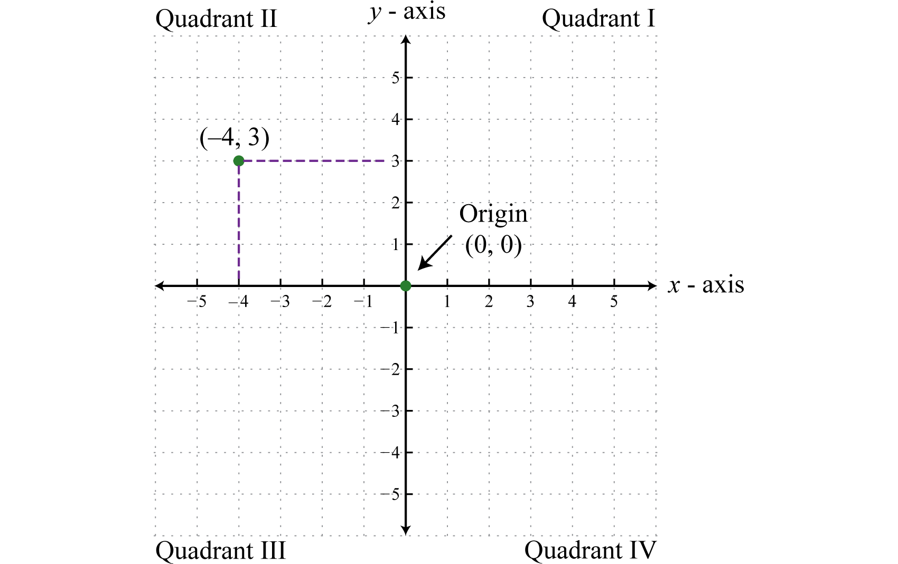
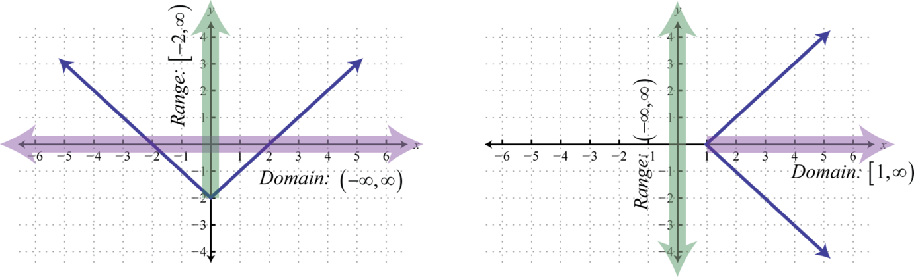
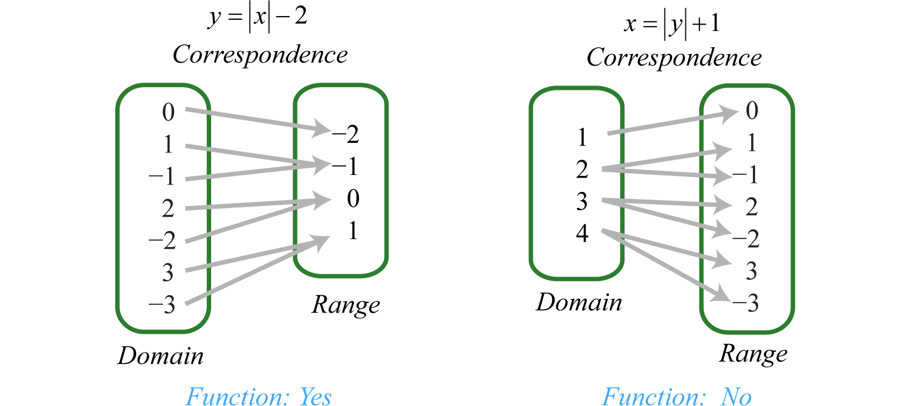
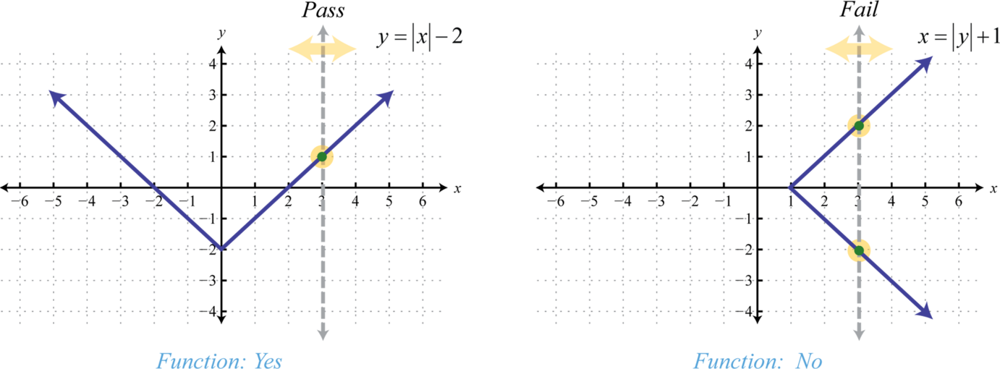
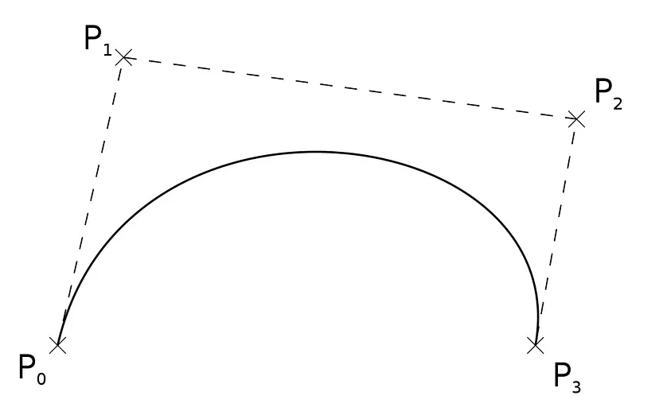
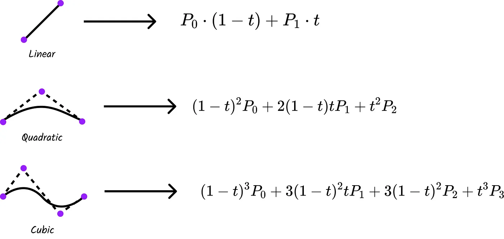
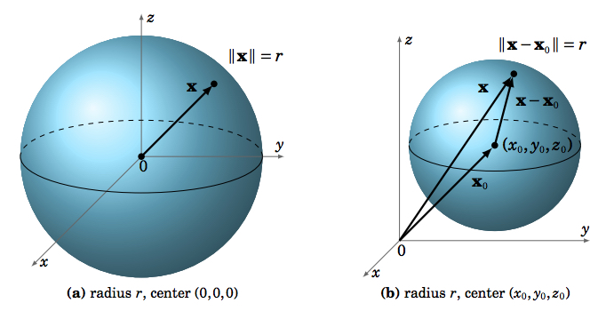

## Relations and Graphs

A **relation** is any set of ordered pairs. In the context of algebra, the relations of interest are sets of ordered pairs $(x, y)$ in the rectangular coordinate plane. Typically, the coordinates are related by a rule expressed using an algebraic equation. For example, both the algebraic equations $y=|x|-2$ and $x=|y|+1$ define relationships between $x$ and $y$. We can visually display any relation of this type on a coordinate plane by plotting the points.

he representation of a relation on a rectangular coordinate plane is called a graph. Any curve graphed on a rectangular coordinate plane represents a set of ordered pairs and thus defines a relation.

The set consisting of all of the first components of a relation, in this case the x-values, is called the **domain**. And the set consisting of all second components of a relation, in this case the y-values, is called the **range** (or **codomain**). Often, we can determine the domain and range of a relation if we are given its graph.

## Functions

Of special interest are relations where every $x$-value corresponds to exactly one $y$-value. A relation with this property is called a **function**.

Notice that in Figure 3 every element in the domain of the solution set of $y=|x|-2$ corresponds to only one element in the range; it is a function. The solutions to $x=|y|+1$, on the other hand, have values in the domain that correspond to two elements in the range. In particular, the $\mathrm{x}$-value 4 corresponds to two $y$-values -3 and 3 . Therefore, $x=|y|+1$ does not define a function.

We can visually identify functions by their graphs using the vertical line test. If any vertical line intersects the graph more than once, then the graph does not represent a function.

The vertical line represents a value in the domain, and the number of intersections with the graph represent the number of values to which it corresponds. As we can see, any vertical line will intersect the graph of $y=|x|-2$ only once; therefore, it is a function. A vertical line can cross the graph of $x=|y|+1$ more than once; therefore, it is not a function. As pictured, the $x$-value 3 corresponds to more than one $y$-value.

With the definition of a function comes special notation. If we consider each $x$-value to be the input that produces exactly one output, then we can use function notation:
$$
f(x)=y
$$

## Curves

In mathematics, a curve is an object similar to a line, but that does not have to be straight. One of the most famous examples of curves used in computer visualization or computer-aided design (CAD) are [Bézier curves](#bézier-curves).

**Definition:** (Parametric Equations)

If $x$ and $y$ are continuous functions of $t$ on an interval $I$, then the equations
$$
x=x(t)
$$
and
$$
y=y(t)
$$
are called parametric equations and $t$ is called the parameter. The set of points $(x, y)$ obtained as $t$ varies over the interval $I$ is called the graph of the parametric equations. The graph of parametric equations is called a parametric curve or plane curve, and is denoted by $C$.

### Bézier Curves

Bézier curves are parametric curves (with the parameter $t$ varying from 0 to 1) that are defined by a set of control points. These points’ positions in relation to one another define the shape of the curve.

----

The mathematical basis of such curves is the Bernstein polynomials:

$$
B_n(x):=\sum_{v=0}^n \beta_v b_{v, n}(x)
$$

where the Bernstein basis polynomial is:

$$
b_{v, n}(x):=\binom{n}{v} x^v(1-x)^{n-v}, \quad v=0, \ldots, n
$$

and $\beta_v$ is Bernstein coefficient.

----

**Remark:** That makes a Bézier curve essentially a Bernstein polynomial where the Bernstein coefficients are the control points.

Essentially, Bézier curves are a way to build curves that can be scaled indefinitely, meaning that we can make them as detailed as we want them to be. Instead of creating super high degree curves, we can just concatenate smaller degree curves together and get pretty much any curve we want to. Take the prime example of typography. Bézier curves enable us to create all kinds of different fonts.

----

## Surfaces

In mathematics, a surface is a mathematical model of the common concept of a surface. It is a generalization of a plane, but, unlike a plane, it may be curved; this is analogous to a curve generalizing a straight line.

A plane is an example of a **surface**, which we will define informally as the solution set of the equation $F(x, y, z)=0$ in $\mathbb{R}^3$, for some real-valued function $F$. For example, a plane given by $a x+b y+c z+d=0$ is the solution set of $F(x, y, z)=0$ for the function $F(x, y, z)=a x+b y+c z+d$. A more complex example of a surface is a sphere in the Euclidean 3-space.

A sphere $S$ is the set of all points $(x, y, z)$ in $\mathbb{R}^3$ which are a fixed distance $r$ (called the radius) from a fixed point $P_0=\left(x_0, y_0, z_0\right)$ (called the center of the sphere):
$$
S=\left\{(x, y, z):\left(x-x_0\right)^2+\left(y-y_0\right)^2+\left(z-z_0\right)^2=r^2\right\}
$$

Using vector notation, this can be written in the equivalent form:
$$
S=\left\{\mathbf{x}:\left\|\mathbf{x}-\mathbf{x}_0\right\|=r\right\}
$$
where $\mathbf{x}=(x, y, z)$ and $\mathbf{x}_0=\left(x_0, y_0, z_0\right)$ are vectors.

Note in Figure 7 that the intersection of the sphere with the $x y$-plane is a circle of radius $r$ (i.e. a great circle, given by $x^2+y^2=r^2$ as a subset of $\mathbb{R}^2$ ). Similarly for the intersections with the $x z$-plane and the $y z$-plane. In general, a plane intersects a sphere either at a single point or in a circle.

----

## Computer Visualization of Curves and Surfaces

### Explicit Representation

Expressions of the form $y=f(x)$ or $z=f(x, y)$ are called explicit representations because they express one variable explicitly in terms of the other variables.

### Implicit Representation

Not all curves and surfaces can be captured readily by a single explicit expression. For example, the unit circle centered the origin is represented implicitly by all solutions to the equation $x^2+y^2-1=0$. If we try to solve explicitly for $y$ in terms of $x$, we obtain
$$
y=\sqrt{1-x^2}
$$
which represents only the upper half circle. We must use two explicit formulas
$$
y= \pm \sqrt{1-x^2}
$$
to capture the entire circle.
Often it is easier just to stick with the original implicit equation rather than to solve explicitly for one of the variables. Thus $x^2+y^2-1=0$ represents a circle, and $x^2+y^2+z^2-1=0$ represents a sphere. Equations of the form $f(x, y)=0$ or $f(x, y, z)=0$ are called implicit representations because they represent the curve or surface implicitly without explicitly solving for one of the variables.

### Parametric Representations

Parametric equations are convenient for describing curves and surfaces in higher-dimensional spaces.

A torus with major radius $R$ and minor radius $r$ may be defined parametrically as
$$
\begin{aligned}
& x=\cos (t)(R+r \cos (u)) \\
& y=\sin (t)(R+r \cos (u)) \\
& z=r \sin (u)
\end{aligned}
$$
where the two parameters $t$ and $u$ both vary between 0 and $2 \pi$.

