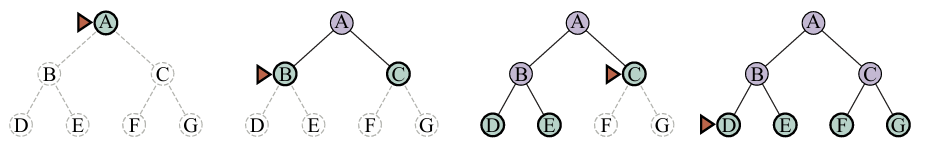
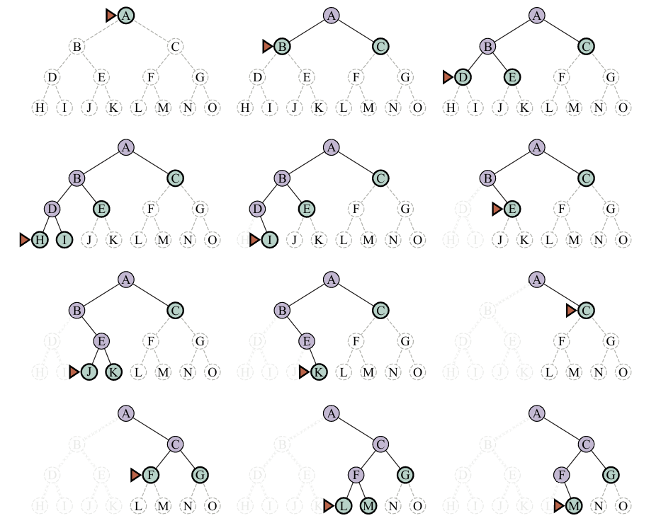
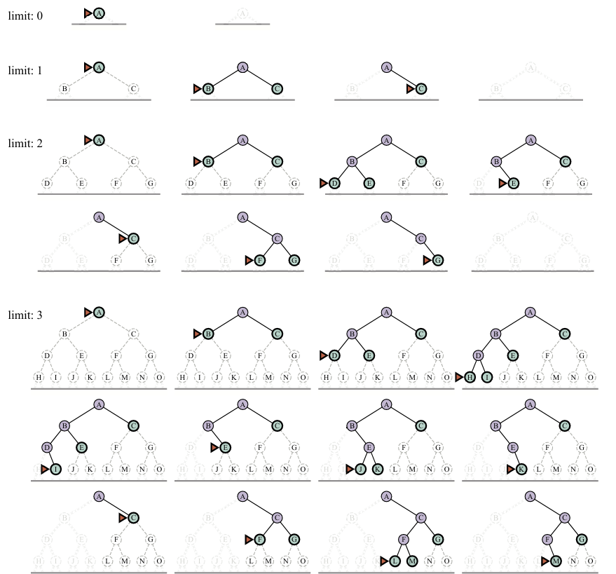
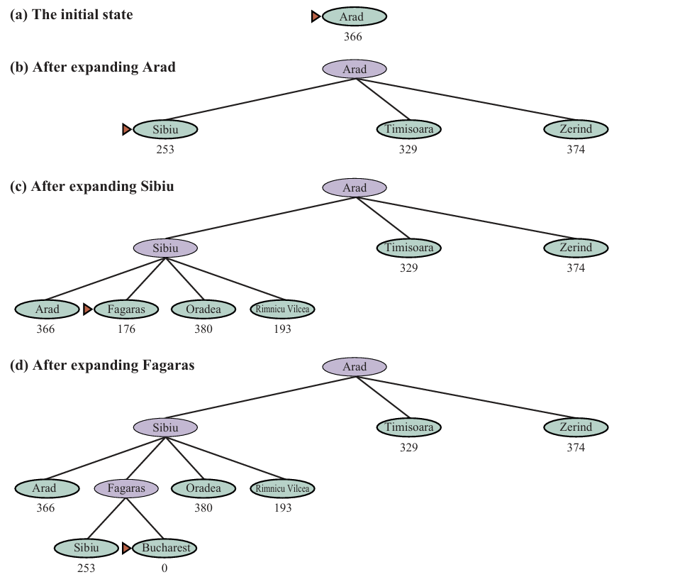
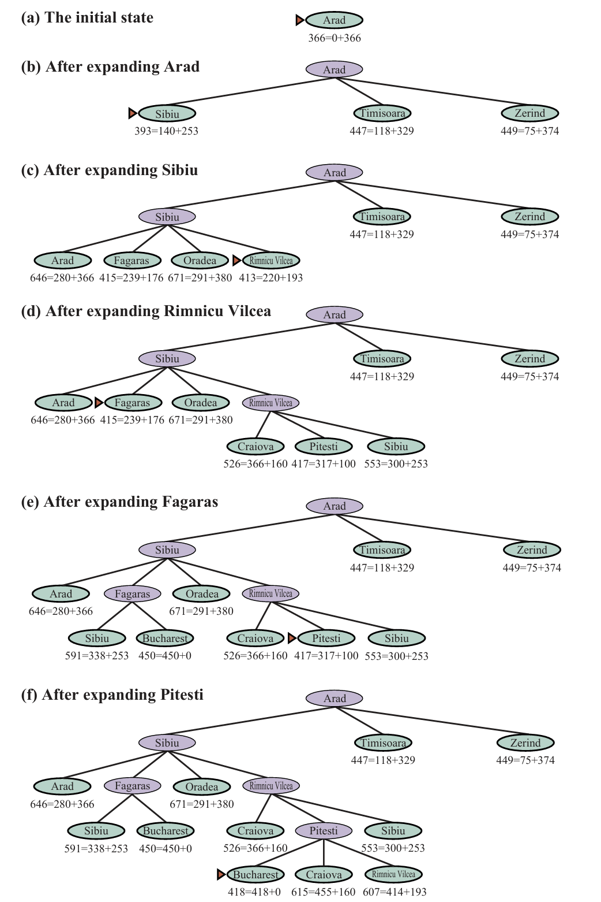
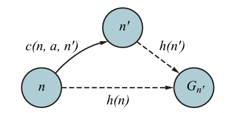

## State Space Representation

In the context of AI problem-solving, a state space is a fundamental concept that represents all possible states that a problem-solving agent can be in or encounter during the course of solving a problem. These states encompass the various configurations or conditions that the agent or system can exist in, and transitions between these states are guided by actions or operators. The state space provides a structured way to model and analyze a problem, enabling AI algorithms to search for a solution effectively.

Formally a search problem can be defined as follows:

- **State Space**: A set of possible states that the environment can be in.
- **Initial State**: The state the agent starts in
- **Goal States**: A set of goal states, sometimes there is a small set of alternative goal states, and sometimes the goal is defined by a property that applies to many states.
- **Actions**: The actions that are available the agent. Given a state *s*, ACTIONS(s) returns a finite set of actions that can be executed in *s*. We say that these actions is applicable in *s*.
- **Transition Model**: Describes what each action does, RESULT(*s,a*) returns the state that results from doing action *a* in state *s*.
- **Action Cost Function**: ACTION-COST(*s, a, s'*) that gives the numeric cost of applying action *a* in state *s* to reach state *s'*. It is used to reflect its own performance measure.

----

## Constraint Satisfaction Problem

A constraint satisfaction problem consists of three components, $\mathcal{X}, \mathcal{D}$, and $\mathcal{C}$:

- $\mathcal{X}$ is a set of variables, $\left\{X_1, \ldots, X_n\right\}$.
- $\mathcal{D}$ is a set of domains, $\left\{D_1, \ldots, D_n\right\}$, one for each variable.
- $\mathcal{C}$ is a set of constraints that specify allowable combinations of values.

For Example, if we want to color a map of a country:

- *Variables*: Names of cities
- *Domains*: $D_i = \{\text{red, green, blue}\}$
- *Constraints:* adjacent regions must have different colors

Solution would be an assignment that satisfies all the constraints.

CSP algorithms use the graph structure to speed up search.

### Types of Constraints

1. **Hard Constraints**: the essential and non-negotiable requirements that must be satisfied in order for a solution to be considered valid. Violating a hard constraint directly leads to an infeasible or unacceptable solution. These constraints represent the core rules and limitations of the problem and cannot be compromised.

    - For example, in the N-Queens problem, the hard constraint would be that no two queens can share the same row, column, or diagonal. Violating this constraint would result in an invalid solution.

2. **Soft Constraints**: preferences or guidelines that are desirable to satisfy, but their violation does not render a solution infeasible. These constraints are usually assigned weights or costs to quantify their importance. The goal is to minimize the total violation or cost associated with the soft constraints while still satisfying the hard constraints.

   - Continuing with the N-Queens problem example, a soft constraint could be to minimize the number of queens attacking each other. While it is important to avoid conflicts, violating this constraint does not make the solution infeasible. However, minimizing the number of conflicts would be a desirable objective.

### Backtracking Search

Backtracking search is a depth-first search algorithm used for solving Constraint Satisfaction Problems (CSPs). It explores the search space by assigning values to variables and backtracking when conflicts arise. The algorithm terminates when a solution that satisfies all constraints is found or all assignments have been exhausted. Backtracking search is efficient for small to moderate search spaces but can be slow for large spaces or complex constraints. For example it can solve *n*-queens for $n \approx 25$

It’s a process of creating a space tree that can represent all the possible combinations of the elements of the set of variables we have.

Variable assignments are commutative. In this search we only need to consider assignments to a single variable at each node.

----

## Systematic Search Strategies

### Breadth-first Search

- The root node is expanded first, then all the successors of the root node are expanded next, then *their* successors, and so on (Figure 2).
- This is a systematic search strategy that is therefore complete even on infinite state spaces.
- Uses a first-in-first-out queue.
- Allows an **early goal test**, checking whether a node is a solution as soon as it is generated.
- Cost-optimal if all actions have the same cost.
- Total number of nodes generated: $1+b+b^2+b^3+\cdots+b^d=O\left(b^d\right)$
  - All nodes remain in memory, so both time and space complexity are $O(b^d)$.
- The memory requirements are a bigger problem for breadth-first search than the execution time.
  - As a typical real-world example, consider a problem with branching factor $b=10$, processing speed 1 million nodes/second, and memory requirements of 1 Kbyte/node. A search to depth $d=10$ would take less than 3 hours, but would require 10 terabytes of memory.

### Depth-first Search

- Expands the deepest node in the frontier first.
- Uses a last-in-first-out stack.
- Not cost-optimal; it returns the first solution if finds, even if it is not the cheapest.
- Completeness
  - *Finite state spaces:* complete.
  - *Acyclic state spaces:* may end up expanding the same state many times via different paths.
  - *Cyclic state spaces:* can get stuck in an infinite loop; modified to check each new nodes for cycles.
  - *Infinite state spaces:* not systematic, can get stuck going down an infinite path. Thus, is incomplete.
- Memory complexity of $O(bm)$, where $b$ is the branching factor and $m$ is the maximum depth of the tree.
- Takes time proportional to the number of states, i.e. $O(b^m)$

### Depth-limited Search

- A version of [depth-first search](#depth-first-search) in which we supply a depth limit $\ell$ and treat all nodes at depth $\ell$ as if they had no successors.
- Time complexity: $O(b^\ell)$
- Space complexity: $O(b\ell)$
- If we made a poor choice of $\ell$, the algorithm will fail to reach a solution.

### Iterative Deepening Search

- Solves picking a good depth limited $\ell$
- Tries all values: first 0, then 1, then 2, and so on. Until either a solution is found, or the depth-limited search returns the *failure* value rather than the *cutoff* value.
- Optimal for problems where all actions have the same cost.
- Complete.
- Time complexity: $O(b^d)$
- Space complexity: $O(bd)$

## Heuristic Search Strategies

This section shows how an informed search strategy-one that uses domain-specific hints about the location of goals-can find solutions more efficiently than an uninformed strategy. The hints come in the form of a heuristic function, denoted $h(n):$

$$
h(n)= \text{estimated cost of the cheapest path from the state at node $n$ to a goal state.}
$$

## Greedy Best-first Search

- A form or best-first search that expands first the node with the lowest $h(n)$ value&mdash;the node that appears to be closest to the goal&mdash;on the grounds that this is likely to lead to a solution quickly.
- 
- Complete
  - Can get stuck in loop
  - Complete in finite space with repeated-state checking
- Time and space complexity: $O(b^m)$[^2] as it keeps all nodes in memory
- With a good heuristic we can reach $O(bm)$;

[^2]: We can say that this is the number of vertices or $O(|V|)$

## A* Search

- Evaluation function $f(n)=g(n)+h(n)$
  - $g(n)=$ path cost from initial state to node $n$
  - $h(n)=$ estimated cost to goal from $n$
  - $f(n)=$ estimated total cost of path through $n$ to goal
- Complete assuming that the state space either has a solution or is finite.
- Cost-optimal depends on certain properties of the heuristic:
  - **Admissibility:** an **admissible heuristic** is one that never overestimates the cost to reach a goal.
  - **Consistency**: A heuristic $h(n)$ is consistent if, for every node $n$ and every successor $n^{\prime}$ of $n$ generated by an action $a$, we have: $h(n) \leq c\left(n, a, n^{\prime}\right)+h\left(n^{\prime}\right).$ This is a form of triangle inequality (Figure 7). 

