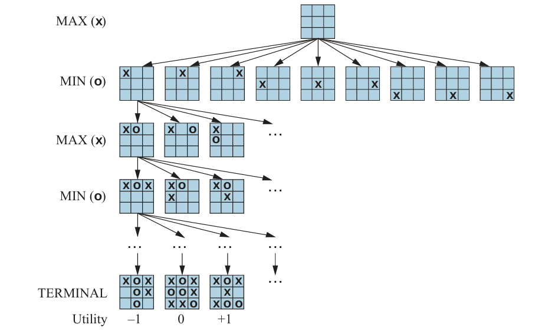
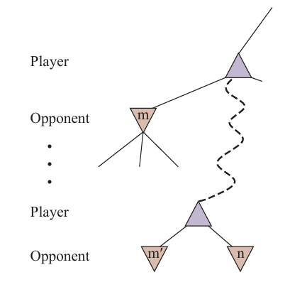
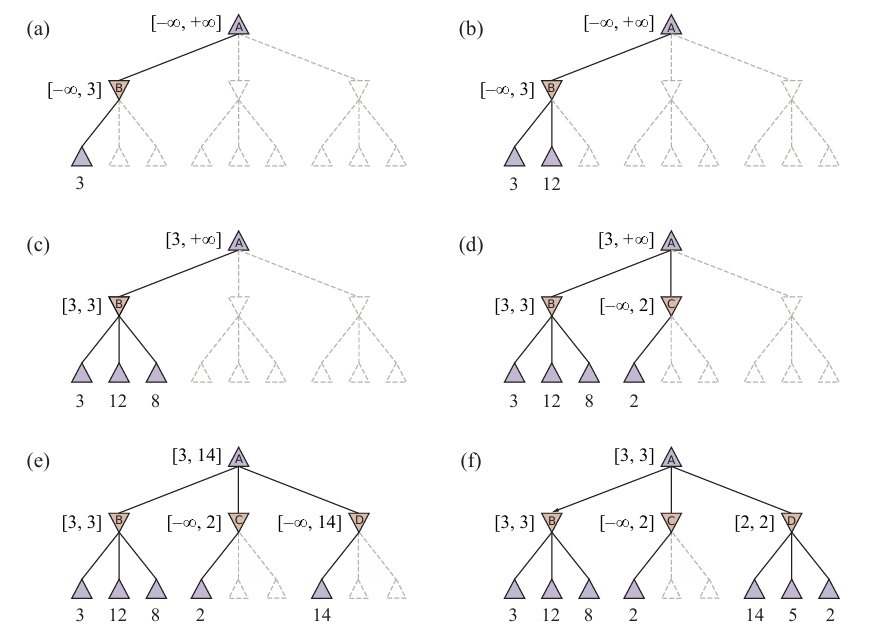

## Two-player Zero-sum Games

Deterministic, two-plater, turn-taking, perfect information and zero-sum games.

- Example: Chess

A game can be formally defined with the following elements:

- $S_0$ : The initial state, which specifies how the game is set up at the start.
- To-Move $(s)$ : The player whose turn it is to move in state $s$.
- Actions $(s)$ : The set of legal moves in state $s$.
- Result $(s, a)$ : The transition model, which defines the state resulting from taking action $a$ in state $s$.
- Is-Terminal $(s)$ : A terminal test, which is true when the game is over and false otherwise. States where the game has ended are called terminal states.
- Utility $(s, p)$ : A utility function (also called an objective function or payoff function), which defines the final numeric value to player $p$ when the game ends in terminal state $s$. In chess, the outcome is a win, loss, or draw, with values 1,0 , or $1 / 2 .$ Some games have a wider range of possible outcomes-for example, the payoffs in backgammon range from 0 to 192.

## Optimal Decisions in Games

### Minimax Search

- Finds the best move for MAX by trying all actions and choosing the one whose resulting state has the highest MINIMAX value.
- A recursive algorithm that proceeds all the way down to the leaves of the tree and then backs up the minimax values through the tree as the recursion unwinds.
- The minimax algorithm performs a complete depth-first exploration of the game tree.
  - If the maximum depth of the tree is $m$ and there are $b$ legal moves at each point, then the time complexity of the minimax algorithm is $O\left(b^m\right)$.
  - The space complexity is $O(b m)$ for an algorithm that generates all actions at once, or $O(m)$ for an algorithm that generates actions one at a time.
- The exponential complexity makes Minimax impractical for complex games;
  - for example, chess has a branching factor of about 35 and the average game has depth of about $80$ ply, and it is not feasible to search $35^{80} \approx 10^{123}$ states.
- Minimax does, however, serve as a basis for the mathematical analysis of games. By approximating the minimax analysis in various ways, we can derive more practical algorithms.

### Alpha-Beta Pruning

If Player has a better choice either at the same level (e.g. $m^{\prime}$ in Figure 3) or at any point higher up in the tree (e.g. $m$ in Figure 3), then Player will never move to $n$. So once we have found out enough about $n$ (by examining some of its descendants) to reach this conclusion, we can prune it.

It is a depth-first search, at any one time we just have to consider the nodes along a single path in the tree.

$\alpha=$ the value of the best (i.e., highest-value) choice we have found so far at any choice point along the path for MAX. Think: $\alpha=$ "at least."
$\beta=$ the value of the best (i.e., lowest-value) choice we have found so far at any choice point along the path for MIN. Think: $\beta=$ "at most."

Alpha-beta search updates the values of $\alpha$ and $\beta$ as it goes along and prunes the remaining branches at a node (i.e., terminates the recursive call) as soon as the value of the current node is known to be worse than the current $\alpha$ or $\beta$ value for MAX or MIN, respectively.

Figure 4 shows the stages in the calculation of the optimal decision for the game tree in Figure 2. At each point, we show the range of possible values for each node.

(a) The first leaf below $B$ has the value 3. Hence, $B$, which is a MIN node, has a value of at most 3.

(b) The second leaf below $B$ has a value of 12; MIN would avoid this move, so the value of $B$ is still at most 3.

(c) The third leaf below $B$ has a value of 8; we have seen all $B$'s successor states, so the value of $B$ is exactly 3. Now we can infer that the value of the root is at least 3, because MAX has a choice worth 3 at the root.

(d) The first leaf below $C$ has the value 2. Hence, $C$, which is a MIN node, has a value of at most 2. But we know that $B$ is worth 3, so MAX would never choose $C$. Therefore, there is no point in looking at the other successor states of $C$. This is an example of alpha-beta pruning.

(e) The first leaf below $D$ has the value 14, so $D$ is worth at most 14. This is still higher than MAX's best alternative (i.e., 3), so we need to keep exploring $D$ 's successor states. Notice also that we now have bounds on all of the successors of the root, so the root's value is also at most 14.

(f) The second successor of $D$ is worth 5, so again we need to keep exploring. The third successor is worth 2, so now $D$ is worth exactly 2. MAX's decision at the root is to move to $B$, giving a value of 3.

#### Move Ordering

The effectiveness of alpha–beta pruning is highly dependent on the order in which the states are examined. It might be worthwhile to try to first examine the successors that are likely to be best.

- With perfect ordering, we would need to examine only $O(b^{m/2})$ nodes.
- Put another way, alpha beta with perfect move ordering can solve a tree roughly twice as deep as minimax in the same amount of time.

We cannot achieve perfect move ordering - in that case the ordering function could be used to play a perfect game! But we can often get fairly close. For chess, a fairly simple ordering function (such as trying captures first, then threats, then forward moves, and then backward moves) gets you to within about a factor of 2 of the best-case $O\left(b^{m / 2}\right)$ result.