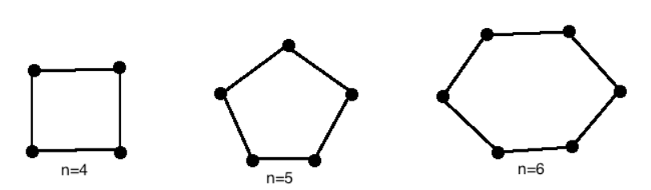

## Graphs

A (non-directed) graph $G$ consists of two things:

- A set $V=V(G)$ whose elements are called vertices, points, or nodes of $G$.
- A set $E=E(G)$ of unordered pairs of distinct vertices called edges of $G$.

We denote such a graph by $G(V, E)$.

Vertices $u$ and $v$ are said to be *adjacent* or *neighbors* if there is an edge $e = \lbrace u, v \rbrace$. In such cases, $u$ and $v$ are called the *endpoints* of $e$, and $e$ connects $u$ and $v$.

- For Figure 1(a)
  - $V$ consists of vertices $A, B, C, D$.
  - $E$ consists of edges $e_1=\{A, B\}, e_2=\{B, C\}, e_3=\{C, D\}, e_4=\{A, C\}, e_5=\{B, D\}$.
- For Figure 1(b)
  - The edges $e_4$ and $e_5$ are called multiple edges since they connect the same endpoints, and the edge $e_6$ is called a loop since its endpoints are the same vertex. Such a diagram is called a multigraph; the formal definition of a graph permits neither multiple edges nor loops. Thus a graph may be defined to be a multigraph without multiple edges or loops.

### Degree of a Vertex

The degree of a vertex $v$ in a graph $G$, written $\operatorname{deg}(v)$, is equal to the number of edges in $G$ which contain $v$, that is, which are incident on $v$. Since each edge is counted twice in counting the degrees of the vertices of $G$, we have the following simple but important result.

#### Theorem

The sum of the degrees of the vertices of a graph $G$ is equal to twice the number of edges in $G$.

Consider, for example, the graph in Figure 1(a). We have
$$
\operatorname{deg}(A)=2, \quad \operatorname{deg}(B)=3, \quad \operatorname{deg}(C)=3, \quad \operatorname{deg}(D)=2 .
$$

## Paths, Connectivity

A path (or a walk) in a multigraph $G$ consists of an alternating sequence of vertices and edges of the form
$$
v_0, \quad e_1, \quad v_1, \quad e_2, \quad v_2, \quad \ldots, \quad e_{n-1}, \quad v_{n-1}, \quad e_n, \quad v_n
$$
where each edge $e_i$ contains the vertices $v_{i-1}$ and $v_i$ (which appear on the sides of $e_i$ in the sequence). The number $n$ of edges is called the length of the path. When there is no ambiguity, we denote a path by its sequence of vertices $\left(v_0, v_1, \ldots, v_n\right)$. The path is said to be closed if $v_0=v_n$. Otherwise, we say the path is from $v_0$, to $v_n$ or between $v_0$ and $v_n$, or connects $v_0$ to $v_n$.

A *simple path* is a path in which all vertices are distinct. (A path in which all edges are distinct will be called a *trail*.) A *cycle* is a closed path of length 3 or more in which all vertices are distinct except $v_0=v_n$. A cycle of length $k$ is called a $k$-*cycle*.

#### Example

Consider the graph $G$ in Figure 2(a). Consider the following sequences:

$$
\begin{array}{ll}
\alpha=\left(P_4, P_1, P_2, P_5, P_1, P_2, P_3, P_6\right), & \beta=\left(P_4, P_1, P_5, P_2, P_6\right), \\
\gamma=\left(P_4, P_1, P_5, P_2, P_3, P_5, P_6\right), & \delta=\left(P_4, P_1, P_5, P_3, P_6\right) .
\end{array}
$$

- The sequence $\alpha$ is a path from $P_4$ to $P_6$; but it is not a trail since the edge $\left\{P_1, P_2\right\}$ is used twice.
- The sequence $\beta$ is not a path since there is no edge $\left\{P_2, P_6\right\}$.
- The sequence $\gamma$ is a trail since no edge is used twice; but it is not a simple path since the vertex $P_5$ is used twice.
- The sequence $\delta$ is a simple path from $P_4$ to $P_6$; but it is not the shortest path (with respect to length) from $P_4$ to $P_6$. The shortest path from $P_4$ to $P_6$ is the simple path $\left(P_4, P_5, P_6\right)$ which has length 2.

By eliminating unnecessary edges, it is not difficult to see that any path from a vertex $u$ to a vertex $v$ can be replaced by a simple path from $u$ to $v$. We state this result formally.

#### Theorem

There is a path from a vertex $u$ to a vertex $v$ if and only if there exists a simple path from $u$ to $v$.

### Connectivity, Connected Components

A graph $G$ is connected if there is a path between any two of its vertices. The graph in Figure 2(a) is connected, but the graph in Figure 2(b) is not connected since, for example, there is no path between vertices $D$ and $E$.

Suppose $G$ is a graph. A connected subgraph[^1] $H$ of $G$ is called a connected component of $G$ if $H$ is not contained in any larger connected subgraph of $G$. It is intuitively clear that any graph $G$ can be partitioned into its connected components. For example, the graph $G$ in Figure 2(b) has three connected components, the subgraphs induced by the vertex sets $\{A, C, D\},\{E, F\}$, and $\{B\}$.

The vertex $B$ in Figure 2(b) is called an isolated vertex since $B$ does not belong to any edge or, in other words, $\operatorname{deg}(B)=0$. Therefore, as noted, $B$ itself forms a connected component of the graph[^2].

[^1]: Consider a graph $G=G(V, E)$. A graph $H=H\left(V^{\prime}, E^{\prime}\right)$ is called a subgraph of $G$ if the vertices and edges of $H$ are contained in the vertices and edges of $G$, that is, if $V^{\prime} \subseteq V$ and $E^{\prime} \subseteq E$.

[^2]: Formally speaking, assuming any vertex $u$ is connected to itself, the relation "$u$ is connected to $v$" is an equivalence relation on the vertex set of a graph $G$ and the equivalence classes of the relation form the connected components of $G$.

## Weighted Graphs

A graph $G$ is called a *labeled graph* if its edges and/or vertices are assigned data of one kind or another. In particular, $G$ is called a *weighted graph* if each edge $e$ of $G$ is assigned a nonnegative number $w(e)$ called *the weight* or *length* of $v$. Figure 3 shows a weighted graph where the weight of each edge is given. The *weight* (or *length*) of a path in such a weighted graph $G$ is defined to be the sum of the weights of the edges in the path. One important problem in graph theory is to find a *shortest path*, that is, a path of minimum weight (length), between any two given vertices. The length of a shortest path between $P$ and $Q$ in Figure 3 is 14; one such path is
$$
\left(P, A_1, A_2, A_5, A_3, A_6, Q\right)
$$

## Types of Graphs

### Complete Graphs

A graph $G$ is said to be complete if every vertex in $G$ is connected to every other vertex in $G$. Thus a complete graph $G$ must be connected. The complete graph with $n$ vertices is denoted by $K_n$. Figure 4 shows the graphs $K_1$ through $K_6$.

### Tree Graphs

A graph $T$ is called a *tree* if $T$ is connected and $T$ has no cycles. Examples of trees are shown in Figure 5. A *forest* $G$ is a graph with no cycles; hence the connected components of a forest $G$ are trees. A graph without cycles is said to be *cycle-free*. The tree consisting of a single vertex with no edges is called the *degenerate tree*.

Consider a tree $T$. Clearly, there is only one simple path between two vertices of $T$; otherwise, the two paths would form a cycle. Also:

- Suppose there is no edge $\{u, v\}$ in $T$ and we add the edge $e=\{u, v\}$ to $T$. Then the simple path from $u$ to $v$ in $T$ and $e$ will form a cycle; hence $T$ is no longer a tree.
- On the other hand, suppose there is an edge $e=\{u, v\}$ in $T$, and we delete $e$ from $T$. Then $T$ is no longer connected (since there cannot be a path from $u$ to $v$ ); hence $T$ is no longer a tree.

The following theorem applies when our graphs are finite.

#### Theorem

Let $G$ be a graph with $n>1$ vertices. Then the following are equivalent:

- $G$ is a tree.
- $G$ is a cycle-free and has $n-1$ edges.
- $G$ is connected and has $n-1$ edges.

This theorem also tells us that a finite tree $T$ with $n$ vertices must have $n-1$ edges. For example, the tree in Figure 5(a) has 9 vertices and 8 edges, and the tree in Figure 5(b) has 13 vertices and 12 edges.

### Bipartite Graphs[^3]

[^3]: In graph theory, a paired graph isn't a standard term. The author of this notes believes it to be equivalent to bipartite graphs.

A graph $G$ is said to be *bipartite* if its vertices $V$ can be partitioned into two subsets $M$ and $N$ such that each edge of $G$ connects a vertex of $M$ to a vertex of $N$. By a complete bipartite graph, we mean that each vertex of $M$ is connected to each vertex of $N$; this graph is denoted by $K_{m, n}$ where $m$ is the number of vertices in $M$ and $n$ is the number of vertices in $N$, and, for standardization, we will assume $m \leq n$. Figure 6 shows the graphs $K_{2,3}, K_{3,3}$, and $K_{2,4}$, Clearly the graph $K_{m, n}$ has $m n$ edges.

### Cycle Graphs

A graph $G$ is said to be a *Cycle Graph* if it consists only of a single cycle of vertices and edges. That is, the entire graph is a cycle.

We denote cycle graphs by $C_n$ where $n$ represents the number of vertices of the cycle graph. The cycle graphs $C_4, C_5$, and $C_6$ are shown in Figure 7.

Notice that all cycle graphs for $n \geq 3$ (least number of vertices is 3, in case of simple graphs) can be drawn a regular polygons, for example triangles $\left(C_3\right)$, squares, parallelograms, and rhombuses $\left(C_4\right)$, pentagons $\left(C_5\right)$, etc...

It is also important to note that cycle graphs all have degree 2; that is, every vertex has exactly two edges incident with it, and each cycle has exactly $n$-edges.

----

## Directed Graphs

A *directed graph* $G$ or *digraph* consists of two things:

- A set $V$ whose elements are called vertices, nodes, or points.
- A set $E$ of ordered pairs $(u, v)$ of vertices called arcs or directed edges or simply edges.

Suppose $e=(u, v)$ is a directed edge in a digraph $G$. Then the following terminology is used:

- e begins at $u$ and ends at $v$.
- $u$ is the origin or initial point of $e$, and $v$ is the destination or terminal point of $e$.
- $v$ is a successor of $u$.
- $u$ is adjacent to $v$, and $v$ is adjacent from $u$.

If $u=v$, then $e$ is called a loop.
The set of all successors of a vertex $u$ is important; it is denoted and formally defined by
$$
\operatorname{succ}(u)=\{v \in V \mid \text { there exists an edge }(u, v) \in E\}
$$

It is called the successor list or adjacency list of $u$.

A *picture* of a directed graph $G$ is a representation of $G$ in the plane. That is, each vertex $u$ of $G$ is represented by a dot (or small circle), and each (directed) edge $e=(u, v)$ is represented by an arrow or directed curve from the initial point $u$ of $e$ to the terminal point $v$. One usually presents a digraph $G$ by its picture rather than explicitly listing its vertices and edges.

If the edges and/or vertices of a directed graph $G$ are labeled with some type of data, then $G$ is called a labeled directed graph.

A directed graph $(V, E)$ is said to be *finite* if its set $V$ of vertices and its set $E$ of edges are finite.

