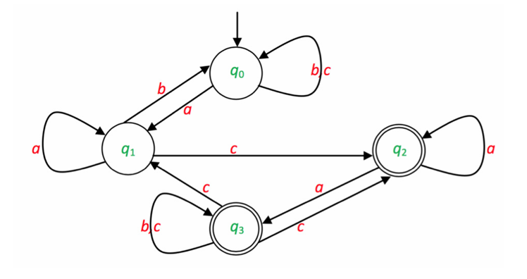
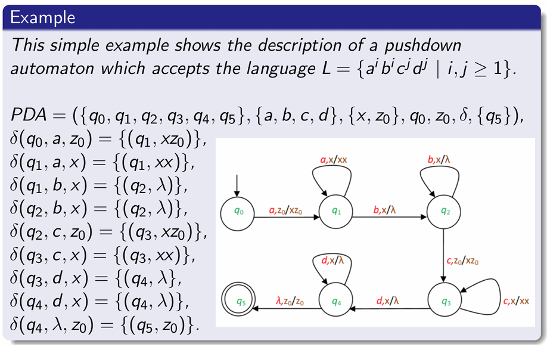
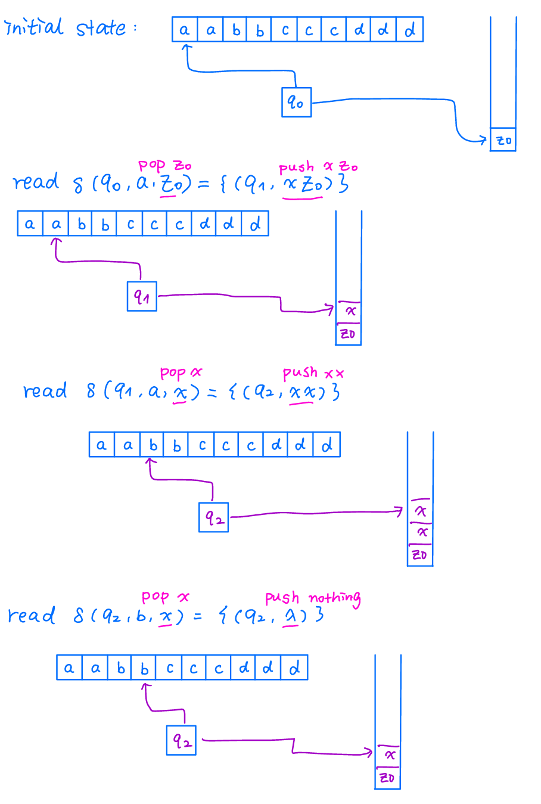
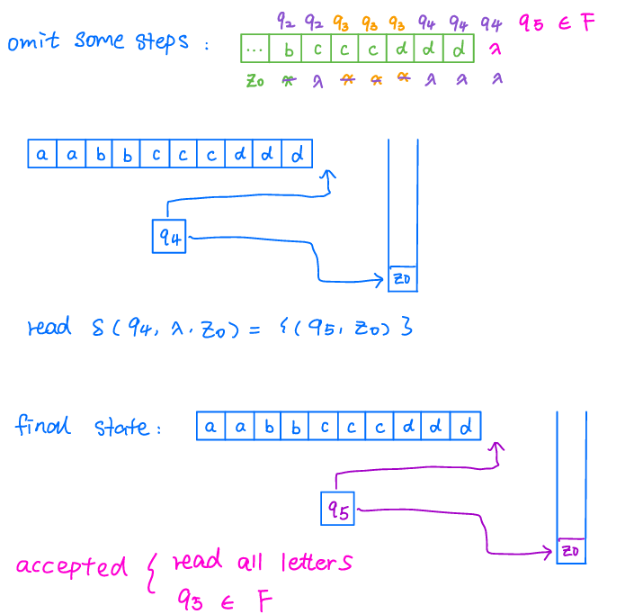

## Finite Automata

### Finite Automata &mdash; Defintion

Let $A=\left(Q, T, q_{0}, \delta, F\right)$. It is a finite automaton (recognizer), where $Q$ is the finite set of (inner) states, $T$ is the input (or tape) alphabet, $q_{0} \in Q$ is the initial state, $F \subseteq Q$ is the set of final (or accepting) states and $\delta$ is the transition function as follows.

- $\delta: Q \times T \rightarrow Q$ (for deterministic[^1] finite automata);

- $\delta: Q \times T \rightarrow 2^{Q}$ (for nondeterministic[^2] finite automata).

#### Description

One can imagine a finite automaton as a machine equipped with an input tape. The machine works on a discrete time scale. At every point of time the machine is in one of its states, then it reads the next letter on the tape (the letter under the reading head), and then, according to the transition function (depending on the actual state and the letter being read,) it goes to the next state. It may happen in some variations that there is no transition defined for the actual state and letter, then the machine gets stuck and cannot continue its run. This case the automaton is called **partially defined** finite automaton. Otherwise the automaton is called **completely defined** finite automaton.

#### Example

Let the finite automaton $A$ be
$$
\begin{aligned}
& A=\left(\left\{q_0, q_1, q_2, q_3\right\},\{a, b, c\}, q_0, \delta,\left\{q_2, q_3\right\}\right), \text { where } \\
& \delta\left(q_0, a\right)=\left\{q_1\right\} \\
& \delta\left(q_0, b\right)=\left\{q_0\right\} \\
& \delta\left(q_0, c\right)=\left\{q_0\right\} \\
& \delta\left(q_1, a\right)=\left\{q_1\right\} \\
& \delta\left(q_1, b\right)=\left\{q_0\right\} \\
& \delta\left(q_1, c\right)=\left\{q_2\right\} \\
& \delta\left(q_2, a\right)=\left\{q_2, q_3\right\} \\
& \delta\left(q_3, b\right)=\left\{q_3\right\} \\
& \delta\left(q_3, c\right)=\left\{q_1, q_2, q_3\right\} .
\end{aligned}
$$

Representation &mdash; Cayley Table:

$$
\begin{array}{|c|c|c|c|c|}
\hline T \quad Q & \rightarrow q_0 & q_1 & \subset \overline{q_2} \supset & \left(\overline{q_3}\right) \\
\hline a & q_1 & q_1 & q_2, q_3 & - \\
\hline b & q_0 & q_0 & - & q_3 \\
\hline \text { c } & q_0 & q_2 & - & q_1, q_2, q_3 \\
\hline
\end{array}
$$

When an automaton is given by a Cayley table, then the 0th line and the 0th column of the table are reserved for the states and for the alphabet, respectively (and it is marked in the 0th element of the 0th row).

The initial state should be the first among the states (it is advisable to mark it by a $\rightarrow$ sign also). The final states should also be marked, they should be circled.

The transition function is written into the table: the elements of the set $\delta(q, a)$ are written (if any) in the field of the column and row marked by the state $q$ and by the letter a.

Representation &mdash; Graph

Figure 1 shows that automata can also be defined in a graphical way: let the vertices (nodes, that are drawn as circles in this case) of a graph represent the states of the automaton (we may write the names of the states into the circles). The initial state is marked by an arrow going to it not from a node. The accepting states are marked by double circles. The labeled arcs (edges) of the graph represent the transitions of the automaton. If $p \in \delta(q, a)$ for some $p, q \in Q, a \in T$, then there is an edge from the circle representing state $q$ to the circle representing state $p$ and this edge is labeled by a.

### Language Accepted by Finite Automaton &mdash; Definition

Let $A=\left(Q, T, q_{0}, \delta, F\right)$ be an automaton and $w \in T^{*}$ be an input word. We say that $w$ is accepted by $A$ if there is a run of the automaton, i.e., there is an alternating sequence $q_{0} t_{1} q_{1} \ldots q_{k-1} t_{k} q_{k}$ of states and transitions, that starts with the initial state $q_{0},\left(q_{i} \in Q\right.$ for every $i$, they are not necessarily distinct, e.g., $q_{i}=q_{j}$ is allowed even if $i \neq j$ ) and for every of its transition $t_{i}$ of the sequence

- $t_{i}: q_{i} \in \delta\left(q_{i-1}, a_{i}\right)$ in nondeterministic cases,

- $t_{i}: q_{i}=\delta\left(q_{i-1}, a_{i}\right)$ in deterministic cases, where $a_{1} \ldots a_{k}=w$, and $q_{k} \in F$. This run is called an accepting run.

All words that $A$ accepts form $L(A)$, the language accepted (or recognized) by the automaton $A$.

### Determinization of Finite Automata &mdash; Theorem

For every finite automaton there is an equivalent (completely defined) deterministic finite automaton.

### Equivalence of Finite Automata and Regular Grammar

Every language generated by a regular grammar is accepted by a finite automaton.

[^1]: Deterministic: one input, only one result.

[^2]: Non-deterministic: one input, more than one result.

----

## Regular Languages

The language $L$ is regular, if there exists a regular grammar $G$ such that $L=L(G)$.

## Regular Normal Form

### Regular Grammars &mdash; Definition

A grammar $G=(N, T, S, P)$ is regular if each of its productions has one of the following forms: $A \rightarrow u, A \rightarrow u B$, where $A, B \in N, u \in T^{*}$. The languages that can be generated by regular grammars are the regular languages (they are also called type 3 languages of the Chomsky hierarchy).

### Regular Normal Form &mdash; Definition

A grammar $G=(N, T, S, P)$ is regular if each of its productions has one of the following forms: $A \rightarrow a, A \rightarrow a B, S \rightarrow \lambda$, where $A, B \in N, a \in T$. The languages that can be generated by these grammars are the regular languages.

## Context-Free Languages

The language $L$ is context-free, if there exists a context-free grammar $G$ such that $L=L(G)$.

The grammar $G$ is called context-free, if all of its productions have a form

$$
A \rightarrow p,
$$

where $A \in N$ and $p \in V^{*}$.

----

## Pushdown Automata

### Definition

A pushdown automaton (PDA) is the following 7-tuple:

$$
P D A=\left(Q, T, Z, q_{0}, z_{0}, \delta, F\right)
$$

where

- $Q$ is the finite nonempty set of the states,

- $T$ is the set of the input letters (finite nonempty alphabet),

- $Z$ is the set of the stack symbols (finite nonempty alphabet),

- $q_{0}$ is the initial state, $q_{0} \in Q$,

- $z_{0}$ is the initial stack symbol, $z_{0} \in Z$,

- $\delta$ is the transition function having a form

    $Q \times\{T \cup\{\lambda\}\} \times Z \rightarrow 2^{Q \times Z^{*}}$, and

- $F$ is the set of the final states, $F \subseteq Q$.

### Description

In order to understand the operating principle of the pushdown automaton, we have to understand the operations of finite automata and the stack memory. The stack is a LIFO (last in first out) memory, which has two operations, PUSH and POP. When we use the POP operation, we read the top letter of the stack, and to the same time we delete it. When we use the PUSH operation, we add a word to the top of the stack.

The pushdown automaton accepts words over the alphabet $T$. At the beginning the PDA is in state $q_0$, we can read the first letter of the input word, and the stack contains only $z_0$. In each step, we use the transition function to change the state and the stack of the PDA. The PDA accepts the input word, if and only if it can read the whole word, and it is in a final state when the end of the input word is reached.

Consider reading the word: aabbcccddd in Figure 2

