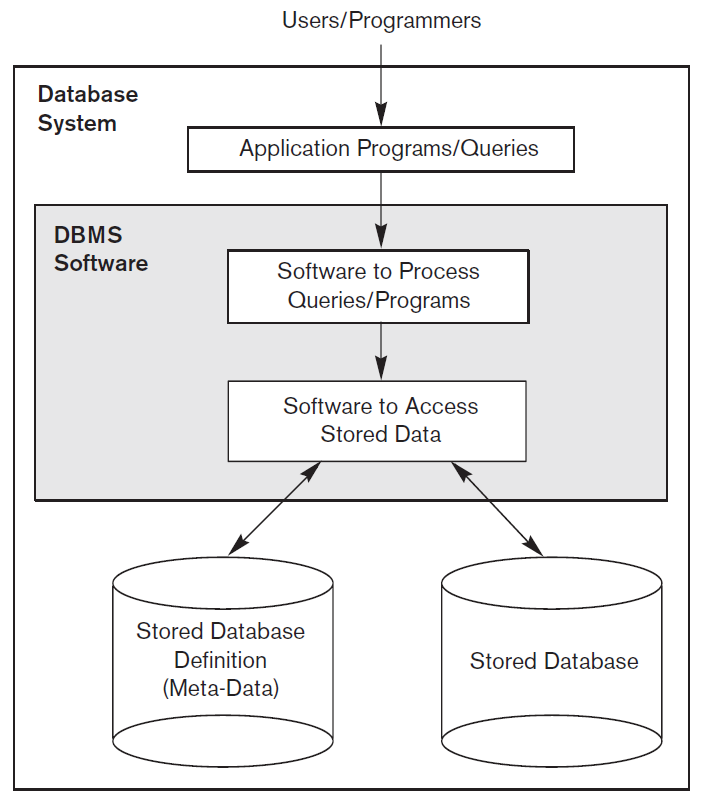
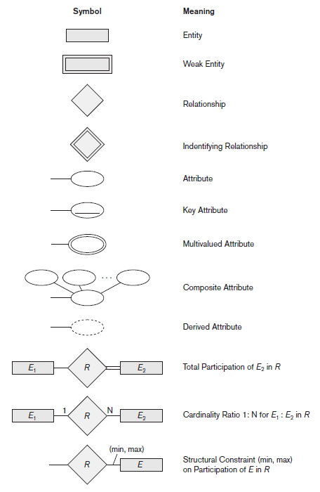
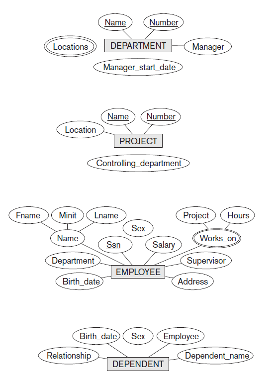
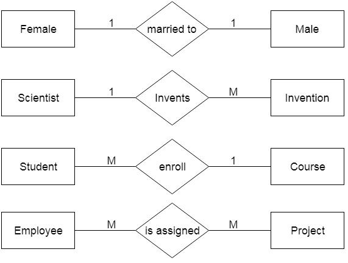
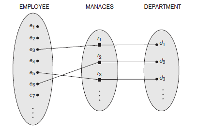

## Basic Terms

#### Database

A collection of related data

- Represents some aspects of the real world
- Logically coherent collection of data with some inherent meaning.
- Designed, built and populated with data for a specific purpose

#### Data

known facts that can be recorded and have implicit meaning

#### Meta-data

database definition or descriptive information stored by the DBMS in the form of a database catalog or dictionary. 

## Database Management System

#### Definition

collection of programs that enables users to create and maintain the database.

### Functionalities

- **Define:** specifying data type, structures and constraints
- **Construct:** Storage of data on some medium
- **Manipulate:** querying to retrieve data, updating database and generating reports
- **Share:** multiple users and programs access the DB concurrently
- Protection and Maintenance



### Characteristics

- Self-describing nature of a database system:
  - Database system &rightarrow; Database + Meta-data

    Meta-date &rightarrow; stored in DBMS catalog &rightarrow; used by DBMS software and database users
  - DBMS software must work equally well with any number of database applications.
  - In traditional file processing, data definition &rightarrow; part of application programs &rightarrow; work with only one specific DB.
- Insulation between programs and data, and data abstraction
  - In traditional file processing &rightarrow; structure of data files is embedded in the application programs.
  - In DB approach &rightarrow; structure of data files is stored in catalog &rightarrow; separate from access programs (program data independence)
  - Data abstraction allows program-data independence
  - DBMS provide users with conceptual representation of data
  - Data model &rightarrow; type of data abstraction &rightarrow; provides conceptual representation
- Support of multiple views of data
  - many users require different view of database
  - View &rightarrow; subset of database &rightarrow; contains virtual data derived from database
- Sharing of data and multiuser transaction
  - Must include concurrency control &mdash; prevent two users of modifying the same data in the same time.
  - OLTP (Online transaction processing)
  - must enforce several transaction properties:
    - isolation: example if a seat is being booked, it must be blocked from other agents.
    - atomicity: ensure that transaction is executed completely or not at all.

----

## Basic Concepts of ER Model

ER model stands for an Entity-Relationship model. It is a high-level data model. This model is used to define the data elements and relationship for a specified system. It develops a conceptual design for the database. It also develops a very simple and easy design view of data. In ER modeling, the database structure is portrayed as a diagram called an entity-relationship diagram.

#### Entity

represents a real world object or concept. 

#### Attributes

properties that describe the entities.

#### Composite Attributes

Can be divided into further parts, e.g. *name &rightarrow; first, middle, last*.

#### Simple Attributes

Can’t be divided, e.g. *weight*.

#### Single-Valued Attributes

Single value for a particular entity, e.g. *age*.

#### Multivalued Attributes 

Set of values for a particular entity, e.g. *known languages*

#### Derived Attribute

Can be derived from other attributes, e.g. *age &rightarrow; date of birth*

#### Complex Attributes

Has multi-valued and composite components

- Multivalued represented '{ }'
- Composite represented '( )'
- Example: {CollegeDegrees(College, Year, Degree, Field)}

#### Null Values

Something which is not applicable or unknown

#### Entity Type

A collection of entities that have the same attributes

#### Entity Set

Collection of entities of a particular entity type at a point in time. 

#### Key Attribute

Attribute capable of identifying each entity uniquely

#### Value Set of Attributes

Set of values that can be assigned to an attribute.

#### Weak Entity Types

Entity types that do not have key attributes of their own.

- Identified by relating to another entity type called the identifying or the owner entity type.
- Relationship between weak entity type to its owner → identifying relationship





----

## Relation

##### Relationship

Association among 2 or more entities.

#### Degree of Relationship

Number of entity types that participate in a relationship (Unary, binary, ternary)

### Relationship Constraints

1. **Cardinality Ratio**
    - Max number of relationship instances that an entity can participate in
    - Binary Relationship → 1:1, 1:N, N:1, M:N



1. **Relationship Constraints**
    - Specifies whether existence of an entity depends on its being related to another entity.
    - Total and Partial participation (Figure 5)



### Attributes of Relationship Types

- Attributes of 1:1 or 1:N relationship types can be migrated to one of the participating entity types
  - In 1:1 type, attributes can be migrated to either of the entity types
  - In 1:N or N:1 type, attributes are migrated only to the entity type on the N-side of the relationship
  - In M:N type some attributes can be determined by a combination of participating entities.

----

## Types of Databases

### Relational Databases

- Represents data as a collection of tables
- A table is also called a relation
- Each row → tuple.
- Column headers → attributes
- **Domain** - Set of atomic values allowed for an attribute
- **Relation Schema** - Describes a relation. Made up of a relation name R and a list of attributes $A_1, A_2,\dots A_n$
- **Degree of a relation** - number of attributes in a relation schema
- **Cardinality** - total number of tuples present in a relation
- **Relational database schema** - set of a relation schemas and a set of integrity constraints.
- **Relation state** - set of tuples at a given time

#### Characteristics of Relations

- Tuples in a relation need not have any particular order.
- An n-tuple → ordered list on n values, so ordering of values in a tuple in important.
- A tuple → set of (<attribute>, <value>) pair, then ordering of attributes is not important.
- Each value in a tuple is an atomic value
- The relation schema can be represented as a declaration or assertion.
- Each tuple can be interpreted as a fact.

#### Relational Model Constraints

**Inherent model-based:** Inherent in the data model

**Schema based** - defined directly in the schemas of the data model.

**Application based** - must be expressed and enforced by the application programs

#### Schema-based Constraints

**Domain Constraints:**

- Must be atomic
- Performs data type check

**Key Constraints:**

- An attribute that can uniquely identify each tuple in a relation is called a key.  Must be unique and minimal superkey.
- **Superkey** - specifies that no two tuples can have the same value
- Every relation has at least one superkey → set of all attributes.
- **Candidate Keys** - set of attributes that uniquely identify a tuple in a relation.

**Constraints on NULL values** - specifies whether null values are permitted or not.

**Entity integrity constraint** - no primary key value can be null.

**Referential Integrity Constraint** - specified between 2 relations, a tuple in one relation that refers to another relation must refer to an existing tuple in that relation.

**Foreign Key** must satisfy:

- Same domain
- Value of FK in a tuple either occurs as a value of PK or is NULL.

### Object Relational Databases (Object-oriented databases)

A database management system (DBMS) similar to a relational database, but with an object-oriented database model: objects, classes and inheritance are directly supported in database schemas and in the query language. In addition, just as with pure relational systems, it supports extension of the data model with custom data types and methods. An object–relational database can be said to provide a middle ground between relational databases and object-oriented databases. In object–relational databases, the approach is essentially that of relational databases: the data resides in the database and is manipulated collectively with queries in a query language; at the other extreme are OODBMSes[^1] in which the database is essentially a persistent object store for software written in an object-oriented programming language, with a programming API for storing and retrieving objects, and little or no specific support for querying.

[^1]: Object-oriented database management systems

#### About Object Types [^2]

An object type is a kind of data type.

You can use an object in the same ways that you use standard data types such as `NUMBER` or `VARCHAR2`. For example, you can specify an object type as the data type of a column in a relational table, and you can declare variables of an object type. The value is a variable or an instance of that type. An object instance is also called an object. 

Object types serve as blueprints or templates that define both structure and behavior. Object types are database schema objects, subject to the same kinds of administrative control as other schema objects. Application code can retrieve and manipulate these objects.


[^2]: I will use [Oracle Databases](https://docs.oracle.com/en/database/oracle/oracle-database/21/adobj/key-features-object-relational-model.html#GUID-0C7CE261-467B-4F8B-A04D-B0900E1FB284) implementation.

### NoSQL (Not Only SQL) Databases

NoSQL is a type of database management system (DBMS) that is designed to handle and store large volumes of unstructured and semi-structured data. Unlike traditional relational databases that use tables with pre-defined schemas to store data, NoSQL databases use flexible data models that can adapt to changes in data structures and are capable of scaling horizontally to handle growing amounts of data.

#### Main Types

##### Key-value stores

In it the aggregate is opaque to the database. The advantage of opacity is that we can store whatever we like in the aggregate. The database may impose some general size limit, but other than that we have complete freedom. We can only access an aggregate by lookup based on its key. In other words, it stores data as key-value pairs.

##### Document Databases

- Able to see a structure in the aggregate.
- A document database imposes limits on what we can place in it, defining allowable structures and types. In return, however, we get more flexiblity in access.
- We can submit queries to the database based on the fields in the aggregate, we can retrieve part of the aggregate rather than the whole thing, and database can create indexed based on the contents of the aggregate.

##### Graph Databases

- Graph databases are motivated by small records with complex interconnections.
- A graph is a graph data structure of nodes connected by edges.
- It is ideal for capturing any data consisting of complex relationships such as social networks.
- It makes the traversal along the relationships very cheap.
- More likely to run on a single server rather than distributed across clusters.

##### Column-Family Databases

- Stores groups of columns for all rows as the basic storage unit.
- A two-level aggregate structure, first key is described as a row identifier, picking up the aggregate of interest. 
- The row aggregate is itself formed of a map of more detailed values.
- The second-level values are referred to as columns
- It organizes their columns into column families. Each column has to be part of a single column family, and the column acts as unit for access.
- Data can be structured in two ways:
  - **Row-oriented**: Each row is an aggregate.
  - **Column-oriented**: Each column family defines a record type with rows for each of the records.
- You can add any column to any row, and rows can have very different column keys.


----

## Functional Dependency

Denoted by $X \rightarrow Y$, between two sets of attributes $X$ and $Y$ that are subsets of $R$ specifies a **constraint** on the possible tuples that can form a relation state $r$ of $R$. The constraint is that, for any two tuples $t_1$ and $t_2$ in $r$ that have  $t_1[X] = t_2[X]$, they must also have  $t_1[Y] = t_2[Y]$

In other words, two tuples of $r(R)$ agree on their $X$-value, they must agree on their $Y$-value. It is a concept that specifies the relationship between two sets of attributes where one attribute determines the value of another attribute. It is denoted as $X$ &rightarrow; $Y$, where the attribute set on the left side of the arrow, $X$ is called **Determinant**, and $Y$ is called the **Dependent**.

### Armstrong's Axioms

*Note: IR 1-3 are the main axioms, IR 4-6 are derived.*

$$
\begin{array}{ll}
\text{IR1 (Reflexive Rule):} & \text{If } X \supseteq Y, \text{ then } X \rightarrow Y \\
\text{IR2 (Augmentation Rule):} & \{X \rightarrow Y\} \models XZ \rightarrow YZ \\
\text{IR3 (Transitive Rule):} & \{X \rightarrow Y, Y \rightarrow Z\} \models X \rightarrow Z \\
\text{IR4 (Decomposition):} & \{X \rightarrow YZ\} \models X \rightarrow Y \\
\text{IR5 (Union):} & \{X \rightarrow Y, X \rightarrow Z\} \models X \rightarrow YZ \\
\text{IR6 (Pseudotransitive):} & \{X \rightarrow Y, WY \rightarrow Z\} \models WX \rightarrow Z
\end{array}
$$

----

## Conceptual Database Design

Conceptual database design is the process of identifying the essential data elements, relationships, and constraints in a data model, which represents a particular organization's business requirements. The conceptual design stage is the first step in the database design process, which precedes the logical and physical design stages. In this article, we will discuss the conceptual database design, its objectives, its process, and the key components of a conceptual data model.

### Objectives of Conceptual Database Design

- **Identify the entities and their attributes** &mdash; Entities are objects or concepts that exist in the real world and can be distinguished from each other. Attributes are the properties or characteristics of the entities. The first objective of conceptual database design is to identify the entities and their attributes that are relevant to the organization's business requirements.
- **Define the relationships** &mdash; Relationships are the associations between entities. The second objective of conceptual database design is to define the relationships between the identified entities. Relationships can be one-to-one, one-to-many, or many-to-many.
- **Establish the constraints** &mdash; Constraints are the rules that govern the relationships between entities. The third objective of conceptual database design is to establish the constraints between entities, which ensure data consistency and integrity.

### Process of Conceptual Database Design

- **Requirements gathering** &mdash; The first step in conceptual database design is to gather the business requirements from the stakeholders. This involves identifying the data elements, relationships, and constraints that are essential to the organization's business requirements.
- **Entity-relationship modeling** &mdash; The second step in conceptual database design is to create an entity-relationship (ER) model, which represents the entities, attributes, and relationships between the entities. The ER model is a graphical representation of the data elements and their relationships.
- **Normalization** &mdash; The third step in conceptual database design is to normalize the ER model, which ensures that the data is organized efficiently and reduces data redundancy
- **Review and feedback** &mdash; The fourth step in conceptual database design is to review the ER model with the stakeholders and incorporate their feedback into the design.

----

## ER-to-Relational Mapping

The process of converting an ER diagram into a relational schema involves:

- Mapping Entity Sets: Each entity set becomes a table.
- Mapping Attributes: Attributes become columns in the respective tables.
- Mapping Relationships: Foreign keys are used to represent relationships between tables.


----

## SQL

Structured query language (SQL) is a programming language for storing and processing information in a relational database.

### DDL (Data Definition Language)

- Specification notation for defining the database schema

    ```SQL
    create table instructor(
        ID char(5),
        name varchar(20),
        dept_name varchar(20),
        salary numeric(8,2)
    )
    ```

- DDL compiler generates a set of table templates stored in a `data_dictionary`
- Data dictionary contains metadata (i.e., data about data)
  - Database schema
  - Integrity constraints - Primary key (ID uniquely identifies instructors)
  - Authorization - Who can access what

### DML (Data Manipulation Language)

- Language for accessing and updating the data organized by the appropriate data model
  - DML also known as query language
- There are basically two types of data-manipulation language
  - Procedural DML -- require a user to specify what data are needed and how to get those data.
  - Declarative DML -- require a user to specify what data are needed without specifying how to get those data.
- Declarative DMLs are usually easier to learn and use than are procedural DMLs.
- Declarative DMLs are also referred to as non-procedural DMLs
- The portion of a DML that involves information retrieval is called a query language.

### DCL (Data Control Language)

DCL includes commands such as `GRANT` and `REVOKE` which mainly deal with the rights, permissions, and other controls of the database system.

### Simple Queries

Simple queries will display data from a few tables. An SQL query consists of three pieces, or blocks:

- `SELECT` block -- tells the database which columns of data you want it to return.
- `FROM` block -- specifies which table (or tables) you want to search.
- `WHERE` block -- allows you to search for records with certain characteristics.

### Joining Tables

A join table contains common fields from two or more other tables. A `JOIN` clause combines columns from one or more tables into a new table.

#### Different Types of SQL `JOIN`s

- `(INNER) JOIN`: Returns records that have matching values in both tables.
- `LEFT (OUTER) JOIN`: Returns all records from the left table, and the matched records from the right table.
- `RIGHT (OUTER) JOIN`: Returns all records from the right table, and the matched records  from the left table.
- `FULL (OUTER) JOIN`: Returns all records when there is a match in either left or right table.

