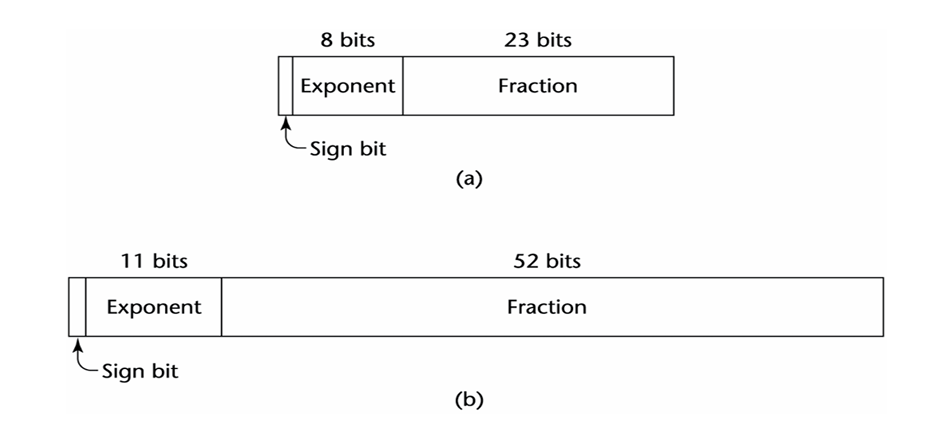
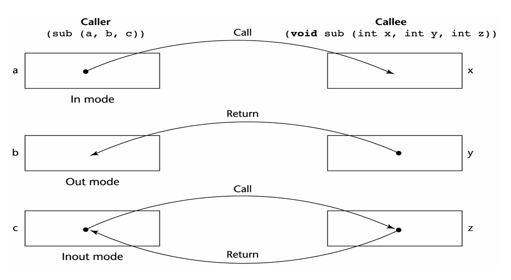

## Types

A data type defines a collection of **data objects** and a set of **predefined operations** on those objects. Computer programs produce results by manipulating data.

A **descriptor** is the collection of the attributes of a variable. In an implementation a descriptor is a collection of memory cells that store variable attributes. If the attributes are static, descriptor are required only at compile time. They are built by the compiler, usually as a part of the symbol table, and are used during compilation. For dynamic attributes, part or all of the descriptor must be maintained during execution. Descriptors are used for type checking and by allocation and deallocation operations.

### Primitive Data Types

Those not defined in terms of other data types are called primitive data types. The primitive data types of a language, along with one or more type constructors provide structured types.

#### Numeric Types

1. **Integer**

    - Almost always an exact reflection of the hardware, so the mapping is trivial.
    - There may be as many as eight different integer types in a language.
    - *Java* has four: **byte**, **short**, **int**, and **long**.
    - Integer types are supported by the hardware.

1. **Floating-point**

    - Model real numbers, but only as approximations for most real values.
    - On most computers, floating-point numbers are stored in binary, which exacerbates the problem.
    - Another problem is the loss of accuracy through arithmetic operations.
    - Languages for scientific use support at least two floating-point types; sometimes more (e.g. **float**, and **double**.)
    - The collection of values that can be represented by a floating-point type is defined in terms of precision and range.
    - **Precision**: is the accuracy of the fractional part of a value, measured as the number of bits. Figure 1 shows single and double precision.
    - **Range**: is the range of fractions and exponents.

    

1. **Decimal**
    - Most larger computers that are designed to support business applications have hardware support for **decimal** data types.
    - Decimal types store a fixed number of decimal digits, with the decimal point at a fixed position in the value.
    - These are the primary data types for business data processing.
    - **Advantage**: accuracy of decimal values.
    - **Disadvantages**: limited range since no exponents are allowed, and its representation wastes memory.

#### Boolean Types

They are used to represent switched and flags in programs. The use of Booleans enhances readability.

- One popular exception is *C89*, in which numeric expressions are used as conditionals. In such expressions, all operands with nonzero values are considered true, and zero is considered false.

#### Character Types

Char types are stored as numeric codings (ASCII / Unicode). Traditionally, the most commonly used coding was the **8-bit** code ASCII (American Standard Code for Information Interchange). A 16-bit character set named Unicode has been developed as an alternative.

- *Java* was the first widely used language to use the Unicode character set. Since then, it has found its way into JavaScript and C\#.

#### Character String Types

A character string type is one in which values are sequences of characters.

**Important Design Issues:**

1. Is it a primitive type or just a special kind of array?
2. Is the length of objects static or dynamic?

- *C* and *C++* use **`char` arrays** to store `char` strings and provide a collection of string operations through a standard library whose header is `string.h`.
- How is the length of the char string decided?
  - The null char which is represented with 0 .
  - Example:

    ```C
    char *str = "apples"; // char ptr points at the str applesO
    ```

  - In this example, `str` is a `char` pointer set to point at the string of characters, `apples0` , where `0` is the `null char`.

**String Typical Operations:**

- Assignment
- Comparison ( $=,>$, etc.)
- Catenation
- Substring reference
- Pattern matching

In *Java*, strings are supported as a **primitive** type by `String` class

**String Length Options:**

- **Static Length String**: The length can be static and set when the string is created. This is the choice for the **immutable** objects of Java's `String` class as well as similar classes in the *C++* standard class library and the .NET class library available to *C\#*.
- **Limited Dynamic Length Strings**: Allow strings to have varying length up to a **declared and fixed maximum** set by the variable's definition, as exemplified by the strings in *C*.
- **Dynamic Length Strings**: Allows strings various length with no maximum. Requires the overhead of dynamic storage allocation and deallocation but provides flexibility. Ex: *Perl* and *JavaScript*.

### User-Defined Ordinal Types

An ordinal type is one in which the range of possible values can be easily associated with the set of positive integers

Examples of primitive ordinal types in *Java*:

- `int`
- `char`
- `boolean`

#### Enumeration Types

All possible values, which are named constants, are provided in the definition

```c++
enum colors {red, blue, green, yellow, black};
colors myColor = blue, yourColor = red;
myColor++; // would assign green to myColor
```

- The enumeration constants are typically implicitly assigned the integer values, $0,1, \ldots$, but can be explicitly assigned any integer literal.

#### Subrange Types

An ordered contiguous subsequence of an ordinal type

- Example: $12, \dots, 18$ is a subrange of integer type

### Array Types

An array is an aggregate of **homogeneous** data elements in which an individual element is identified by its position in the aggregate, relative to the first element. A reference to an array element in a program often includes one or more non-constant subscripts. Such references require a run-time calculation to determine the memory location being referenced.

### Record Types

A record is a possibly **heterogeneous** aggregate of data elements in which the individual elements are identified by names. 

In *C*, *C++*, and *C#*, records are supported with the `struct` data type.

### Unions Types

A union is a type whose variables are allowed to store different type values at different times during execution.

In the *TypeScript* example below, `code` can be either a `string` or a `number`:

```ts
function printStatusCode(code: string | number) {
  console.log(`My status code is ${code}.`)
}
```

### Pointers

A pointer type in which the vars have a range of values that consists of **memory addresses** and a special value, nil. The value nil is not a valid address and is used to indicate that a pointer cannot currently be used to reference any memory cell.

#### Pointer Operations

- A pointer type usually includes two fundamental pointer operations, assignment and dereferencing.
- Assignment sets a pointer variable's value to some useful address.
- Dereferencing takes a reference through one level of indirection.
- In C++, **dereferencing** is explicitly specified with the (`*`) as a prefix unary operation.
- If `ptr` is a pointer variable with the value 7080, and the cell whose address is 7080 has the value 206, then the assignment

    ```C
    j = *ptr
    ```

    sets `j` to 206.

    

## Variables

A variable is an abstraction of a memory cell(s) characterized as a sextuple of attributes: *(Name, Address, Value, Type, Lifetime, Scope)*

### Name

Not all variables have names: **Anonymous**, heap-dynamic variables

### Address

The memory address with which it is associated

- A variable may have **different addresses at different times** during execution. If a subprogram has a local variable that is allocated from the run time stack when the subprogram is called, different calls may result in that variable having different addresses.
- The address of a variable is sometimes called its **l-value** because that is what is required when a variable appears in the **left** side of an assignment statement.

#### Aliases

If two variable names can be used to access the same memory location, they are called aliases

- Aliases are created via pointers, reference variables, *C* and *C++* unions.
- Aliases are harmful to readability (program readers must remember **all** of them)

### Type

Determines the range of values of variables and the set of operations that are defined for values of that type; in the case of floating point, type also determines the precision.

- For example, the `int` type in *Java* specifies a value range of `-2147483648` to `2147483647`, and arithmetic operations for addition, subtraction, multiplication, division, and modulus.

### Value

The value of a variable is the contents of the memory cell or cells associated with the variable.

- A variable's value is sometimes called its **r-value** because that is what is required when a variable appears in the **right** side of an assignment statement.

## Operations

**Operators** are symbols that instruct the computer to perform a single, simple task.

**Operands** are the data, the expressions or values, on which they act or work.

Operators and their operands are integral to programming, so understanding them is a prerequisite for writing and understanding programs. Many operators are familiar and easy to understand, while others are less common or have unexpected behaviors.

Most *C++* operators consist of one or two characters: `=`, `+`, `*`, `<=`, or `==`. Some *C++* operators consist of complete words: `new` and `return`.


- Operands may be constants.
- Operands may be variables.
- Operands may be more complex expressions: `2 * A` and `5 * B` are the left and right hand `+`. operands, respectively.
- The value returned by a non-void function may also be an operand.

### Number of Operands

#### Unary Operators

Unary operators require one operand, typically following the operator but sometimes preceding it:

```C
-N
```

The combination `-` and `N` forms an expression whose value is the negative of the value stored in `N` (e.g., `-5 = -5` or `-(-5) = 5` ). However, the operation does not change the value stored in `N`.

#### Binary Operators

Binary operators require two operands, as illustrated by the familiar arithmetic and assignment operators:

```C
A = counter + 5
```

The addition operator, `+`, runs before the assignment operator, `=`, making `counter` and `5` its operands. The assignment operator, `=`, runs next, making `A` and `counter + 5` its operands. The example ends with a semicolon, making it a statement (specifically, *an assignment statement*).

#### Ternary Operator

The conditional operator is *C++*'s only ternary operator, forming it with two symbols separating the required three operands:

```C
op1 ? op2 : op3
```

`op1`, `op2`, and `op3` the operator's three operands.

### Parentheses

Programmers can alter the precedence and associativity rules by placing parentheses in expressions. A parenthesized part of an expression has precedence over its adjacent un-parenthesized parts.

### Conditional Expressions

Sometimes if-then-else statements are used to perform a conditional expression assignment.

```C
if (count == 0) 
    average = 0; 
else 
    average = sum / count; 
```


## Control Statements

### Selection Statements

A selection statement provides the means of choosing between two or more paths of execution.

#### Two-Way Selection Statements

The general form of a two-way selector:

```
if (control_expression) 
then (clause) 
else (clause) 
```

Control expressions are specified in parenthesis if the `then` reserved word is not used to introduce the then clause, as in the C-based languages.

- C-based languages use braces to form compound statements.
- Control expressions are specified in parenthesis if the then reserved word is not used to introduce the then clause, as in the C-based languages.
- In contemporary languages, such as Java and C#, **only Boolean expressions** can be used for control expressions.
- In *Java* and contemporary languages, the static semantics of the language specify that the **`else`** clause is always paired with the nearest unpaired **`then`** clause.

    ```java
    if (sum == 0) 
        if (count == 0) 
            result = 0; 
        else 
            result = 1;
    ```

    In the above example, the else clause would be the alternative to the second then clause.

- To force the alternative semantics in *Java*, a different syntactic form is required, in which the inner if-then is put in a compound, as in

    ```java
    if (sum == 0) { 
        if (count == 0) 
            result = 0; 
    } 
    else
        result = 1; 
    ```

#### Multiple Selection Constructs

The **multiple selection** construct allows the selection of one of any number of statements or statement groups.

```
switch (expression) { 
    case constant_expression_1 : statement_1; 
    ... 
    case constant_expression_n : statement_n; 
    [default: statement_n+1]  
}
```

- The control expression and the constant expressions are integer type.
- The **`switch`** construct does not provide implicit branches at the end of those code segments.
- Selectable segments can be statement sequences, blocks, or compound statements.
- Any number of segments can be executed in one execution of the construct (a trade-off between reliability and flexibility-convenience.)
- To avoid it, the programmer must supply a break statement for each segment.
- **`default`** clause is for unrepresented values (if there is no **default**, the whole statement does nothing.)

### Iterative Statement

The repeated execution of a statement or compound statement is accomplished by iteration zero, one, or more times.

- Iteration is the very essence of the power of computer.
- The repeated execution of a statement is often accomplished in a functional language by recursion rather then by iteration.
- The primary possibilities for iteration control are logical, counting, or a combination of the two.
- The main choices for the location of the control mechanism are the top of the loop or the bottom of the loop.
- The **body** of a loop is the collection of statements whose execution is controlled by the iteration statement.
- The term **pretest** means that the loop completion occurs before the loop body is executed.
- The term **posttest** means that the loop completion occurs after the loop body is executed.
- The iteration statement and the associated loop body together form an **iteration construct**.

#### Counter-Controlled Loops

- A counting iterative control statement has a variable, called the **loop variable**, in which the count value is maintained.
- It also includes means of specifying the **initial** and **terminal** values of the loop variable, and the difference between sequential loop variable values, called the **stepsize**.
- The initial, terminal and stepsize are called the **loop parameters**.
- Loop variable **must be an integer** and may be either negative or positive.

```C
for (i = 0, i < 10; i++)
```

#### Logically Controlled Loops

- In *C* and *C++*, the control expression for the posttest version is treated just like in the pretest case (`while-do` and `do-while`)
- The only real difference between the do and the while is that the do always causes the loop body to be executed **at least once**.

## Blocks

A **block** is a program unit which may occur only within another program unit. Formally, a block consists of a **beginning**, a **body** and an **end**. The beginning and the end of a block are indicated by a special character sequence or a reserved word. The body contains declarations and executable statements. Similarly to what has been mentioned about the structure of subprograms, these statements may either be mixed in an arbitrary fashion, or there is a separate declaration part and an executable part. Blocks cannot have parameters, but may have a name in certain languages (usually specified in the form of a label placed before the beginning of the block). Blocks may occur anywhere in the source code where executable statements are allowed.

A block is activated when it is reached by the control sequentially, or a `GOTO` statement jumps to its beginning. A block terminates if control reaches its end, a `GOTO` statement is used to leave the block, or if the whole program is terminated from within the block.

Allows a section of code to have its own local vars whose scope is minimized. Such vars are stack dynamic, so they have their storage allocated when the section is entered and deallocated when the section is exited.

```C
for (...) {
    // index will be deallocated after termination of the for-loop
    int index;
    ...
}
```

## Evaluation of Parameters

**Parameter evaluation** is the process of mapping formal and actual parameters when a subprogram is called; evaluation also determines the information which governs the communication of the parameters.

The formal parameter list is primary for parameter evaluation; **formal parameters** are defined in the specification of the subprogram, and they are declared only once. As opposed to formal parameters, **actual parameters** (or **arguments**) are specified in the calls themselves, which implies that there may be as many actual parameters as the number of times the subprogram is called. Therefore, it is always the formal parameter list which is determinative to parameter evaluation, since actual parameters are assigned to formal parameters.

## Parameter Passing Methods

### Semantic Models of Parameter Passing

Formal parameters are characterized by one of three distinct semantic models:

- **in mode**: They can receive data from corresponding actual parameters.
- **out mode**: They can transmit data to the actual parameter.
- **inout mode**: They can do both.

There are two conceptual models of how data transfers take places in parameter transmission:

- Either an **actual value** is copied (to the caller, to the callee, or both ways), or
- An access path is transmitted.

Most commonly, the access path is a simple **pointer** or **reference**.



### Implementation Models of Parameter Passing

#### Pass-by-Value

When a parameter is passed by value, the value of the actual parameter is used to initialize the corresponding formal parameter, which then acts as a local variable in the subprogram, thus implementing in-mode semantics.

**Disadvantages:**
Additional storage is required for the formal parameter, either in the called subprogram or in some area outside both the caller and the called subprogram. The actual parameter must be **copied** to the storage area for the corresponding formal parameter. "If the parameter is large such as an **array**, it would be costly.

#### Pass-by-Result

Pass-by-Result is an implementation model for **out-mode** parameters. When a parameter is passed by result, **no value** is transmitted to the subprogram.

- The corresponding formal parameter acts as a **local variable**, but just before control is transferred back to the caller, its value is transmitted back to the caller's actual parameter, which must be a variable.
- One problem with the pass-by-result model is that there can be an actual parameter collision, such as the one created with the call.

    ```C
    sub(p1, p1)
    ```

    In `sub`, assuming that the two formal parameters have different names, the two can obviously be assigned different values.

    Then whichever of the two is copied to their corresponding actual parameter **last** becomes the value of `p1`.

#### Pass-by-Value-Result

It is an implementation model for **inout-mode** parameters in which actual values are copied. It is a combination of pass-by-value and pass-by-result. 

- The value of the actual parameter is used to **initialize** the corresponding formal parameter, which then acts as a local variable.

    At subprogram termination, the value of the formal parameter is transmitted back to the actual parameter.

- It is sometimes called **pass-by-copy** because the actual parameter is copied to the formal parameter at subprogram entry and then copied back at subprogram termination.

#### Pass-by-Reference

Pass-by-reference is a second implementation model for **inout-mode** parameters. Rather than copying data values back and forth. This method transmits an **access path**, sometimes just **an address**, to the called subprogram. This provides the access path to the cell storing the actual parameter.

- The actual parameter is shared with the called subprogram.

**Advantages:**
The passing process is efficient in terms of time and space. Duplicate space is not required, nor is any copying.

**Disadvantages:**
Access to the formal parameters will be slower than pass-by-value, because of additional level of indirect addressing that is required.

- Inadvertent and erroneous **changes** may be made to the **actual parameter**.
- **Aliases** can be created as in *C++*.

    ```C
    void fun(int &first, int &second)
    ```

    If the call to fun happens to pass the same variable twice, as in

    ```C
    fun(total, total)
    ```

    Then first and second in fun will be aliases.

#### Pass-by-Name

The method is an **inout-mode** parameter transmission that doesn't correspond to a single implementation model.

- When parameters are passed by name, the actual parameter is, in effect, **textually** substituted for the corresponding formal parameter in all its occurrences in the subprogram.
- A formal parameter is bound to an access method at the time of the subprogram call, but the actual binding to a value or an address is delayed until the formal parameter is assigned or referenced.

## Scope

The scope of a variable is the range of statements in which the variable is visible. A variable is visible in a statement if it can be referenced in that statement.

- **Local variable** is local in a program unit or block if it is declared there.
- **Non-local variable** of a program unit or block are those that are visible within the program unit or block but are not declared there.

## Exceptions

Exception handling is a means of taking the handling of interruptions from the operating system to the level of the program. 

**Exceptions** are events that cause interruptions. **Exception handling** is an activity performed by the program if an exception occurs. The **exception handler** is the part of the program that runs after the occurrence of a given exception as a reaction to the event.

Similarly to the way in which certain interruptions may be masked at the operating system level, it is also possible to mask exceptions at the language level by making the monitoring of certain exceptions **disabled** or **enabled**.

Disabling the monitoring of an exception is the simplest form of exception handling: an event causes an interruption, which propagates to the level of the program raising an exception, of which the program takes no notice and continues running.

The effect of the unhandled exception on the further functioning of the program is completely unknown, it is possible that the program cannot recover from the exception at all, or its operation will be corrupted.

Exceptions usually have a **name** (which usually plays the role of the message describing the event) and a **code** (an integer).

```Java
public class ExceptionHandling {
    public static void main(String[] args) {
        try {
		        // 2. Exception catching
            int result = divide(10, 0);
            System.out.println("Result: " + result);
        } catch (ArithmeticException e) {
		        // 3. Exception handling
            System.out.println("Error: " + e.getMessage());
        }
    }

    public static int divide(int a, int b) {
        if (b == 0) {
		        // 1. Exception throwing
            throw new ArithmeticException("Cannot divide by zero");
        }
        return a / b;
    }
}
```

## Using the Memory

Imperative programming languages are, to varying degrees, abstractions of the underlying von Neumann computer architecture. The architecture’s two primary components are its memory, which stores both instructions and data, and its processor, which provides operations for modifying the contents of the memory. The abstractions in a language for the memory cells of the machine are variables. In some cases, the characteristics of the abstractions are very close to the characteristics of the cells; an example of this is an integer variable, which is usually represented directly in one or more bytes of memory. In other cases, the abstractions are far removed from the organization of the hardware memory, as with a three-dimensional array, which requires a software mapping function to support the abstraction.

- A program variable is an abstraction of a computer memory cell or collection of cells. Programmers often think of variables as names for memory locations

Memory is divided into different segments.

- **Stack:**
  - LIFO
  - used for local variables, functions, and managing scopes.
  - managed automatically
- **Heap:**
  - used for dynamic memory allocation.
  - allocate memory wherever available.
  - temporary variable storage.

- The memory cell to which a variable is bound somehow must be taken from a pool of available memory. This process is called **allocation**.
- **Deallocation** is the process of placing a memory cell that has been unbound from a variable back into the pool of available memory.
- The **lifetime** of a variable is the time during which the variable is bound to a specific memory location.
  - **Static variables** are those that are bound to memory cells before program execution begins and remain bound to those same memory cells until program execution terminates.
  - **Stack-dynamic variables** are those whose storage bindings are created when their declaration statements are elaborated, but whose types are statically bound. 
  
    **Elaboration** of such a declaration refers to the storage allocation and binding process indicated by the declaration, which takes place when execution reaches the code to which the declaration is attached.
  - **Explicit heap-dynamic variables** are nameless (abstract) memory cells that are allocated and deallocated by explicit  run-  time instructions written by the programmer.
  - **Implicit heap-dynamic variables** are bound to heap storage only when they are assigned values. In fact, all their attributes are bound every time they are assigned.
