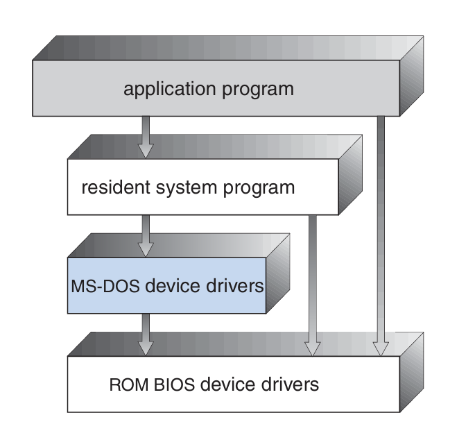
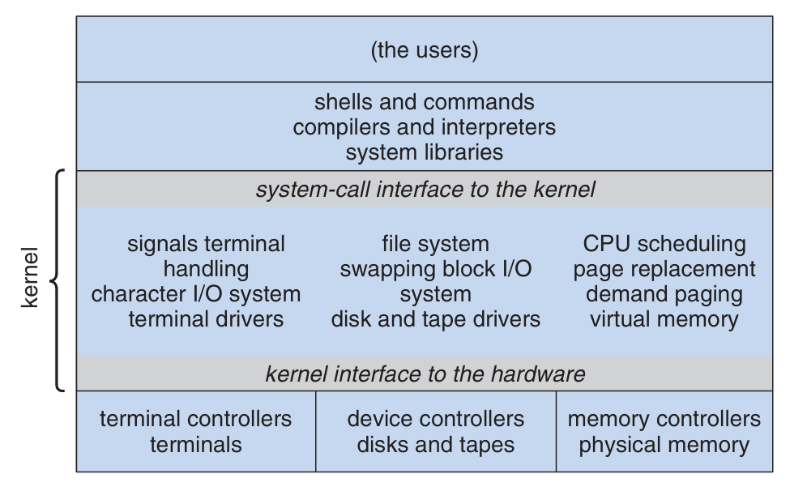
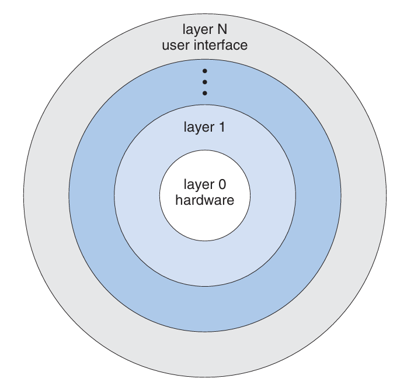
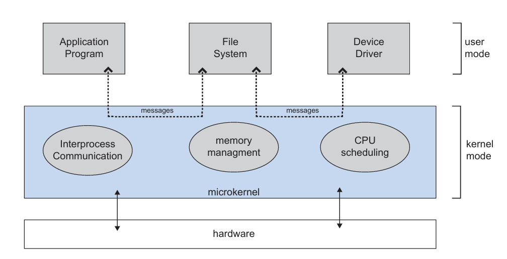
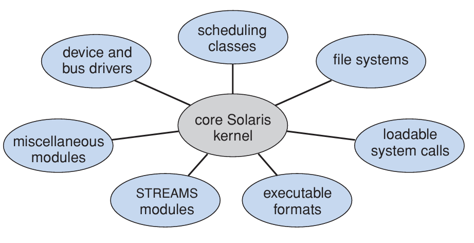
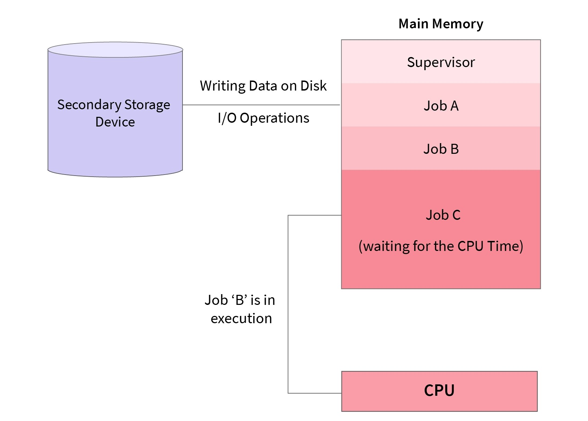
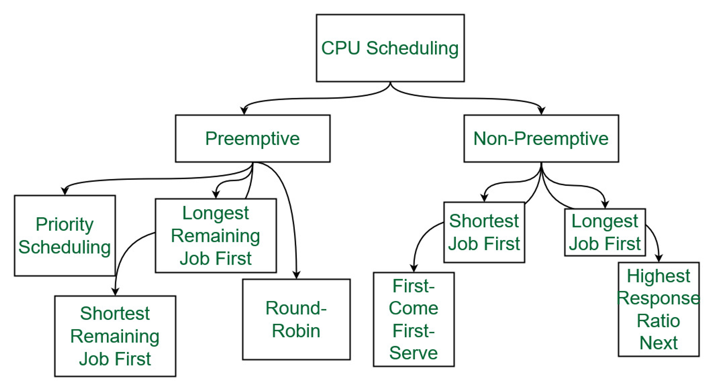

## The Concept of Operating System

An operating system is a program that manages a computer’s hardware. It also provides a basis for application programs and acts as an intermediary between the computer user and the computer hardware.

### Goals

- Execute user programs and make solving user problems easier.
- Make the computer system convenient to use.
- Use the computer hardware in an efficient manner.

### User View

The goal is to maximize the work (or play) that the user is performing. In this case, the operating system is designed mostly for **ease of use**, with some attention paid to performance and none paid to **resource utilization** -- how various hardware and software resources are shared. Performance is, of course, important to the user; but such systems are optimized for the single-user experience rather than the requirements of multiple users.

### System View

From the computer's point of view, the operating system is the program most intimately involved with the hardware. In this context, we can view an operating system as a **resource allocator**. A computer system has many resources that may be required to solve a problem: CPU time, memory space, file-storage space, I/O devices, and so on. The operating system acts as the manager of these resources. Facing numerous and possibly conflicting requests for resources, the operating system must decide how to allocate them to specific programs and users so that it can operate the computer system efficiently and fairly. As we have seen, resource allocation is especially important where many users access the same mainframe or minicomputer.

A slightly different view of an operating system emphasizes the need to control the various I/O devices and user programs. An operating system is a **control program**. A control program manages the execution of user programs to prevent errors and improper use of the computer. It is especially concerned with the operation and control of I/O devices.

### Defining Operating Systems

A common definition, and the one that we usually follow, is that the operating system is the one program running at all times on the computer-usually called the **kernel**. (Along with the kernel, there are two other types of programs: **system programs**, which are associated with the operating system but are not necessarily part of the kernel, and **application programs**, which include all programs not associated with the operation of the system.)

## Operating System Structure

### Simple Structure

*MS-DOS* was written to provide the most functionality in the least space, so it was not carefully divided into modules. Figure 1 shows its structure.



In *MS-DOS*, the interfaces and levels of functionality are not well separated. For instance, application programs are able to access the basic I/O routines to write directly to the display and disk drives. Such freedom leaves *MS-DOS* vulnerable to errant (or malicious) programs, causing entire system crashes when user programs fail. Of course, *MS-DOS* was also limited by the hardware of its era.

Another example of limited structuring is the original *UNIX* operating system. Like *MS-DOS*, *UNIX* initially was limited by hardware functionality. It consists of two separable parts: the kernel and the system programs. The kernel is further separated into a series of interfaces and device drivers, which have been added and expanded over the years as UNIX has evolved. We can view the traditional UNIX operating system as being layered to some extent, as shown in Figure 2. Everything below the system-call interface and above the physical hardware is the kernel. The kernel provides the file system, CPU scheduling, memory management, and other operating-system functions through system calls. Taken in sum, that is an enormous amount of functionality to be combined into one level. This monolithic structure was difficult to implement and maintain. It had a distinct performance advantage, however: there is very little overhead in the system call interface or in communication within the kernel. We still see evidence of this simple, monolithic structure in the UNIX, Linux, and Windows operating systems.



### Layered Approach

With proper hardware support, operating systems can be broken into pieces that are smaller and more appropriate than those allowed by the original *MS-DOS* and *UNIX* systems.

A system can be made modular in many ways. One method is the layered approach, in which the operating system is broken into a number of layers (levels). The bottom layer (layer 0) is the hardware; the highest (layer $N$ ) is the user interface. This layering structure is depicted in Figure 3.



An operating-system layer is an implementation of an abstract object made up of data and the operations that can manipulate those data. A typical operating-system layer--say, layer $M$--consists of data structures and a set of routines that can be invoked by higher-level layers. Layer $M$, in turn, can invoke operations on lower-level layers.

The main advantage of the layered approach is simplicity of construction and debugging. The layers are selected so that each uses functions (operations) and services of only lower-level layers. This approach simplifies debugging and system verification.

The first layer can be debugged without any concern for the rest of the system, because, by definition, it uses only the basic hardware (which is assumed correct) to implement its functions. Once the first layer is debugged, its correct functioning can be assumed while the second layer is debugged, and so on. If an error is found during the debugging of a particular layer, the error must be on that layer, because the layers below it are already debugged. Thus, the design and implementation of the system are simplified.

Each layer is implemented only with operations provided by lower-level layers. A layer does not need to know how these operations are implemented; it needs to know only what these operations do. Hence, each layer hides the existence of certain data structures, operations, and hardware from higher-level layers.

The major difficulty with the layered approach involves appropriately defining the various layers. Because a layer can use only lower-level layers, careful planning is necessary.

A final problem with layered implementations is that they tend to be less efficient than other types. For instance, when a user program executes an I/O operation, it executes a system call that is trapped to the I/O layer, which calls the memory-management layer, which in turn calls the CPU-scheduling layer, which is then passed to the hardware. At each layer, the parameters may be modified, data may need to be passed, and so on. Each layer adds overhead to the system call. The net result is a system call that takes longer than does one on a nonlayered system.

### Microkernels

This method structures the operating system by removing all nonessential components from the kernel and implementing them as system and user-level programs. The result is a smaller kernel. There is little consensus regarding which services should remain in the kernel and which should be implemented in user space. Typically, however, microkernels provide minimal process and memory management, in addition to a communication facility. Figure 4 illustrates the architecture of a typical microkernel.



The main function of the microkernel is to provide communication between the client program and the various services that are also running in user space. Communication is provided through **message passing**, if the client program wishes to access a file, it must interact with the file server.The client program and service never interact directly. Rather, they communicate indirectly by exchanging messages with the microkernel.

It makes extending the operating system easier, as all new services are added to user space and consequently do not require modification of the kernel. It is also easier to port from one hardware to another, provides more security and reliability. However, they can still suffer due to increased system-function overhead.

### Modules

Perhaps the best current methodology for operating-system design involves using loadable kernel modules. Here, the kernel has a set of core components and links in additional services via modules, either at boot time or during run time. This type of design is common in modern implementations of UNIX, such as Solaris, Linux, and Mac OS X, as well as Windows.

The overall result resembles a layered system in that each kernel section has defined, protected interfaces; but it is more flexible than a layered system, because any module can call any other module. The approach is also similar to the microkernel approach in that the primary module has only core functions and knowledge of how to load and communicate with other modules; but it os more efficient, because modules do not need to invoke message passing in order to communicate.



### Hybrid Systems

In practice, very few operating systems adopt a single, strictly defined structure. Instead, they combine different structures, resulting in hybrid systems that address performance, security, and usability issues. For example, both Linux and Solaris are monolithic, because having the operating system in a single address space provides very efficient performance. However, they are also modular, so that new functionality can be dynamically added to the kernel. Windows is largely monolithic as well (again primarily for performance reasons), but it retains some behavior typical of microkernel systems, including providing support for separate subsystems (known as operating-system ***personalities***) that run as user-mode processes. Windows systems also provide support for dynamically loadable kernel modules.

## Operating System Classification

### Batch-Processing Operating System

In batch operating system the jobs were performed in batches. This means Jobs having similar requirements are grouped and executed as a group to speed up processing. Users using batch operating systems do not interact with the computer directly. Each user prepares their job using an offline device for example a punch card and submits it to the computer operator. Once the programmers have left their programs with the operator, they sort the programs with similar needs into batches.

The Batch operating system is a real-time operating system intended for batch processing. It structures a segmental architecture, which permits the addition of new segments without touching the current codebase.

A batch processing operating system (BPOS) is designed to handle and process large volumes of data in batches, making it ideal for organizations that require efficient and rapid data processing. Unlike interactive systems, batch processing systems operate by executing a series of jobs without manual intervention, which enhances their speed and efficiency. This makes BPOS particularly suitable for businesses that consistently manage substantial data sets and need reliable, high-speed processing capabilities.


### Multiprogramming in Operating System

Before the concept of Multiprogramming, there were single tasking operating systems like MS DOS that used to allow only one program to be loaded at a time and run. These systems were not efficient as CPU was not used efficiently. For example, in a single tasking system if the current program waits for some input/output to finish, the CPU is not used. The idea of multiprogramming is to assign CPUs to other processes while the current process might not be finished. This has the below advantages.

1) User get the feeling that he/she can run multiple applications on a single CPU even if the CPU is running one process at a time.
2) CPU is utilized better

All modern operating systems like MS Windows, Linux, etc are multiprogramming operating systems.



### Time Sharing Operating System

A time sharing operating system is that it is a type of computer operating system that allows multiple users to interact with a single computer system at the same time. The OS achieves this by dividing the CPU time, memory, and other resources of the computer among different users, allowing each user to perform their tasks independently as if they were the sole user of the system.

Computers can be simultaneously shared by users this functionality is provided by the time sharing operating system.

The amount of CPU time allotted to each process is divided when a user performs multiple tasks.

Each process can only run for a set amount of time at once. The minimum time quantum is between 10 and 100 milliseconds. Time slot or time slice are other names for time quantum.


The three crucial states of the time sharing operating system are:

- **Active State:** It’s referred to as being in an active state when a process is actively using the CPU. As the CPU can only be allocated to one process at a time for processing, only one process can be in an active state.
- **Ready State:** The term "Ready state" refers to a process that is prepared for execution and is awaiting the assignment of a CPU. Although more than one process can be in the Ready state at once, only one of them will ever receive the CPU to process data.
- **Waiting State:** Processes that are not yet prepared for execution and are awaiting the conclusion of an input/output process are referred to as being in a waiting state. The process jumps to the Ready state after the input/output process is finished and is then prepared to be executed.

### Network Operating System

#### Functions

- Creating and managing user accounts on the network.
- Controlling access to resources on the network.
- Provide communication services between the devices on the network.
- Monitor and troubleshoot the network.
- Configuring and Managing the resources on the network.

#### Types

- **Peer to Peer:** Peer-to-peer network operating systems allow the sharing of resources and files with small-sized networks and having fewer resources. In general, peer-to-peer network operating systems are used on LAN.
- **Client/server:** Client-server network operating systems provide users access to resources through the central server. This NOS is too expensive to implement and maintain. This operating system is good for the big networks which provide many services.

### Real Time Operating System

Real-time operating systems (RTOS) are used in environments where a large number of events, mostly external to the computer system, must be accepted and processed in a short time or within certain deadlines. such applications are industrial control, telephone switching equipment, flight control, and real-time simulations.  With an RTOS, the processing time is measured in tenths of seconds. This system is time-bound and has a fixed deadline. The processing in this type of system must occur within the specified constraints. Otherwise, This will lead to system failure.

Examples of real-time operating systems are airline traffic control systems, Command Control Systems, airline reservation systems, Heart pacemakers, Network Multimedia Systems, robots, etc.

#### Types

- **Hard Real-Time Operating System:**  These operating systems guarantee that critical tasks are completed within a range of time.
- **Soft real-time operating system:** This operating system provides some relaxation in the time limit.
- **Firm Real-time Operating System:** RTOS of this type have to follow deadlines as well. In spite of its small impact, missing a deadline can have unintended consequences, including a reduction in the quality of the product.
- **Deterministic Real-time operating System:** Consistency is the main key in this type of real-time operating system. It ensures that all the task and processes execute with predictable timing all the time,which make it more suitable for applications in which timing accuracy is very important.

## Files and File Systems

### File

File is the basic entity in computing to store information. Computer files can be considered as the modern counterpart of paper documents which traditionally are kept in offices' and libraries' files. A file can be a block of related information which is available to a computer program (to a user) as a single, contiguous block of data and that is retained on some kind of durable storage; or the computer program itself can be a file.

In a traditional manner files are containing textual or binary data. Among binary files its worthy to made a distinction between executable and non-executable ones. Executable files are containing instructions which can be understood by the CPU.

In files we can store any-kind of data, like text, picture, sound, etc. There is no regulation how to store these information. The format of a file is mostly defined by its content since a file is solely a container for data, although, on some platforms the format is usually indicated by its filename extension.

#### Common Attributes:

- **Filename:** used to access files.
- **Extension:** a suffix (separated from the base filename by a dot) to the name of a computer file applied to indicate the file format of its content.
- **Size:** expressed as number of bytes.
- **Date:** usually three different timestamps are stored. Namely: creation, last modification and last access date
- **Time:** the time part of the above timestamps.

In addition, each file system can extend this list with custom attributes. These attributes can serve privacy, permissions, compression or indexing as well.

### File System

Narrow sense, a file system organizes data in an efficient manner on the device(s) which contain it. The identification of the files are done by the filename. On early systems that was the whole thing, there were no other way to organize data.

Unix-like operating systems create a virtual file system, which makes all the files on all the devices appear to exist in a single hierarchy. This means, in those systems, there is one root directory, and every file existing on the system is located under it somewhere.

Stricter sense, a file system is an abstraction to store, retrieve and update a set of files. It describes the abstract data types used for storing the metadata as well.

#### Directory

Directory is a file system entity what is exactly a file containing filenames and their additional attributes. From this definition we can derive the following statement: if a directory contains files and directories are files than we can create directories inside a directory. A directory (also sometimes referred to as a folder) can be conveniently viewed as a container.

A directory contained inside another directory is called a **subdirectory**. The terms **parent** and **child** are often used to describe the relationship between a subdirectory and the directory in which it is cataloged, the latter being the parent. The top-most directory in such a file system, which does not have a parent of its own, is called the **root** directory.

## Special Files on Unix Systems

Used to represent a real physical device such as a printer, tape drive or terminal, used for Input/Output operations. Device or special files are used for device Input/Output on UNIX and Linux systems. They appear in a file system just like an ordinary file or a directory. On UNIX systems there are two flavors of special files for each device, character special files and block special files:

- When a character special file is used for device Input/Output, data is transferred one character at a time. This type of access is called raw device access.
- When a block special file is used for device Input/Output, data is transferred in large fixed-size blocks. This type of access is called block device access.
For terminal devices, it’s one character at a time. For disk devices though, raw access means reading or writing in whole chunks of data – blocks, which are native to your disk.

- In long-format output of `ls -l`, character special files are marked by the `c` symbol.
- In long-format output of `ls -l`, block special files are marked by the `b` symbol.

## Redirection, Pipes

Every program we run on the command line automatically has three data streams connected to it.

- `STDIN` (`0`) - Standard input (data fed into the program)
- `STDOUT` (`1`) - Standard output (data printed by the program, defaults to the terminal)
- `STDERR` (`2`) - Standard error (for error messages, also defaults to the terminal)

### Redirecting to a file

Normally, we will get our output on the screen, which is convenient most of the time, but sometimes we may wish to save it into a file to keep as a record, feed into another system, or send to someone else. The greater than operator ( `>` ) indicates to the command line that we wish the programs output (or whatever it sends to `STDOUT`) to be saved in a file instead of printed to the screen.

We can get new data to be appended to the file by using the double greater than operator ( `>>` ).

### Redirecting from a file

If we use the less than operator ( `<` ) then we can send data the other way. We will read data from the file and feed it into the program via it's `STDIN` stream.

### Redirecting `STDERR`

The three streams actually have numbers associated with them (in brackets in the list at the top of the page). `STDERR` is stream number `2` and we may use these numbers to identify the streams. If we place a number before the `>` operator then it will redirect that stream (if we don't use a number, like we have been doing so far, then it defaults to stream `1`).

### Piping

A mechanism for sending data from one program to another is called **piping** and the operator we use is ( `|` ). What this operator does is feed the output from the program on the left as input to the program on the right.

```bash
ls | grep file.txt
```

## Process, Process Management

### Process

A process is a program in execution. For example, when we write a program in *C* or *C++* and compile it, the compiler creates binary code. The original code and binary code are both programs. When we actually run the binary code, it becomes a process. A process is an ‘active’ entity instead of a program, which is considered a ‘passive’ entity.

#### Explanation of Process

- **Text Section:** Includes the current activity represented by the value of the Program Counter.
- **Stack:** Contains temporary data, such as function parameters, returns addresses, and local variables. 
- **Data Section:** Contains the global variable.
- **Heap Section:** Dynamically memory allocated to process during its run time.


#### Thread

A thread is the unit of execution within a process. A process can anywhere from just one thread to many threads.

### Process Management

Process management within operating systems involves a set of methodologies and protocols dedicated to overseeing the creation, scheduling, and termination of processes. It encompasses activities such as process creation, planning, termination, and resource allocation. Through techniques like process mapping, analysis, and optimization, operating systems ensure efficient CPU utilization, minimize response times, and maintain system stability. Process management is fundamental to maintaining system performance and ensuring users perceive seamless control over CPU resources.

Some process management examples are: Eliminate redundant processes, automate workflows and Improve communication between multiple processes with appropriate business tools.

**The operating system is responsible for the following activities in connection with process management:**

- Scheduling processes and threads on the CPUs
- Creating and deleting both user and system processes
- Suspending and resuming processes
- Providing mechanisms for process synchronization
- Providing mechanisms for process communication

## Signals

A signal is an asynchronous notification sent to a process or thread in an operating system to indicate a specific event or condition. These signals can be generated by the operating system itself, by other processes, or even by the process itself.

Signals exist to facilitate communication and coordination between processes. They provide an effective way to handle events and conditions in an operating system. Some common examples of signals include process termination (`SIGTERM`), process interruption (`SIGINT`), or detection of an error (`SIGSEGV`).

## Task Scheduling

The process scheduling is the activity of the process manager that handles the removal of the running process from the CPU and the selection of another process on the basis of a particular strategy.

Process scheduling is an essential part of a Multiprogramming operating systems. Such operating systems allow more than one process to be loaded into the executable memory at a time and the loaded process shares the CPU using time multiplexing.



### Categories of Scheduling

- **Non-preemptive:** Here the resource can’t be taken from a process until the process completes execution. The switching of resources occurs when the running process terminates and moves to a waiting state.
- **Preemptive:** Here the OS allocates the resources to a process for a fixed amount of time. During resource allocation, the process switches from running state to ready state or from waiting state to ready state. This switching occurs as the CPU may give priority to other processes and replace the process with higher priority with the running process.

### Scheduling Algorithms

#### First Come First Serve (FCFS)

- Jobs are executed on first come, first serve basis.
- Its implementation is based on FIFO queue. 
- Poor in performance as average wait time is high.

#### Shortest Job First (SJF)

- Best approach to minimize waiting time. 
- Easy to implement in Batch systems where required CPU time is known in advance. 
- Impossible to implement in interactive systems where required CPU time is not known. 
- The processer should know in advance how much time process will take.

#### Priority Based Scheduling

- Each process is assigned a priority. Process with highest priority is to be executed first and so on.
- Processes with same priority are executed on first come first served basis.
- Priority can be decided based on memory requirements, time requirements or any other resource requirement.

#### Shortest Remaining Time

- The processor is allocated to the job closest to completion but it can be preempted by a newer ready job with shorter time to completion.
- Impossible to implement in interactive systems where required CPU time is not known.
- It is often used in batch environments where short jobs need to give preference.

#### Round Robin Scheduling

- Each process is provided a fix time to execute, it is called a quantum.
- Once a process is executed for a given time period, it is preempted and other process executes for a given time period.
- Context switching is used to save states of preempted processes.

#### Multiple-Level Queues Scheduling

Multiple-level queues are not an independent scheduling algorithm. They make use of other existing algorithms to group and schedule jobs with common characteristics.

- Multiple queues are maintained for processes with common characteristics.
- Each queue can have its own scheduling algorithms.
- Priorities are assigned to each queue.