## Version Control

Version control is a system that records changes to a file or set of files over time so that you can recall specific versions later. It allows you to revert selected files back to a previous state, revert the entire project back to a previous state, compare changes over time, see who last modified something that might be causing a problem, who introduced an issue and when, and more. Using a VCS also generally means that if you screw things up or lose files, you can easily recover. In addition, you get all this for very little overhead.

### Local Version Control Systems

Many people’s version-control method of choice is to copy files into another directory (perhaps a time-stamped directory, if they’re clever). This approach is very common because it is so simple, but it is also incredibly error prone. It is easy to forget which directory you’re in and accidentally write to the wrong file or copy over files you don’t mean to.

To deal with this issue, programmers long ago developed local VCSs that had a simple database that kept all the changes to files under revision control.

### Centralized Version Control Systems

The next major issue that people encounter is that they need to collaborate with developers on other systems. To deal with this problem, Centralized Version Control Systems (CVCSs) were developed. These systems (such as CVS, Subversion, and Perforce) have a single server that contains all the versioned files, and a number of clients that check out files from that central place. For many years, this has been the standard for version control.

This setup offers many advantages, especially over local VCSs. For example, everyone knows to a certain degree what everyone else on the project is doing. Administrators have fine-grained control over who can do what, and it’s far easier to administer a CVCS than it is to deal with local databases on every client.

However, this setup also has some serious downsides. The most obvious is the single point of failure that the centralized server represents. If that server goes down for an hour, then during that hour nobody can collaborate at all or save versioned changes to anything they’re working on. If the hard disk the central database is on becomes corrupted, and proper backups haven’t been kept, you lose absolutely everything -- the entire history of the project except whatever single snapshots people happen to have on their local machines. Local VCSs suffer from this same problem -- whenever you have the entire history of the project in a single place, you risk losing everything.

### Distributed Version Control Systems

This is where Distributed Version Control Systems (DVCSs) step in. In a DVCS (such as Git, Mercurial or Darcs), clients don’t just check out the latest snapshot of the files; rather, they fully mirror the repository, including its full history. Thus, if any server dies, and these systems were collaborating via that server, any of the client repositories can be copied back up to the server to restore it. Every clone is really a full backup of all the data.

Furthermore, many of these systems deal pretty well with having several remote repositories they can work with, so you can collaborate with different groups of people in different ways simultaneously within the same project. This allows you to set up several types of workflows that aren’t possible in centralized systems, such as hierarchical models.

----

## Software Testing

### What is software testing?

**IEEE**: Software testing consists of the dynamic verification that a program provides expected behaviors on a finite set of test cases, suitably selected from the usually infinite execution domain.

**ISTQB**: Software testing is a way to assess the quality of the software and to reduce the risk of software failure in operation.

**Sommerville**: Testing is intended to show that a program does what it is intended to do and to discover program defects before it is put into use.

### Verification and Validation

**Verification**: the process of checking that the software meets its (functional and non-functional) requirements.
**Validation**: the aim is to ensure that the software meets the customer’s expectations.

### Terms Used to Describe a Malfunction

**Error/mistake**: a human action that produces an incorrect result.
**Defect/fault/bug**: an imperfection or deficiency in a work product where it does not meet its requirements or specifications.
**Failure**: an event in which a component or system does not perform a required function within specified limits.

### Testing Principles

1. Testing shows the presence of defects, not their absence
2. Exhaustive testing is impossible
3. Early testing saves time and money
4. Defects cluster together
5. Beware of the pesticide paradox
6. Testing is context dependent
7. Absence-of-errors is a fallacy

### Test Case

**IEEE**: A set of test inputs, execution conditions, and expected results developed for a particular objective, such as to exercise a particular program path or to verify compliance with a specific requirement.
**ISTQB**: A set of preconditions, inputs, actions (where applicable), expected results and postconditions, developed based on test conditions.
   - **Test Condition**: A testable aspect of a component or system identified as a basis for testing.

- **High-level test case**: A test case with abstract preconditions, input data, expected results, postconditions, and actions (where applicable).
- **Low-level test case**: A test case with concrete values for preconditions, input data, expected results, postconditions, and a detailed description of actions (where applicable).

### Test Data

Test data means the data needed for test execution.

It serves to assign concrete values to the inputs and expected results of test cases.

### Test Levels

#### Unit Testing

- Focuses on components that are separately testable.
- Usually performed by the developer who wrote the code.

#### Integration Testing

- Focuses on interactions between components or systems.
- Integration tests should concentrate on the integration itself, not on the functionality of the individual components/system.

Two different levels of integration testing:

- **Component integration testing**: focuses on the interactions and interfaces between integrated components.
  - Performed after component testing, generally automated.
  - Developer's responsibility.
- **System integration testing**: focuses on the interactions and interfaces between systems.
  - Cover interactions with, and interfaces provided by, external organizations
  - May be done after system testing or in parallel with ongoing system test activities
  - Testers' responsibility

#### System Testing

- Focuses on the overall behavior of the system as a whole, both functional and non-functional.
- Typically carried out by independent testers who rely heavily on specifications.

#### Acceptance Testing

- Focuses on determining the system’s readiness for deployment and use by the customer.
- Often the responsibility of the customers or operators of a system, and other stakeholders may be involved as well.
- **Alpha testing:**
  - Users and developers work together to test a system as it is being developed.
  - Performed at the developing organization’s site.
- **Beta testing:**
  - Takes place when an early, sometimes unfinished, release of a software system is made available to a larger group of customers and users for evaluation.
  - Performed at the users’s locations.
  - Mostly used for software products that are used in many different settings.
  - A form of marketing.

## Test Types

#### Functional Testing

Testing functions that the system should perform. Should be performed at all test levels.

#### Non-functional Testing

Testing characteristics of systems such as usability, performance efficiency or security.

#### White-box Testing

Tests based on the system’s internal structure or implementation. Internal structure may include code, architecture, or workflows within the system.

#### Change-related Testing

Tests should be performed when changes are made to a system either to fix a defect or add new/alter existing functionality.

Two types:

- **Confirmation Testing**: its purpose is to confirm whether the original defect has been successfully fixed.
- **Regression Testing**: It is possible that a change made in one part of the code, whether a fix or another type of change, may accidentally affect the behavior of other parts of the code. The purpose of regression testing is to detect unintended side-effects caused by a change.

### Unit Testing: FIRST

- Fast
- Independent
- Repeatable &mdash; repeatable in any environment
- Self-Validating &mdash; boolean output
- Timely &mdash; unit tests should be written just before the production code that makes them pass

### Structuring Unit Tests: AAA Pattern

- **Arrange**: this section is responsible for bringing the system under test (SUT) and its dependencies to a desired state.
- **Act**: this section it is used to call methods on the SUT, pass the prepared dependencies, and capture the output value (if any).
- **Assert**: this section it is used to verify the outcome. The outcome may be represented by the return value, the final state of the SUT and its collaborators, or the methods the SUT called on those collaborators.

An alternative formulation: *Given-When-Then*.

----

## Object-Oriented Design Principles

### GoF

> "Program to an interface, not an implementation."

> "Favor object composition over class inheritance."

#### Common techniques for reusing functionality

- Class inheritance (white-box reuse)
- Object composition (black-box reuse)

### Class Inheritance

#### Advantages

- Class inheritance is defined statically at compile-time and is straightforward to use
- Class inheritance also makes it easier to modify the implementation being reused.
  - When a subclass overrides some but not all operations, it can affect the operations it inherits as well, assuming they call the overridden operations.

#### Disadvantages

- First, you can't change the implementations inherited from parent classes at run-time, because inheritance is defined at compile-time.
- Second, and generally worse, parent classes often define at least part of their subclasses' physical representation.
  - Because inheritance exposes a subclass to details of its parent's implementation, it's often said that inheritance breaks encapsulation.
  - The implementation of a subclass becomes so bound up with the implementation of its parent class that any change in the parent's implementation will force the subclass to change.
- Implementation dependencies can cause problems when you're trying to reuse a subclass.
  - Should any aspect of the inherited implementation not be appropriate for new problem domains, the parent class must be rewritten or replaced by something more appropriate. This dependency limits flexibility and ultimately reusability.

### Object Composition

- Object composition is defined dynamically at runtime through objects acquiring references to other objects.
- Composition requires objects to respect each others' interfaces, which in turn requires carefully designed interfaces that don't stop you from using one object with many others.

#### Advantages

- Because objects are accessed solely through their interfaces, we don't break encapsulation.
- Any object can be replaced at run-time by another as long as it has the same type.
- Favoring object composition over class inheritance helps you keep each class encapsulated and focused on one task.
- Your classes and class hierarchies will remain small and will be less likely to grow into unmanageable monsters.

#### Disadvantages

- A design based on object composition will have more objects (if fewer classes), and the system's behavior will depend on their interrelationships instead of being defined in one class.

## SOLID

Formulated by Robert C. Martin (Uncle Bob)

### Single Responsibility Principle (SRP)

> "A class should have only one reason to change"

- A responsibility is a reason to change.
- Each responsibility is an axis of change. When the requirements change, that change will be manifest through a change in responsibility amongst the classes.
- If a class assumes more than responsibility, then there will be more than one reason for it to change.
- If a class has more than one responsibility, then the responsibilities become coupled. Changes to one responsibility may impair or inhibit the ability of the class to meet the others.

#### Example of violation

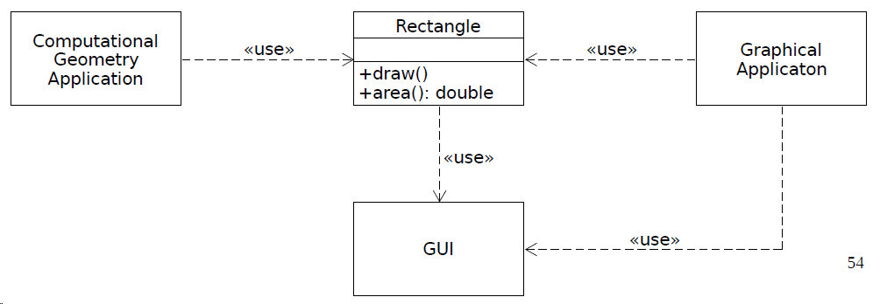

The `Rectangle` class has two responsibilities:

- provide mathematical model
- render the rectangle on a GUI

A reworked version to conform to the principle:

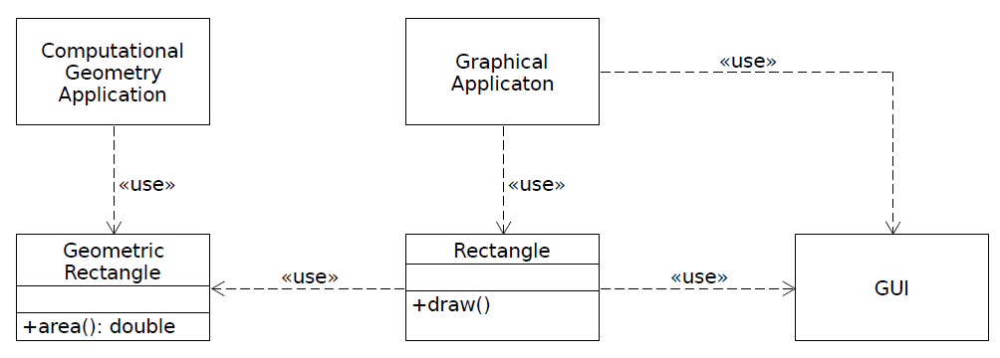

-----

- Software is changed to satisfy actors.
  - actors refer to a group of people

Thus, the principle can be rephrased as:

> "A module should be responsible to one, and only one, actor."

#### Example

The `Employee` class below violates the SRP because the three methods are responsible to three very different actors:

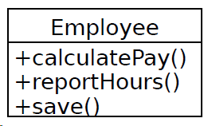

- `calculatePay()`: is specified by the accounting department
- `reportHours()`: is specified by the human resources department
- `save()`: is specified by the database administrators

### Open/Closed Principle (OCP)

- Bertrand Meyer coined the principle

> "Software entities (classes, modules, functions, ...) should be open for extension, but closed for modification."

#### Primary Attributes

- **Open for extension**: behavior of a module can be extended
- **Closed for modification**: extending the behavior of a module does not result in changes to the source or binary code of the module.

##### Example of violation

Both the `Client` and `Server` classes are concrete. The `Client` class uses the `Server` class. If we wish for a `Client` object to use a different server object, then the `Client` class must be changed to name the new server class.

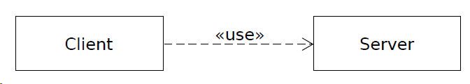

This model conforms to the principle:

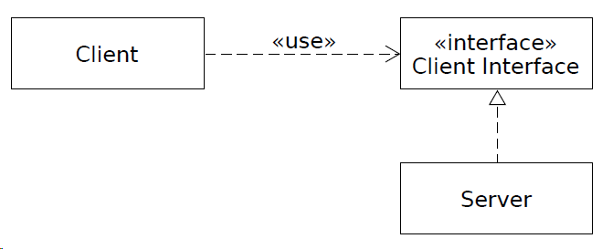

### Liskov Substitution Principle (LSP)

- Barbara Liskov described the principle.

If the type *S* is a subtype of the type *T*, then the behavior of a program should not change when objects of type *T* are substituted with objects of type *S* in it.

### Interface Segregation Principle (ISP)

This principle deals with the disadvantages of "fat interfaces".

> "Classes should not be forced to depend on
methods they do not use." -Robert C. Martin

> **Fat Interface**
> "An interface with more member functions and friends than are logically necessary" -Bjarne Stroustrup

- Classes that have “fat” interfaces are classes whose interfaces are not cohesive. In other words, the interfaces of the class can be broken into groups of methods. Each group serves a different set of clients.
- The ISP acknowledges that there are objects that require noncohesive interfaces; however, it suggests that clients should not know about them as a single class.
- **Interface pollution**: Polluting an interface with redundant methods.
- When a client depends on a class that contains methods that the client does not use, but that other clients do use, then that client will be affected by the changes that those other clients force upon the class.
  - This results in an inadvertent coupling between all the clients.

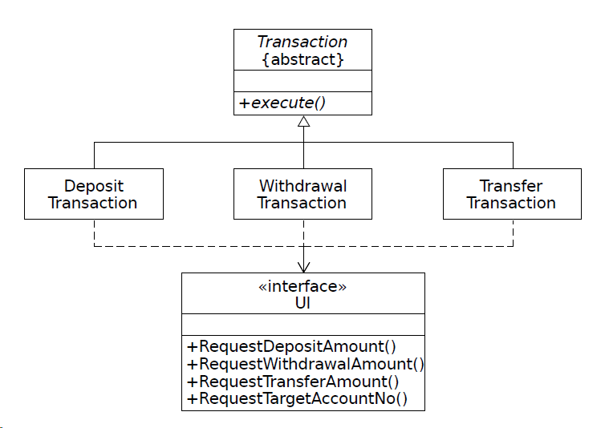

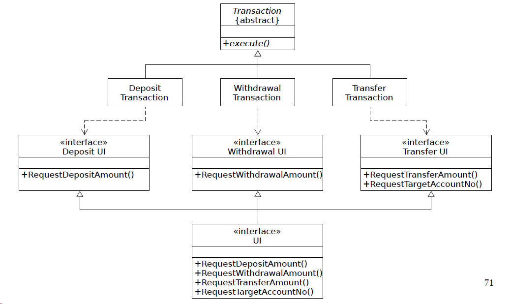

### Dependency Inversion Principle (DIP)

> "High level modules should not depend on low-level modules. Both should depend on abstractions."
> "Abstractions should not depend on details. Details should depend on abstractions."

Traditional software development methods tend to create software structures in which high-level modules depend on low-level modules, and in which policy depend on detail.

- It is the high level modules that contain the important policy decisions and business models of an application. These modules contain the identity of the application. Yes, when these modules depend on lower level modules, changes to the lower level modules can have direct effects on the higher level modules and can force them to change in turn.
- This predicament is absurd! It is the high level, policy-settings modules that ought to be influencing the low level, detail modules. The modules that contain the high-level business rules should take precedence over, and be independent of, the modules that contain the implementation details.
- It is the high-level, policy-setting modules that we want to be able to reuse.
- It is the high-level, policy-setting modules that we want to be able to reuse. We are already quite good at reusing low-level modules in the form of libraries.
- When high-level modules depend on low-level modules, it becomes very difficult to reuse those high-level modules in different contexts.
- However, when the high-level modules are independent of the low-level modules, then the high-level modules can be reused quite simply.

### Example

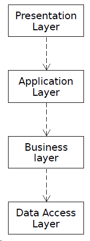

A reworked version of the previous model that conforms to the principle:

- Each of the upper-level layers declares an interface for the services that it needs.
- The lower-level layers are then realized from these interfaces.
- Thus, the upper layers do not depend on the lower layers.
- Notice that the inversion here is not just one of dependencies, it is also one of interface ownership (inversion of ownership).

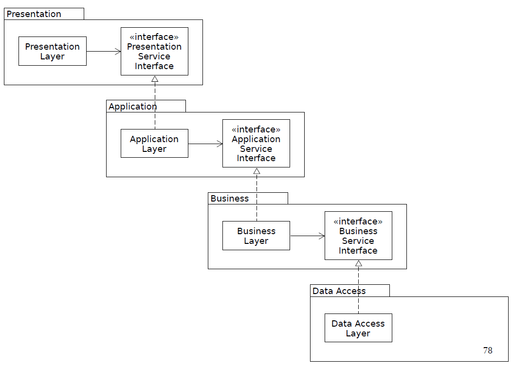

----

## Dependency Injection

> "Dependency Injection is a set of software design principles and patterns that enables you to develop loosely coupled code."

- Coined by Martin Fowler.
- It can be considered as a special case of the application of the architectural pattern called inversion of control (IoC).
- Loose coupling makes code extensible, and extensibility makes it maintainable.
- An object can be seen as a service that are consumed by other objects as clients.
- Such a client-service relationship between objects is called a dependence. This relationship is transitive.

- **Dependency**: a specific service that is required by another object to fulfill its function.
- **Dependent**: a client object that needs a dependency (or dependencies) in order to perform its function.
- **Object graph**: a set of dependent objects and their dependencies.
- **Injection**: giving a client its dependency (or dependencies).
- **DI container**: a library or framework that provides reusable DI functionality.
  - also known as Inversion of Control (IoC) containers.
- DI can be applied without using a DI container.
- **Pure DI**: the practice of applying DI without a DI container.
- DI as a subject is primarily concerned with reliably and efficiently building object graphs and the strategies, patterns, and best practices therein.
- DI frameworks allow clients to delegate the responsibility of creating and injecting their dependencies to external code.

### Advantages of DI

- Extensibility
- Maintainability
- Testability: DI support unit testing.
  - test doubles can be injected into the system under test.

----

## Patterns in Software Development

### What is a Pattern?

It was introduced by the Gang of Four. 

> "Each pattern describes a problem which occurs over and over again in our environment, and then describes the core of the solution to that problem, in such a way that you can use this solution a million times over, without ever doing it the same way twice."

### Architectural patterns

> "An architectural pattern expresses a fundamental structural organization schema for software systems. It provides a set of predefined subsystems, specifies their responsibilities, and includes rules and guidelines for organizing the relationships between them."

### Model-View-Controller (MVC) Architectural Pattern

MVC was conceived by Trygve Reenskaug

**Name**: Model-View-Controller

**Context**: Interactive applications with a flexible human-computer interface.

**Problem**: User interfaces are especially prone to change requests.

**Solution**: Dividing an interactive application into the following components:

- The model component encapsulate core data and functionality, and it is independent of specific output representations or input behavior.
- View components display information to the user.
- Controller components receive input, usually as events, that are translated to service requests for the model or the view.

-------

- The separation of the model from view and controller components allows multiple views of the same model.
  - Same data can be displayed in multiple ways.
- Separating the view from the controller is less important.
  - Allow multiple controllers for the same view.
- The model component contains the functional core of the application.
  - It encapsulates the appropriate data, and exports procedures that perform application-specific processing. Controllers call these procedures on behalf of the user.
  - The model also provides functions to access its data that are used by view components to acquire the data to be displayed.
  - It registers dependent components (i.e., views and controllers) that are notified by the model about data changes.

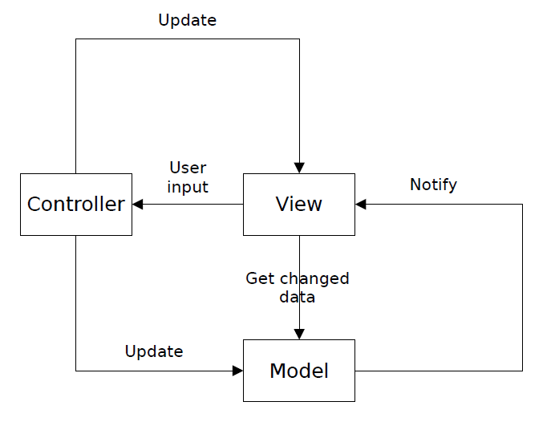

### Design Patterns

Design patterns are medium-scale patterns. They are smaller than architectural patterns, but are at a higher level than the programming language-specific idioms.

- The application of a design pattern has no effect on the fundamental structure of a software system, but may have a strong influence on the architecture of a subsystem.
- Most design patterns are independent of a particular programming language or a programming paradigm.

#### Creational Patterns

They deal with the creation of objects.

##### Builder

**Intent**: “Separate the construction of a complex object from its representation so that the same construction process can create different representations.”

**Known Uses:**

- `java.lang.Appendable`
- `java.lang.ProcessBuilder`
- `java.time.format.DateTimeFormatterBuilder`
- `java.util.Locale.Builder`
- `java.util.StringJoiner`
- `java.util.stream.Stream.Builder`

#### Singleton

**Intent**: Ensure a class only has one instance, and provide a global point of access to it.

**Motivation**: It's important for some classes to have exactly one instance.

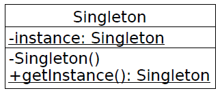

**Known uses**: 

- `java.lang.Runtime`
- `java.time.chrono.IsoChronology`

#### Object Pool

**Intent**: Maintains a set of initialized objects rather than creating and destroying them on demand.

### Structural Patterns

They deal with how classes and objects are composed to form larger structures.

#### Adapter

**Intent**: "Convert the interface of a class into another interface clients expect. Adapter lets classes work together that couldn't otherwise because of incompatible interfaces."

**Known Uses**:

- `java.io.InputStreamReader`
- `java.io.OutputStreamWriter`
- `jakarta.xml.bind.annotation.adapters.XmlAdapter`

#### Decorator

**Intent**: "Attach additional responsibilities to an object dynamically. Decorators provide a flexible alternative to subclassing for extending functionality."

- `java.io.InputStream`
- `java.io.OutputStream`
- `java.util.Collections#unmodifiableXXX()`

### Behavioral Patterns

They characterize the ways in which classes or objects interact and distribute responsibility.

#### Iterator

**Intent**: "Provide a way to access the elements of an aggregate object sequentially without exposing its underlying representation."

**Known Uses**:

- `java.sql.ResultSet`
- `java.util.Enumeration`
- `java.util.Iterator`

#### Template Method

**Intent**: "Define the skeleton of an algorithm in an operation, deferring some steps to subclasses. Template Method lets subclasses redefine certain steps of an algorithm without changing the algorithm's structure."

**Known Uses**:

- `java.io.InputStream`
- `java.io.OutputStream`
- `java.util.AbstractList`
- `java.util.AbstractMap`
- `java.util.AbstractQueue`

#### Observer

**Intent**: "Define a one-to-many dependency between objects so that when one object changes state, all its dependents are notified and updated automatically."

**Known Uses**:

- `java.util.EventListener`
- `javafx.beans.Observable`
- `java.util.concurrent.Flow`

----

## Free and Non-free Software

### Non-Free Software

Non-free software is any software that is not free.

- Its use, redistribution or modification is prohibited or restricted or requires permission.
- It is also called **closed-source software** or **proprietary software**.
- Non-free software is the complementary set of free software.

### Private Software

Private or custom software is software developed for one user (typically an organization or company).

- That user keeps it and uses it, and does not release it to the public.

### Free Software

The four essential freedoms:

- The freedom to run the program for any purpose.
- The freedom to study how the program works.
- The freedom to redistribute copies of the program.
- The freedom to modify the program.

Access to the source code is a precondition for the second and the fourth freedom.

## Open-Source Software

The terms "free software" and "open-source software" refer to almost the same range of software. However, they represent two different approaches.

The term "open source" is more suitable for marketing purposes than the "term free" software because free is an ambiguous word. One meaning of the word is "at no cost". See, for example, "free speech" vs "free beer".

The free software movement emphasizes the ethical aspects of freedom. By contrast, the open-source movement emphasizes the practical advantages of openness. Despite the ideological differences between the two camps, the terms free software and open-source software practically has the same meaning.

#### Free and Open-Source Software (FOSS)

A category that includes both free software and open-source software.

## Software Licenses

A software license is a legal instrument that regulates the distribution and use of software. In the case of proprietary software, the term **end-user license agreement** (EULA) is used.

### Copyleft Licenses

- Software licenses using the copyleft mechanism are called **copyleft licenses**.
  - They are also called **viral licenses**, pejoratively.
- Copyleft licenses represent a subset of FOSS licenses that are disjoint with the set of permissive licenses.
- Copyleft licenses are further divided into strong and weak copyleft licenses.
  - **Strong copyleft license**: the copyleft applies with full force, which excludes the use of the software covered by the license for developing closed-source software. Example, GNU General Public License (GNU GPL)
  - **Weak copyleft license**: they permit the limited use of the software covered by the license such that derivative works do not fall under the copyleft. Examples: GNU Lesser General Public License (GNU LGPL), Mozilla Public License (MPL).

### GNU General Public License (GNU GPL)

- Copyleft licenses impose limitations on the distribution of derivative works that are unacceptable for developing non-free software.
- However, they do not limit the use of the software itself.
- Example: Blender -- It is distributed under the GPLv3. The program can be used for developing non-free software, the license does not apply to the artwork created by the program.
- In general, the GPL does not apply to the output of a GPL-covered program, unless it includes source code of the program.
  - This means that, for example, a graphical application can be used without any limitations for any purpose, however, the Autoconf program could not be, if it would not fall under an exception.
  - Thus, for example, the GPL may apply to the "output" of a computer game when a screenshot is taken or a video is captured.
- GPL compatible FOSS licenses:
  - Combinations must be distributed under the GPL.
  - For example, the following FOSS licenses are GPL compatible:
    - Apache License 2.0 (is compatible only with the GNU GPL v3)
    - Three-clause BSD license, two-clause BSD license
    - Mozilla Public License 2.0
    - X11 License

### Weak Copyleft Licenses

- Weak copyleft licenses are typically used for distributing libraries.
  - They allow a library to be linked with an (either free or non-free) program such that the copyleft does not apply to the resulting combination.
  - Generally, dynamic linking is permitted without any restrictions.

### GNU Lesser General Public License (GNU LGPL)

- The LGPL complicates the inclusion of code under it in non-free software, or it may even completely prohibit that.
- The license essentially allows software distributed under it to be linked with software distributed under other licenses.
  - Linking must be performed by the terms of the license.
    - For example, only dynamic linking of libraries is permitted.
- **A work that uses the library:** a program that contains no derivative of any portion of the library, but is designed to work with the library by being compiled or linked with it.
  - Such works falls outside the scope of the license.
  - However, linking a work that uses the library with the library creates an executable that is a derivative of the library.
    - Such an executable is covered by the license!
- A work that uses the library linked with the library must be distributed as follows:
  - It must be possible for the user to modify the library (e.g., to replace it with a newer version) and then relink to produce a modified executable using the modified library.
  - The user must be permitted to reverse-engineer the work that uses the library for debugging such modifications.
- Of course, this means that work that uses the library must be available to users in object code form.
  - However, the source code need not be available.
- Distributing a work that uses the library in object code form is an exception to the previously discussed case.
  - However, this exception does not apply when the object code form uses macros or inline functions of the library that are longer than 10 lines.
  - Modern libraries make heavy use of inline functions that are often longer than 10 lines.
- Thus, distributing non-free software in object code form is merely a theoretical possibility.
- According to the Free Software Foundation, which is the organization responsible for the GNU licenses, this also applies to any Java application that uses libraries distributed under the GNU LGPL.

### GNU Affero General Public License (GNU AGPL)

- A strong copyleft license that is based on the GPL and is specially designed for software often used on network servers.
- The GPL permits making a modified version of a program and let the public access it on a server without ever releasing its source code to the public.
- It requires the operator of a network server to provide the source code of the modified version running there to the users of that server.
- Therefore, public use of a modified version, on a publicly accessible server gives the public access to the source code of the modified version.

### Public Domain

- A creative work being in the public domain is not covered by intellectual property rights.
  - For example, the rights have expired, or have been waived.
- If a software is in the public domain, it might as well have an all-permissive non-copyleft free software license.

### Choosing a FOSS License

- Software licenses should be chosen with great care because FOSS licenses can not be revoked.
  - When the license changes, the rights to use the software can not be doubted in the case of users who obtained the software when the old license was in force.
  - Changing a license only makes sense when the new license is more permissive than the old one.
  - For example, the GPLv3 explicitly states that it is irrevocable.