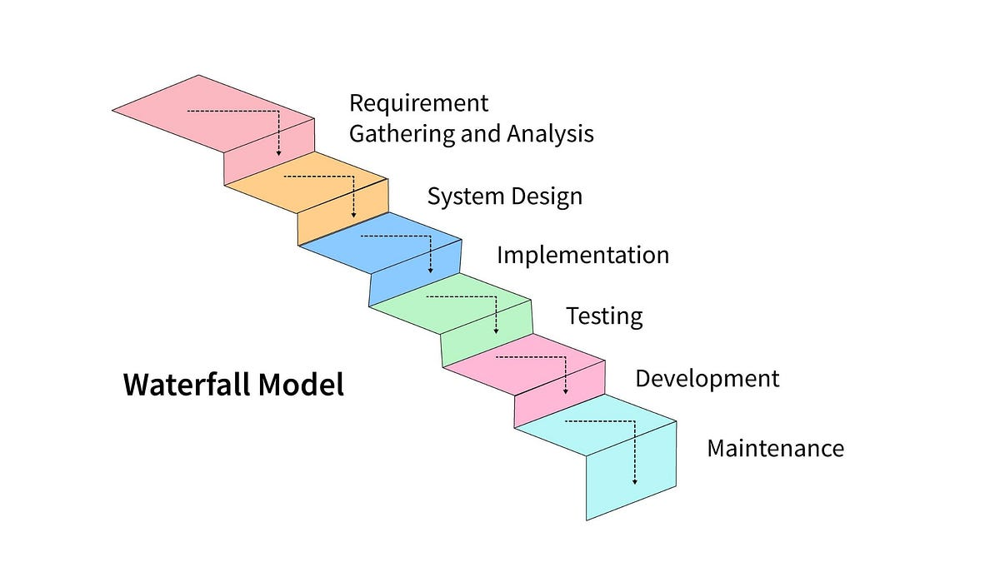
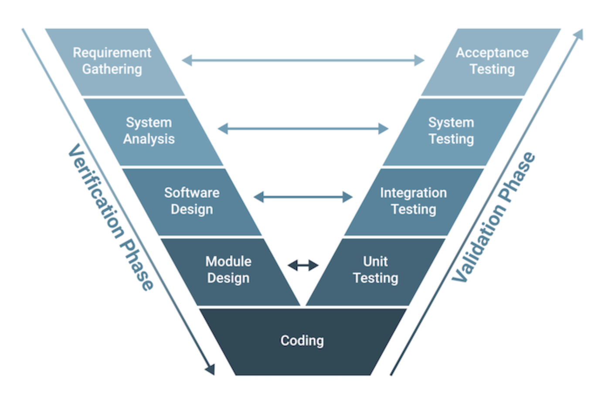
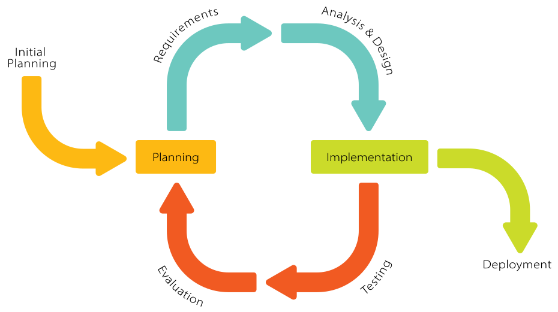
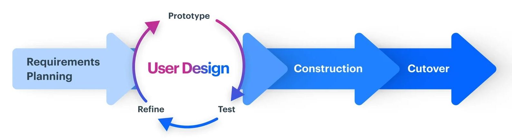

## Waterfall Model

Think of it as a series of steps down the waterfall. Each step represents a phase of the development process, and each phase must be completed before moving on to the next.

1. **Requirements:** the requirements for the software are gathered and documented.
2. **Design:** the software design is created based on the requirements.
3. **Implementation:** the software is built based on the design.
4. **Testing:** the software is tested to ensure it meets the requirements.
5. **Maintenance:** the software is deployed and it is maintained and updated as needed.

Can be summarized in the following points:

- Everything needs to be defined early.
- Sequential flow control.
- Hard to push feedback up.
- Hardly supports iteration.
- Not reactive to changes.
- Still used nowadays.

## V-model

The V-model is a model in which the process executes sequentially in a V-shape. It is also known as the Verification and Validation model. It is based on the association of a testing phase for each corresponding development stage. The development of each step is directly associated with the testing phase. The next phase starts only after completion of the previous phase i.e., for each development activity, there is a testing activity corresponding to it.

### Requirement Gathering $\longleftrightarrow$ Acceptance Testing

In the process of gathering requirements for the system to meet its client’s expectation, a testing phase involved in the finished product in a real user environment will be planned. Acceptance Testing may conclude the overall client experience of the entire system as a complete product.

### System Analysis $\longleftrightarrow$ System Testing

While System Design is on the way to plan out how the system components will be and how they will interact with each other to run the entire system. System Testing phase should be on the construction of the tests based on the system design itself, including software-hardware communication testing, external services and communication testing etc.

### Software Design $\longleftrightarrow$ Integration Testing

A technical phase of software design where the concept and plan will be implemented into smaller modules to accomplish each functionality and requirement of the project itself. A blueprint for Integration Test of each component and their architectural design will be planned at the same time.

### Module Design $\longleftrightarrow$ Unit Testing

A lower level design to help guarantee that the basic component in each module works properly in order to eliminate any fault in fundamental functionality that higher level component will be based on. A Unit Testing will be designed to validate each type of scenario that each module might face and to ensure that the system can handle each one appropriately on the code level.

### Coding

An actual implementation of a code. Coding will be done based on the design of the aforementioned components and modules.

After the coding has been done. A V-Model will process to do the testing in reverse order going from Unit Testing &rightarrow; Integration Testing &rightarrow; System Testing &rightarrow; Acceptance Testing, Thus complete a V-like shape cycle of Verification (Down), Coding (Joint) and Validation (Up) with the planning of Validation being done simultaneously with the verification phase.

## Spiral Model

The spiral model combines the idea of iterative development with the systematic, controlled aspects of the waterfall model. This Spiral model is a combination of iterative development process model and sequential linear development model i.e. the waterfall model with a very high emphasis on risk analysis. It allows incremental releases of the product or incremental refinement through each iteration around the spiral.

The spiral model has four phases. A software project repeatedly passes through these phases in iterations called Spirals.

### Identification

This phase starts with gathering the business requirements in the baseline spiral. In the subsequent spirals as the product matures, identification of system requirements, subsystem requirements and unit requirements are all done in this phase.

This phase also includes understanding the system requirements by continuous communication between the customer and the system analyst. At the end of the spiral, the product is deployed in the identified market.

### Design

The Design phase starts with the conceptual design in the baseline spiral and involves architectural design, logical design of modules, physical product design and the final design in the subsequent spirals.

### Construct or Build

The Construct phase refers to production of the actual software product at every spiral. In the baseline spiral, when the product is just thought of and the design is being developed a POC (Proof of Concept) is developed in this phase to get customer feedback.

Then in the subsequent spirals with higher clarity on requirements and design details a working model of the software called build is produced with a version number. These builds are sent to the customer for feedback.

### Evaluation and Risk Analysis

Risk Analysis includes identifying, estimating and monitoring the technical feasibility and management risks, such as schedule slippage and cost overrun. After testing the build, at the end of first iteration, the customer evaluates the software and provides feedback.

## Prototyping Model

The Prototype model’s core idea is that instead of finalizing requirements before design or coding, a throwaway prototype is built to grasp the requirements. This prototype is made based on the currently known requirements. Using it, the client gets a real sense of the system, as interactions with the prototype help them understand the desired system’s needs. Prototyping suits complex and large systems lacking a manual process or existing system for requirement determination. Usually, the prototype isn’t a complete system and many details aren’t included. The aim is to offer a system with overall functionality.

## Iterative and Incremental Model

The basic idea behind this method is to develop a system through repeated cycles (iterative) and in smaller portions at a time (incremental), allowing software developers to take advantage of what was learned during development of earlier parts or versions of the system. Learning comes from both the development and use of the system, where possible key steps in the process start with a simple implementation of a subset of the software requirements and iteratively enhance the evolving versions until the full system is implemented. At each iteration, design modifications are made and new functional capabilities are added.

Incremental development slices the system functionality into increments (portions). In each increment, a slice of functionality is delivered through cross-discipline work, from the requirements to the deployment. The Unified Process groups increments/iterations into phases: inception, elaboration, construction, and transition.

- Inception identifies project scope, requirements (functional and non-functional) and risks at a high level but in enough detail that work can be estimated.
- Elaboration delivers a working architecture that mitigates the top risks and fulfills the non-functional requirements.
- Construction incrementally fills-in the architecture with production-ready code produced from analysis, design, implementation, and testing of the functional requirements.
- Transition delivers the system into the production operating environment.

Each of the phases may be divided into 1 or more iterations, which are usually time-boxed rather than feature-boxed. Architects and analysts work one iteration ahead of developers and testers to keep their work-product backlog full.

## Rapid Application Development

Rapid Application Development, or RAD, means an adaptive software development model based on prototyping and quick feedback with less emphasis on specific planning. In general, the RAD approach prioritizes development and building a prototype rather than planning. With rapid application development, developers can quickly make multiple iterations and updates to the software without starting from scratch. This helps ensure that the final outcome is more quality-focused and aligns with the end users' requirements.

Can be summarized in the following points:

- Promotes rapid prototyping
- First a prototype is created based on planning and user design
- The prototype can be re-done or changed any number of time, as necessary
- The product itself is developed based on the prototype
- The final cutover phase takes the product into production

## Agile

"Agile", the word has been applied around 2001 for building software in a **non-traditional way**. An approach to building software, in which the overall lifecycle is composed of several iterations in sequence. Each iteration is a self-contained mini-project composed of activities such as requirements analysis, design, programming, and test. The system grows incrementally.

### 12 Principles

1. Customer satisfaction by early and **continuous delivery** of valuable software.
2. Welcome **changing requirements**, even in late development.
3. **Deliver** working software **frequently** (weeks rather than months)
4. Close, daily cooperation between business people and developers.
5. Projects are built around motivated **individuals**, who should be trusted.
6. **Face-to-face** conversation is the best form of communication (co-location)
7. Working software is the primary **measure of progress**
8. Sustainable development, able to maintain a **constant pace**
9. Continuous attention to technical excellence and **good design**
10. Simplicity--the art of maximizing the **amount of work not done**--is essential
11. Best architectures, requirements, and designs emerge from **self-organizing teams**
12. Regularly, the team **reflects** on how to become more effective, and **adjusts** accordingly

### Agile Manifesto

- **Individuals and interactions** over processes and tools
- **Working software** over comprehensive documentation
- **Customer collaboration** over contract negotiation
- **Responding to change** over following a plan

### Agile Methodology

#### Scrum

Scrum is characterized by cycles or stages of development, known as **sprints**, and by the maximization of development time for a software product towards a goal, the Product Goal. This Product Goal is a larger value objective, in which sprints bring the scrum team product a step closer.

It is usually used in the management of the development of software products but can be used successfully in a business-related context.

Every day starts with a small 15-minute meeting, the daily Scrum, which takes the role of synchronizing activities and finding the best way to plan out the working day, allowing for a check on sprint "health" and product progress.

**Overview:**

- **Artifacts:**
  - Product Backlog
  - Sprint Backlog
  - Product Burn Down Chart
  - Sprint Burn Down Chart

- **Daily Scrum Meeting:**
  - What did you accomplish yesterday?
  - What are your working on today?
  - What impediments in your way?

- Sprint Review
- Sprint Retrospective Meeting
- Time Boxing

#### Kanban

The word Kanban is of Japanese origin and its meaning is linked to the concept of "just in time". In practice, the Kanban method is organized on a board or table (Kanban board), divided into columns, showing every flow within the software production project. As the development evolves, the information contained in the table changes, and whenever a new task comes into play, a new "card" is created.

The Kanban method requires communication and transparency so that the members of any team all know exactly what stage development is at and can see the status of a project at any time. It primarily focused on team capacity and is best for processes that undergo small changes.