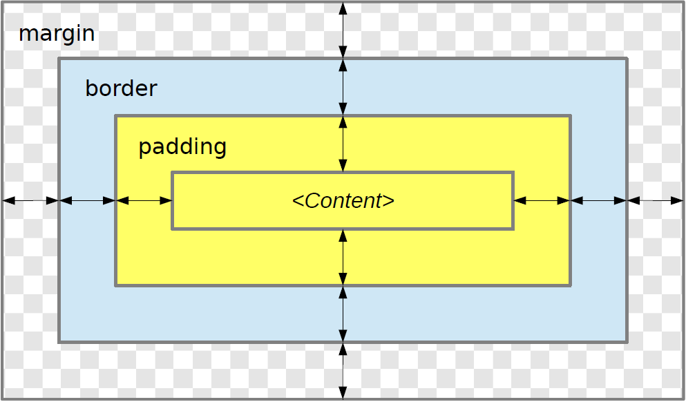

# Basic concepts

**Resource:**  anything that might be identified by a URI.

- **Information resource:** a resource which has the property that all of its essential characteristics can be conveyed in a message.

**Representation:** data that encodes information about resource state.

**Content negotiation:** offering multiple representations for a resource and selecting the one that is the most appropriate when a representation must be served.

**Dereferencing a URI:** using a URI to access the
referenced resource.

- Forms of access includes: retrieving, adding, or modifying a representation of the resource, and deleting some or all representations of the resource.

**User agent:** one type of Web agent, a piece of software acting on behalf of a person. *For example, a web browser.*

----

## Types of standards

- **De facto standards:** arise from common usage.
  - Examples: the QWERTY keyboard layout, TeX, PDF (before 2008).
- **De jure standards:** are mandated by regulators at the local, state, federal, and/or international level.
  - Examples: International System of Units (SI), PDF (from 2008).
- **Voluntary consensus standards:** are specified within a range of private institutions, including engineering societies, trade associations, accredited standards-setting organizations, and industry consortia.
  - Examples: the Internet protocol suite (commonly known as TCP/IP), HTML, CSS.

----

## Organizations responsible for web standards

### Internet Assigned Numbers Authority (IANA)

- Coordinates the allocation of codes and numbers that form the basis for the operation of the Internet.
  - Manages the DNS root zone, and the `.int` and `.arpa` domains.
  - Coordinates the allocation of IP addresses globally.
  - Maintains registries of codes and numbers used in a variety of Internet protocols.
- IANA is performed by ICANN (Internet Corporation for Assigned Names and Numbers)

### Internet Engineering Task Force (IETF)

- An international standards organization developing Internet standards.
  - Develops TCP/IP
- Publishes Internet standards-related specifications in the RFC series of documents.

### Request for Comments (RFC)

- RFC series contains technical and organizational documents about the Internet. RFC Editor edits, publishes, and catalogs RFCs.
- Began in 1969 as a part of ARPANET project.
- Split into four streams:
  - The Internet Engineering Task Force (IETF) Stream
  - The Internet Architecture Board (IAB) Stream
  - The Internet Research Task Force (IRTF) Stream
  - The Independent Submission Stream
- Each RFC is identified by a number.
- Published RFCs never change.
- Various errors are fixed by errata.
- Amendments can be also made by writing and publishing a revised RFC.
  - An RFC can obsolete or update earlier RFCs.
- Contains two important sub-series:
  - *Best Current Practice (BCP):* documents guidelines, processes, or the operation of the IETF itseld.
  - *Internet Standard (STD)*
- BCPs and STDs are assigned a number in their subseries while retaining their RFC number. They can also be shared among several RFCs.
- **Standards Track:** the set of maturity levels of RFCs that are intended to become Internet Standards.
  - Originally, three maturity levels: Proposed, Draft and Internet.
  - Currently, Proposed and Internet Standard are used.
- **Internet-Draft:** a draft version of a specification made available for informal review and comment during the development.
  - May or may not be published as an RFC.
  - Subject to change or removal
  - Valid for maximum six months.
  - Shouldn't be cited in any formal documents, except as "work in progress"

### World Wide Web Consortium (W3C)

- The W3C is an international community where member organizations, a full-time staff, and the public work together to develop Web standards.W3C's mission is to lead the Web to its full potential.
- W3C publishes documents called Recommendations that define Web technologies and are considered Web standards.
- The director is Tim Berners-Lee, the inventor and creator of the Web.

#### W3C Design Principles

- **Web for All:** the Web must be available to all people, whatever their hardware, software, network infrastructure, native language, culture, geographical location, or physical or mental ability.
- **Web on Everything:** the Web must be accessible from a wide variety of devices.

#### Maturity Levels of W3C Technical Reports

- **Working draft (WD):** a document that is published for review by the community, including W3C members, the public, and other technical organizations.
  - Some, but not all, Working Drafts are meant to advance to Recommendation.
- **Candidate Recommendation (CR):** a document that has already received wide review and is published to gather implementation experience.
- **Proposed Recommendation (PR):** a document that is of sufficient quality to become a Recommendation.
- **Recommendation (REC):** a Web standard suitable for wide adoption.
- **Group Note (NOTE):** a document that is not intended to be a formal standard.
  - Are published to document information other than technical specifications, such as use cases motivating a specification and best practices for its use.

- A recommendation may become superseded or obsolete:
  - **Superseded Recommendation:** a specification that has been replaced by a newer version.
  - **Obsolete Recommendation:** a specification that the W3C has determined lacks sufficient market relevance to continue recommending it for implementation.

### Web Hypertext Application Technology Working Group (WHATWG)

- A community committed to the evolution of the Web that develops standards implementable in web browsers.
- The WHATWG develops specifications called “Living Standards” that are continuously updated.

\pagebreak

# URIs

## What is a URI?

- A compact sequence of characters that identifies an abstract or physical resource.
  - A resource is not necessarily available on the Web.
  - URIs can be assigned even to objects from the real world or to concepts.
- Each URI begins with a scheme name that is separated by a ':' character from the scheme-specific part of the URI.
- Organizaiton responsible for the adminstration of the URI schemes: *IANA*

----

## URI Syntax

- Organized hierarchically. Components listed in order of decreasing significance from left to right.
- Generic syntax:
  - *schema* ':' *hier-part* ['?' *query*] ['#' *fragment*]
  - The hier-part component may consist of an authority and a path component, its syntax is:
    `'//'` authority path or path
  - When authority is present, the path must either be empty or begin with a `'/'` character.
  - When authority is not present, the path cannot begin with two `'/'` characters.
- Example:

  `https://wordery.com/search?term=scotland#results`
  - Consists of scheme, host, path, query and fragment.

### Path

- A sequence of path segments separated by a `'/'` character.
- Terminated by the first `'?'` or `'#'`, or by the end of the URI.
- The path segments `'.'` and `'..'` can be used just as in some operating systems' file directory structures.

### Query

- Indicated by the first `'?'` character and terminated by a `'#'` character or by the end of the URI.
- Contains non-hierarchical data.
- Often contains name/value pairs of the form name `'='` value delimited by an `'&'` character.
  - In the case of the http and https URI schemes the query component is used for submitting form data (see the `application/x-www-formurlencoded` format).

### Fragment Identifier

- Indicated by a `'#'` character and terminated by the end of the URI.
- Allows indirect identification of a secondary resource by reference to a primary resource and additional identifying information.
- The semantics of a fragment identifier are defined by the set of representations that might result from a retrieval action on the primary resource.
- The fragment identifier is separated from the rest of the URI prior to a dereference.
- URI scheme specifications must define their own syntax so that all strings matching their scheme-specific syntax must be an absolute URI without a fragment identifier.

\pagebreak

# HTTP

## What is HTTP?

- A family of stateless, application-level, request/response protocols that share a generic interface, extensible semantics, and self-descriptive messages to enable flexible interaction with network-based hypertext information systems.

### Characteristics

- **Stateless protocol:** each request message’s semantics can be understood in isolation.
- **Extensible:** HTTP defines a number of generic extension points that can be used to introduce capabilities to the protocol without introducing a new version, including methods, status codes, fields.

### Message Abstraction

Messages are intended to be self-descriptive. A message consists of the following:

#### Control Data

- Messages start with control data that describe its primary purpose.
  - Request message control data includes a request method, request target, and protocol version.
  - Response message control data includes a status code, optional reason phrase, and protocol version.
- Every HTTP message has a protocol version.

#### Header Section

- Fields that are sent or received before the content are referred to as **header fields** (or just **headers**, colloquially).
- The header section of a message consists of a sequence of header field lines.

#### Content

- Content is transferred as a stream of octets after the header section.
- It is in a format and encoding defined by the the header fields `Content-Type` and `Content-Encoding`.
- The purpose of content in a request is defined by the method semantics.
  - For example, a representation in the content of a POST request represents information to be processed by the target resource.
- In a response, the content’s purpose is defined by the request method, response status code, and response fields describing that content.
  - For example, the content of a 200 (OK) response to GET represents the current state of the target resource, as observed at the time of the message origination date.

#### Trailer Section

- Fields that are sent or received after the content are referred to as **trailer fields** (or just **trailers**, colloquially).
- Trailer fields can be used to carry checksums, digital signatures, delivery metrics, or post-processing status information.
- The trailer section of a message consists of a sequence of trailer field lines.
- Trailer fields should be processed and stored separately from header fields.

### Fields

- HTTP uses fields to provide data in the form of name/value pairs.
- Fields are used to carry:
  - message metadata both in requests and responses (e.g., `Date`),
  - representation metadata both in requests and responses (e.g.,`Content-Type`),
  - client information in requests (e.g., `User-Agent`),
  - server information in responses (e.g., `Server`),
  - resource metadata in responses (e.g., `Last-Modified`).
- Fields are sent and received within the header and trailer sections of messages.
  - A field sent in the header or trailer section of a message is a called a header or trailer field, respectively.
  - Certain fields (such as, e.g., `ETag`) can occur either as a header or a trailer field.
- Field names are case-insensitive and a field name is a sequence of one or more characters from a subset of the US-ASCII character set.

**Field Values:**

- A sequence of one or more visible US-ASCII characters, spaces, and horizontal tabs.
- Leading and trailing whitespaces must be stripped before consuming
- Fields can be defined to carry either a single member or a comma-separated list of members.
- Each field can constrain the set of allowed values.

- HTTP specifications define many standard fields.
- IANA maintains the registry of HTTP fields.

#### Field Sections

- Composed of any number of field lines, each with a field name identifying the field, and a field line value that conveys data for that instance of the field.
- When a field name is repeated within a section, its value consists of the list of corresponding field line values within that section, concatenated in order, with each field line value separated by a comma.
- The order in which field lines with differing field names occur in a section is not significant.

### The `User-Agent` header field

- Contains information about the user agent originating the request.
- Can be used for tailoring responses or analytics regarding browser or operating system use.
- A user agent should send a `User-Agent` header field in each request.
- The field value consists of one or more product identifiers, each followed by zero or more comments.

---

### HTTP methods: `GET, HEAD, POST, PUT, DELETE`

#### `GET`

- Requests transfer of a current selected representation for the target resource.
- The primary mechanism of information retrieval.
- A client can alter the semantics of GET to be a range request, requesting transfer of only some part(s) of the selected representation, by sending a `Range` header field in the request.

#### `HEAD`

- Identical to the GET method except that the server must not send content in the response.
- Can be used to obtain metadata about the selected representation without transferring its representation data.

#### `POST`

- Requests that the target resource process the representation enclosed in the request according to the resource’s own specific semantics.
- Common uses include:
  - Submitting data (e.g., form data) to a data-handling process.
  - Posting a message to a newsgroup, mailing list, or blog.
  - Creating a new resource.
  - Appending data to a resource’s existing representation(s).

#### `PUT`

- Requests that the state of the target resource be created or replaced with the state defined by the representation enclosed in the request message content.
- A successful PUT of a given representation would suggest that a subsequent GET on that same target resource will result in an equivalent representation being sent in a 200 (OK) response.

#### `DELETE`

- Requests that the origin server remove the association between the target resource and its current functionality.
- If the target resource has one or more current representations, they might or might not be destroyed by the origin server, and the associated storage might or might not be reclaimed, depending entirely on the nature of the resource and its implementation by the origin server.
- Relatively few resources allow the DELETE method.

----

### Status codes, classes of status codes

- The status code of a response is a three-digit integer code that describes the result of the request and the semantics of the response, including whether the request was successful and what content is enclosed (if any).
- All valid status codes are within the range of 100 to 599, inclusive.

#### Classes of Status Codes:

- 1*xx* (Informational): indicates an interim response for communicating connection status or request progress prior to sending a final response.
- 2*xx* (Successful): indicates that the request was successfully received, understood, and accepted.
- 3*xx* (Redirection): indicates that further action needs to be taken by the user agent in order to fulfill the request that can be performed automatically by the user agent.
- 4*xx* (Client Error): indicates that the request contains bad syntax or cannot be fulfilled.
- 5*xx* (Server Error): indicates that the server failed to fulfill an apparently valid request.

----

- A client is not required to understand the meaning of all registered status codes.
- However, a client must understand the class of any status code.
- An unrecognized status code must be treated as being equivalent to the *x*00 status code of that class.
- Except when responding to a HEAD request in a response with a status code of 4*xx* or 5*xx*, the server should send a representation containing an explanation of the error situation, and whether it is a temporary or permanent condition.
- Status codes are extensible.
- IANA maintains the registry of status codes.

#### Major Status Codes

| Status Code | Reason |
|-------------|--------|
|100          |Continue|
|101          |Switching Protocols|
|200          |OK      |
|201          |Created |
|202          |Accepted|
|204          |No Content|
|206          |Partial Content|
|300          |Multiple Choices|
|301          |Moved Permanently|
|302          |Found|
|303          |See Other|
|304          |Not Modified|
|400          |Bad Request|
|401          |Unauthorized|
|403          |Forbidden|
|404          |Not Found|
|405          |Method Not Allowed|
|500          |Internal Server Error|
|501          |Not Implemented|
|503          |Service Unavailable|

----

### Redirection, the `Location` header field

Example:
```sh
$ curl -v http://w3.org/
> GET / HTTP/1.1
> Host: w3.org
> User-Agent: curl/7.83.1
> Accept: */*
>
< HTTP/1.1 301 Moved Permanently
< content-length: 0
< location: http://www.w3.org/
<
```

----

### Content Negotiation

- When responses convey content, whether indicating a success or an error, the origin server often has different ways of representing that information; for example, in different formats, languages, or encodings.
- Likewise, different users or user agents might have differing capabilities, characteristics, or preferences that could influence which representation, among those available, would be best to deliver.

----

### Cookies

- A name/value pair and associated metadata (attributes) sent by an origin server to a user agent using the `Set-Cookie` header field in a response.
  - An origin server can specify a scope for the cookie using the attributes.
- In subsequent requests, the user agent returns the name/value pair to the origin server in the `Cookie` header field.
- Uses:
  - Session management
  - Personalization
  - Web tracking (see the `Referer` header field)
- An origin server can send multiple cookies in a response
- When the user agent receives a `Set-Cookie` header, it stores the cookie together with its attributes.
- Subsequently, when the user agent makes an HTTP request, it includes the applicable, non-expired cookies in the `Cookie` header field.
  - It includes only the name/value pairs without the attributes!
- If the user agent receives a new cookie with the same name, `Domain` attribute, and `Path` attribute as a cookie that it has already stored, the existing cookie is replaced with the new cookie.

#### Cookie Attributes

- Attributes indicating the maximum lifetime of the cookie:
  - **`Expires`**: specifies the date and time at which the cookie expires.
  - **`Max-Age`**: specifies the number of seconds until the cookie expires.
- A cookie with a `Max-Age` or `Expires` attribute is called as a **persistent cookie**, because a user agent can retain the cookie over multiple sessions.
  - If a cookie has both the `Max-Age` and the `Expires` attribute, `Max-Age` has precedence over the `Expires` attribute.
- If a cookie has neither the `Max-Age` nor the `Expires` attribute, the user agent will retain the it until the current session is over.
- Servers can delete cookies by sending the user agent a new cookie with an `Expires` attribute with a value in the past.

- **`Domain`**:
  - Specifies the servers to which the cookie will be sent.
    - For example, if the value of the attribute is `example.com`, the user agent will include the cookie in the Cookie header when making HTTP requests to `example.com` or `www.example.com`.
  - If the server omits the attribute, the user agent will return the cookie only to the origin server.
  - The user agent will reject cookies unless the attribute specifies a scope for the cookie that would include the origin server.
  - For security reasons, many user agents are configured to reject Domain attributes that correspond to “public suffixes” controlled by a public registry, such as `com`, `co.uk`, ...
- **`Path`**:
  - Limits the scope of the cookie to a set of paths.
  - If the server omits the attribute, the user agent will use the "directory" of the request URI's path component as the default value.
- **`Secure`**:
  - Limits the scope of the cookie to secure channels.
  - When a cookie has the Secure attribute, the user agent will include the cookie in an HTTP request only if the request is transmitted over a secure channel.
    - Because the cookie may contain sensitive information whose cleartext transmission poses a risk.
- **`HttpOnly`**:
  - Limits the scope of the cookie to HTTP requests.
  - Instructs the user agent not to make the cookie available to client-side APIs (e.g, JavaScript).

----

#### Cookie Management

- User agents:
  - Must remove all expired cookies from the cookie store.
  - When the current session is over, must remove all nonpersistent cookies from the cookie store.
  - Should provide users with a mechanism for managing the cookies stored in the cookie store.
    - For example, let users delete all cookies received during a specified time period or all the cookies related to a particular domain.
  - Should provide users with a mechanism for disabling cookies.
  - User agents have limits on the number and size of cookies that they can store.
  - The specification recommends the following minimum capabilities:
    - At least 4096 bytes per cookie.
    - At least 50 cookies per domain.
    - At least 3000 cookies total.

----

#### Third-party Cookies

- Cookies are often criticized for letting servers track users.
  - Particularly problematic are so-called thirdparty cookies.
  - In rendering an HTML document, a user agent often requests resources from other servers.
  - These third-party servers can use cookies to track the user even if the user never visits the server directly.
- Unless sent over a secure channel (such as TLS), the information in the `Cookie` and `Set-Cookie` headers is transmitted in cleartext.
  - All sensitive information conveyed in these headers is exposed to an eavesdropper and a malicious intermediary could alter it.
- Servers should encrypt and sign the contents of cookies when transmitting them to the user agent (even when sending the cookies over a secure channel).
- When using cookies over a secure channel, servers should set the `Secure` attribute for every cookie.

\pagebreak

# XML

## What is a Markup Language?

- Markup languages are computer languages for annotating text.
- They allow the association of metadata with parts of text in a clearly distinguishable way.
- Examples: AsciiDoc, Markdown, TeX, troff, Wikitext, XML

## What is XML?

- A general purpose markup language
- **In the strict sense:** A syntax for representing structured documents that enables the automatic processing of these documents.
- **In the broadest sense:** A set of related specifications that are also called collectively as **the XML family**.

### Comparison of XML and HTML

|XML | HTML|
|----|-----|
|No predefined set of tags          | Uses a predefined set of tags|
|Its purpose is to describe data    | It is purpose is to present information|
|Is used as a data exchange format  |Is a presentation language|
|                                   |Can be considered as a special application of XML (XHTML)|

### Advantages and disadvantages of XML

#### Advantages

- Simplicity
- Openness
- Vendor independence
- Platform independence
- A universal data exchange format
- Extensive infrastructure
- A **de-facto standard** in the industry

#### Disadvantages

- Verbose and cumbersome to use syntax
- Highly inefficient storage
- Complexity
  - There seems to be any number of XML-related specifications.

### Document-Centric XML

- Documents are composed of text intermingled with markups.
- Highly varied document structure.
- The ordering of elements is important.
- Such documents are primarily intended to be consumed by humans.
- For example, XHTML is such an XML format.

### Data-Centric XML

- Documents are composed of a large number of data elements.
- Less random document structure.
- The ordering of elements is less important.
- Such documents are primarily intended to be processed by computers.
- For example, SVG is such an XML format.

----

## XML Documents

- Textual objects that are well-formed according to the standard.
- Each XML document has both a logical and a physical structure.
  - Physically, a document is composed of storage units called entities.
  - Logically, a document is composed of declarations, elements, comments, processing instructions, and other structural components.

----

## Elements

- Each element is delimited by a start-tag and an end-tag, or is is made up from a single empty-element tag.

```XML
<author>Sir Arthur Conan Doyle</author>
<message xml:lang="en">Hello, World!</message>

```

- The name specified in a start-tag, end-tag, or empty-element tag is called the element type.
  - **Well-formedness constraint**: the name in an element's end-tag must match the element type in the start-tag.
- The tags surround the content of the element
- Elements may have a set of name-value pairs called attribute specifications.
- An element with no content is said to be empty.
- The representation of an empty element is either a start-tag immediately followed by an end-tag, or an empty-element tag.
  - `<elem></elem>, <elem/>`{.xml}

----

## Well-Formedness

- A single top-level element called the **root element** contains all the other elements.
- Each start-tag has a corresponding end-tag.
- Elements are properly nested and and do not overlap.
- Each entity referenced in the document is well-formed.
- Many other constrains, the so-called **well-formedness constraints**, must be fulfilled.

----

## Special characters (the & and < characters)

- The '&' and the '<' characters must not appear in their literal form, except when used as markup delimiters, or within a comment, a processing instruction, or a CDATA section.
  - If they are needed elsewhere, they must be specified using either character references or the `&amp;` and `&lt;` entity references.
  - The '>' character may be represented using the `&gt;` entity reference.
  - To allow attribute values to contain both single and double quotes, the ''' and '"' characters may be specified as `&apos;` and `&quot;`, respectively.

----

## Markup constructs

### Start-tag, end-tag, and empty-element tag

- **Start-tag**
  - `<title>, <title xml:lang="en">`{.xml}

- **End-tag**
  - `</title>`{.xml}

- **Empty element tag**
  - `<br/>, <hr />, `{.xml}

- **Well-formedness constraint**: an attribute name must not appear more than once in the same start-tag or empty-element tag.
- The order of attribute specifications in a start-tag or empty-element tag is not significant.

### Character reference

- In text, attribute values, and literal entity values Unicode characters may also be expressed using character references of the form:
  - `&#nnnn;` where *nnnn* is a sequence of decimal digits
  - `&#xhhhh;` where *hhhh* is a sequence of hexadecimal digits

### Entity reference

- An entity reference refers to the content of a named entity: `&name;`
- Parameter-entity reference: `%name;`

### Comment

- They may appear anywhere in a document outside other markup.
  - `<!-- This is a comment -->`{.xml}

### Processing instruction

- They contain instructions for applications.
  - `<?xml-stylesheet type="text/css" href="style.css"?>`{.xml}

### CDATA section delimiters

- They may occur anywhere where character data may occur.
  - used to escape blocks of text containing characters which would otherwise be recognized as markup.
  - Within a CDATA section, only the ']]>' string is recognized as markup.
  - `<![CDATA[if (0 < n && n <= 10)]]>`{.xml}

### XML declaration

- XML documents should begin with an XML declaration which specifies the version of XML being used.
  - The character encoding must be specified if the encoding used is not UTF-8 or UTF-16, unless an encoding is determined by a higher-level protocol (e.g., HTTP).
  - `<?xml version='1.0' encoding='UTF-8'?>`{.xml}

### Document type declaration

- It contains and/or points to markup declarations that provide a grammar for a class of documents.
  - This grammar is known as a document type definition, or DTD.
- The name in the document type declaration specifies the element type of the root element
- Document type declarations that point to an external entity containing markup declarations called the external DTD subset:
  - `<!DOCTYPE score-partwise SYSTEM "http://www.musicxml.org/dtds/partwise.dtd">`{.xml}
- A document type declaration that contains markup declarations called the internal DTD subset:

```XML
<!DOCTYPE message [
    <!ELEMENT message (#PCDATA)>
    <!ATTLIST message
        xml:lang CDATA #IMPLIED>
]>
```

- A document type declaration that points to an external DTD subset and also contains an internal DTD subset:

```XML
<!DOCTYPE play SYSTEM "play.dtd" [
    <!ENTITY r "Rosencrantz">
    <!ENTITY g "Guildenstern">
    <!ENTITY rag "&r; and &g;">
]>
```

----

## Document type definition

- It allows to define constraints on the logical structure of documents and supports the use of storage units.
- It consists of markup declarations.
- It can be associated with a document in the document type declaration.
  - The document type declaration can point to an external DTD subset, can contain an internal DTD subset, or can do both.
- The DTD for a document consists of both subsets taken together.
  - If both the external and internal subsets are present, the internal subset must be considered to occur before the external subset.

## Validity

- An XML document is valid if it has an associated document type declaration and if the document complies with the constraints expressed in it.
  - The specification defines the constraints that must be fulfilled. These are the so-called **validity constraints**.
  - Any violation of the validity constraints is an error.
- Roughly, it means the following:
  - The name in the document type declaration must match the element type of the root element.
  - Each element in the document must be declared in the DTD and its content must conform to the declaration.
  - Each attribute in the document must be declared in the DTD and its value must conform to the declaration.
  - If an attribute is declared as required in the DTD, it must be specified explicitly in the document for each occurrence of the element type.

----

## Element Type Declarations

- An element type declaration constrains the element's content.
- **Validity constraint**: an element type must not be declared more than once.

### Empty Elements

- **Validity constraint**: such declared elements must have no content.
- Example for declaring and using an empty element:

```XML
<!ELEMENT br EMPTY>
…
<br/>
<br></br>
```

### Element Content

- An element type has element content when elements of that type must contain only child elements (no character data), optionally separated by whitespace.
- The declaration specifies a content model, a simple grammar governing the allowed types of the child elements and the order in which they are allowed to appear.

- Constructs available for specifying content models:
  - Sequence list, such as
        `(street, city, zip, country)`
  - Choice list, such as
        `(ul | ol | dl)`
  - Special characters governing the number of occurrences (they apply to the preceding subexpression):
    - ?: zero or one (0, 1)
    - +: one or more (1, 2, 3, …)
    - *: zero or more (0, 1, 2, …)
- **Validity constraint**: the content of such declared elements must conform to the content model in the declaration.
  - Whitepace, comments and processing instructions are allowed before the first child element, between child elements, and after the last child element.

----

## Predefined entities

- Predefined entities for special characters: `amp ('&'), lt ('<'), gt ('>'), apos ('''), quot ('"')`.
- All XML processors must recognize these entities whether they are declared or not.

\pagebreak

# HTML

## What is HTML?

- *"HTML is the World Wide Web's core markup language."*
- "“"[...] a semantic-level markup language and associated semantic-level scripting APIs for authoring accessible pages on the Web ranging from static documents to dynamic applications."
- Originally, the HTML5 specification was developed by the WHATWG.

----

## The elements of HTML

- Elements, attributes, and attribute values in HTML are defined to have certain meanings (semantics).
  - For example, the `ol` element represents an ordered list, and the `lang` attribute represents the language of the content.
- Authors must not use elements, attributes, or attribute values for purposes other than their appropriate intended semantic purpose.
- The majority of presentational features from previous versions of HTML are no longer allowed.
- The problems of presentational markup:
  - Poorer accessibility.
  - Higher cost of maintenance.
  - Larger document sizes.
- The only remaining presentational markup features in `HTML` are the `style` attribute and the `style` element.

----

## HTML Syntaxes

- HTML defines an abstract language for describing documents and two concrete syntaxes that can be used to transmit resources that use this abstract language.

### HTML Syntax

- While it bears a close resemblance to `SGML` and `XML`, it is a separate language with its own parsing rules.
- It is compatible with most legacy web browsers.
- File extension: `.html`, `.htm`
- Media type: `text/html`

```HTML
<!DOCTYPE html>
<html lang="en">
    <head>
        <meta charset="utf-8">
        <title>Sample Page</title>
        <link rel="stylesheet" href="style.css">
    </head>
    <body>
        <p>Hello, World!</p>
    </body>
</html>
```

- A document type declaration is required.
- Special characters:
  - Element text must not contain the '`<`' character or an ambiguous ampersand.
  - Attribute values must not contain an ambiguous ampersand.
- Ambiguous ampersand ('`&`'):
  - An '`&`' character that is followed by one or more ASCII alphanumerics, followed by a '`;`', where these characters do not match any of the named character references defined by the standard. (e.g., `&nosuchchar;`).
- Element and attribute names are case-insensitive.
  - Element and attribute names, even those for foreign elements, may be written with any mix of lower- and uppercase letters that are an ASCII case-insensitive match for the name of the element/attribute.
  - There must never be two or more attributes on the same start tag whose names are an ASCII caseinsensitive match for each other.
- Unquoted attribute value syntax:
  - If an attribute value other than the empty string does not contain any literal whitespace character it can be specified omitting the attribute value delimiters.
  - The following are equivalent:

```HTML
<input value="yes">
<input value=yes>
```

- Boolean attributes:
  - A number of attributes are boolean attributes.
  - The presence of a boolean attribute on an element represents the true value, and the absence of the attribute represents the false value.
  - If the attribute is present, its value must either be the empty string or a value that is a case-insensitive match for the attribute’s canonical name, with no leading or trailing white space.
- Void elements:
  - Only have a start tag, end tags must not be specified for them.
  - Examples: `br`, `img`, `input`, `link`, `meta`, ...
- Foreign elements must either have a start tag and an end tag, or a start tag that is marked as self-closing, in which case they must not have an end tag.
- Optional tags:
  - The start and end tags of certain elements can be omitted.
  - For example, an HTML document always has a root html element, even if the string `<html>` doesn't appear anywhere in the markup.
  - An `li` element's end tag may be omitted if it is immediately followed by another `li` element or if there is no more content in the parent element.
  - An `html` element's start tag may be omitted if the first thing inside the element is not a comment.
  - An `html` element's end tag may be omitted if the element is not immediately followed by a comment.

### XML Syntax

- A syntax based on the *XML 1.0* and the *Namespaces* in *XML 1.0* standards.
- Does not define any syntax-level requirements beyond those defined for `XML`.
- Also called as `XHTML` syntax.
- File extension: `.xhtml`, .`xht`
- Media type: `application/xhtml+xml`
- DTDs and XML schemas cannot express all the conformance requirements of HTML.

```xml
<?xml version="1.0" encoding="UTF-8"?>
<!DOCTYPE html>
<html xmlns="http://www.w3.org/1999/xhtml" xml:lang="en">
    <head>
        <title>Sample Page</title>
        <link rel="stylesheet" href="style.css"/>
    </head>
    <body>
        <p>Hello, World!</p>
    </body>
</html>
```

----

## The HTML Document Type Declaration

- In the HTML syntax the document type declaration `<!DOCTYPE html>` is required, whose only purpose is to to ensure that the document is rendered in standards mode.

----

## Document Object Model (DOM)

- A DOM tree is an in-memory representation of a document.
- DOM is an API for accessing and manipulating documents (in particular, HTML and XML documents).
- Each such document is represented as a tree that consists of the following kinds of nodes:
  - `Document, DocumentType, DocumentFragment, Element, Text, ProcessingInstruction` and `Comment`.
- Each node is represented by an object with an API so that they can be manipulated.
- Web IDL is an interface definition language that can be used to describe interfaces that are intended to be implemented in web browsers.
- The HTML specification defines additional interfaces that extend DOM interfaces for representing HTML elements.
- The DOM is not just an API, the conformance criteria of HTML implementations are defined in terms of operations on the DOM.
- The specifications are mostly phrased in terms of DOM trees, instead of markup.
- A DOM tree can be manipulated from scripts in the page.

\pagebreak

# CSS

## What is CSS?

- A style sheet language for describing the rendering of structured documents (such as HTML and XML).
  - Supports rendering on different devices, such as screens, printers, and Braille devices.
- Separates the presentation style of documents from the content of documents.

### Development

- Developed by the CSS Working Group of W3C.

### Levels

- CSS does not have versions in the traditional sense, instead it has levels
- Each level of CSS builds on the previous, refining definitions and adding features.

----

## The CSS box model

- CSS takes a source document, organized as a tree, and renders it onto a canvas (such as the screen) generating an intermediary structure, the **box tree**, which represents the formatting structure of the rendered document.
- Each box in the box tree represents a corresponding element (or pseudo-element) from the document in space and/or time on the canvas.
- For each element, CSS generates zero or more boxes as specified by that element’s `display` property.
  - Typically, an element generates a single box.



----

## Syntactic Elements

### Characters

- CSS uses the Unicode character set.

### Escape Sequences

- Unicode characters can be specified with escape sequences of the form \ *hhhhhh*, where *hhhhhh* is a sequence of one to six hexadecimal digits representing the code point of the Unicode character.
- Special characters can be escaped with the a '\' character.

### Comments

- Comments can be placed between the `/*` and `*/` delimiters.
- Can occur anywhere but in tokens.
- Cannot be nested.

### Declaration Blocks

- Start with a '`{`' character and end with a '`}`' character, in between there must be a list of zero or more declarations.
  - Declarations are of the form *name:value*, where whitespace characters are allowed before and after tokens.
  - Declarations must end with a '`;`' character.

### Rule Sets (Style Rules)

- Consist of a selector (or a list of selectors separated with a '`,`' character) followed by a declaration block.

### At-rules

- Define special processing rules or values.
- Start with a '`@`' character, followed by an identifier and includes everything up to the next '`;`' character, or the next declaration block.

----

## Properties

- Parameters defined by CSS for controlling the rendering of documents.
- Properties have names and values.
- **Shorthand property**: A property that allows authors to specify the values of several properties simultaneously.
  - Example, `margin` property is a shorthand for `margin-top`, `margin-right`, `margin-bottom`, and `margin-left`

----

## Selectors

- Selectors express pattern matching rules that determine which style rules apply to elements.
- Selectors are case-insensitive within the ASCII range.

### Type Selector

- Written as a CSS qualified name, generally, an identifier.
- Matches the elements of that name.

```css
p { color: red }
a { text-decoration: none}
```

### Universal Selector

- Written as `*`.
- It matches all elements.
- May be omitted from a simple selector, if it is not the only component.

### Attribute Selectors

- In each attribute selector, *val* must be a CSS identifier or a string.

- [att]
  - Matches elements with the *att* attribute.
- [att=val]
  - Matches elements with the *att* attribute whose value is exactly *val*.

```css
style[type=italic] {
    font-style: italic;
}
```

### Class Selector

- *.val* selector

```css
div.centered {
    margin-left: auto;
    margin-right: auto;
}
```

### ID Selector

- A selector of the form *#identifier* matches the element with that identifier.
- The identifier must be provided by an attribute of type ID in the document.

```css
#footer { text-align: center }
```

### Pseudo-classes

- Selectors of the form :*identifier* or :*identifier*(*value*).
  - Case-insensitive names
- Permit selection based on information that lies outside of the document or that cannot be expressed using the other simple selectors.
- Some pseudo-classes are mutually exclusive.

#### Dynamic Pseudo-classes

- An element may acquire or lose a dynamic pseudo-class while a user interacts with the document.
- **Link pseudo-classes:**
  - `:link`: applies to links that have not yet been visited.
  - `:visited`: applies to links that have been visited by the user.
- **User action pseudo-classes:**
  - `:hover`: applies while the user designates an element with a pointing device, but does not necessarily activate it.
  - `:active`: applies while an element is being activated by the user.
  - `:focus`: applies while an element has the focus (accepts keyboard or mouse events, or other forms of input).

```css
:link {
    border-width: medium;
    border-style: solid;
    text-decoration: none;
}
:visited {
    text-decoration: line-through
}
a:hover {
    text-decoration: overline underline;
    color: red;
}
a:active { font-weight: bolder }
```

#### The `:lang(C)` Pseudo-class

- Represents elements that are in language *C*.
  - *C* is a CSS identifier (language code).
  - Example: `:lang(en)`, `:lang(en-GB)`, `:lang(en-US)`

```css
q:lang(hu) {
    quotes: "„" "”" "»" "«";
}
```

#### Structural Pseudo-classes

- Only elements are counted when calculating the position of an element in its list of siblings.
- Index numbering starts at 1.
- **`:root`**: represents the root element of the document.
- **`:only-child`**: represents elements that have no siblings.
- **`:only-of-type`**: represents elements that have no siblings with the same element name.
- **`:empty`**: represents elements that have no children at all.
- `:nth-child()`, `:nth-last-child()`, `:nth-of-type()` and `:nth-last-of-type()`:
  - The argument *a*n+0 can be specified as *a*n in short.
  - The argument 0n+*b* can be specified as *b* in short.
  - For a negative *b* the argument must be specified as *a*n-*b*, the form *a*n+-*b* is invalid.
  - The argument 2n can be specified as even, the argument 2n+1 as odd, respectively.

### Pseudo-elements

- Pseudo-elements allow authors to refer to content in the document that is otherwise inaccessible.
- Only one pseudo-element may appear per selector.
- CSS3 uses '`::`' for pseudo-elements to distinguish them from pseudo-classes.
  - For compatiblity '`:`' can be used also.
- `::first-line`: represents the first formatted line of an element.
- `::first-letter`: represents the first letter or digit of an element, if it is not preceded by any other content (such as images) on its line.
- `::before` and `::after`: can be used to describe generated content before or after an element’s content.

----

## Combinators

### Descendant combinator

- Whitespace that separates two sequences of simple selectors.
- `thead th { background-color: darkgrey }`{.css}

### Child combinator

- A '>' character that separates two sequences of simple selectors
- `nav > div { display: inline }`{.css}

### Next-sibling combinator

- A '+' character that separates two sequences of simple selectors.
- `h1 + p { text-indent: 0 }`{.css}

----

## Specificity

- For each selector and declaration a specificity is calculated, which is a vector (*a*, *b*, *c*) of length 3, where *a*, *b*, and *c* are non-negative integers.
  - *a* is the number of ID selectors in the selector.
  - *b* is the number of class selectors, attribute selectors, and pseudo-classes in the selector.
  - *c* is the number of type selectors and pseudo-elements in the selector.
- The vectors are sorted in lexicographic order.
- Each declaration has the same specificity as of the selector of the style rule it appears in.
- Declarations that do not belong to a style rule (such as the contents of a style attribute in HTML) are considered to have a specificity higher than any selector.

### Calculating a Selector's Specificity

|Selector| Specificity|
|--------|------------|
|\* | (*a* = 0, *b* = 0, *c* = 0)|
|`div`| (*a* = 0, *b* = 0, *c* = 1)|
|`p::first-letter`| (*a* = 0, *b* = 0, *c* = 2) |
|`a img`| |
|`h1 + p`| |
|`div[class=nav]` | (*a* = 0, *b* = 1, *c* = 1)|
|`div.nav`| |
|`#main *:lang(en)`| (*a* = 1, *b* = 1, *c* = 0)|


## Stylesheet Origins

### User agent stylesheets

- User agents must apply a default stylesheet.
  - For example, they provide a style rule specifying that the content of the HTML `em` element is presented using an italic font.

### User stylesheets

- The user may be able to specify style information for a particular document.
  - This is important to people with disabilities.

### Author stylesheets

- In (X)HTML the `link` element associates an external stylesheet with the document.

```html
<link rel="stylesheet" href="style.css"/>
```

- In (X)HTML the style element allows the direct embedding of style rules in the document.

```html
<style>
    h1, h2, h3, h4, h5, h6 { font-variant: smallcaps }
</style>
```

- In XML the xml-stylesheet processing instruction associates an external stylesheet with the document.
  - The processing instruction should occur before the root element of the document.

```xml
<?xml-stylesheet type="text/css" href="style.css"?>
```

----

## Cascade

- Several different declarations can set the value of the same variable.
- The cascade is the process during which it is determined which declaration sets the value of a given property of a given element.
- The cascade determines the cascaded value of a property for an element as follows:
  - The declarations that set the value of a property for the element are identified and collected.
    - Remember that these declarations are provided by style rules or the `style` HTML attribute.
  - These declarations are sorted by decreasing origin.
  - Declarations of the same origin are sorted by decreasing specificity.
    - In case of equal specificity the last declaration in document order wins.
  - The value of the property is set by the first declaration according to this order.

----

## Rule ordering

- The ordering of style rules may be significant.
  - The ordering is significant when more than one style rule with the same specificity applies to an element.
  - In this case, the last declaration in document order wins.

----

## Inheritance

- Inheritance propagates property values from parent elements to their children.
- Some properties are inherited, this means that, unless the cascade results in a value, the value will be determined by inheritance.
- For each property, the relevant CSS specification defines whether it is inherited or not.
  - For example, the font-family, font-style, font-variant, fontweight, font-size, and font properties are inherited.
  - For example, the `margin-top`, `margin-bottom`, `margin-right`, `margin-left`, `margin`, and `width` properties are not inherited.
- If the cascaded value of a property is the `inherit` keyword, the inherited value becomes the property’s specified and computed values.

----

## Initialization (Initial Value)

- Each property has an initial value, defined in the relevant CSS specification. The initial value can be defined to depend on the user agent.
- If the property is not an inherited property, and the cascade does not result in a value, then the specified value of the property is its initial value.
- If the cascaded value of a property is the `initial` keyword, the property’s initial value becomes its specified value.

\pagebreak

# JSON

## What is JSON?

- Lightweight, textual, and platform independent data exchange format.
- Used for representing structured data.
- Can be read and written easily by humans.
- Can be generated and processed easily by computer programs.
- Originates from the ECMAScript programming language.

## Comparison of JSON and ECMAScript

- Starting with ECMAScript 2019, JSON is a syntactic subset of ECMAScript.

## Comparison of JSON and XML

- JSON can be used as an alternative to XML for data exchange.
- Provides the same advantages as XML but without its disadvantages.
- The main difference is that JSON is dataoriented, while XML is document-oriented.
  - JSON is the perfect choice for representing data structures.

### XML:

```xml
<movie>
    <title>The Dark Knight</title>
    <year>2008</year>
    <url>https://www.imdb.com/title/tt0468569/</url>
    <standalone>false</standalone>
</movie>
```

### JSON:

```json
{
    "movie": {
        "title": "The Dark Knight",
        "year": 2008,
        "url": "https://www.imdb.com/title/tt0468569/",
        "standalone": false
    }
}
```

### Common characteristics of JSON and XML:

- Simplicity (undoubtedly JSON is the winner)
- Can be read and written easily by humans
- Can be generated and processed easily by computer programs (undoubtedly JSON is the winner)
- Interoperability
- Open standard
- Self-describing data representation
- Universal data exchange format

----

## Primitive types

### Strings

- Sequences of Unicode characters delimited by quotation marks (U+0022).

### Numbers

- No constraints are imposed on the range and precision of numbers.
- Implementations should consider interoperability.
  - For example, they should use double-precision numbers.

### Booleans

### `null`

----

## Structured types

### Arrays

- Ordered sequences of zero or more values (can be empty).
- Elements can be of any type (including arrays).
- `["Athos", "Porthos", "Aramis", "d'Artagnan"]`{.json}

### Objects

- Unordered collections of zero or more name/value pairs.
- A name is a string, a value is a JSON value.
- Name/value pairs are also called as members.

```json
{
    "title": "Alien",
    "year": 1979,
    "rating": 8.5,
    "votes": 643196,
    "genres": ["horror", "sci-fi"],
    "url": "http://www.imdb.com/title/tt0078748/"
}
```

----

## JSON Schema

- A JSON-based schema language for validating JSON documents.
- **JSON document**: an information resource described by the `application/json` media type, i.e., a JSON value.
- **Instance**: a JSON document to which a schema is applied.
- **JSON schema**: a JSON document used to describe an instance.
  - An object or a boolean.
  - Can be nested one into another.
    - The outermost schema is called the root schema, the others are called subschemas.
  - Media type: `application/schema+json`
  - **Property**: a member of an object instance.
  - **Keyword**: a property of a schema object that is applied to an instance.
  - **Vocabulary**: a set of keywords defined for a particular purpose together with their syntax and semantics.
  - **Meta-schema**: a schema that itself describes a schema.

### JSON Schema Examples

Schema:

```json
{
    "$schema": "https://json-schema.org/draft/2020-12/schema",
    "type": "object",
    "properties": {
        "name": { "type": "string" },
        "age": { "type": "integer" },
        "email": { "type": "string" },
        "webpage": { "type": "string" }
    },
    "required": ["name", "age", "email"]
}
```

A valid instance:

```json
{
    "name": "Douglas Crockford",
    "age": 66,
    "email": "douglas@crockford.com",
    "webpage": "https://www.crockford.com/"
}
```
