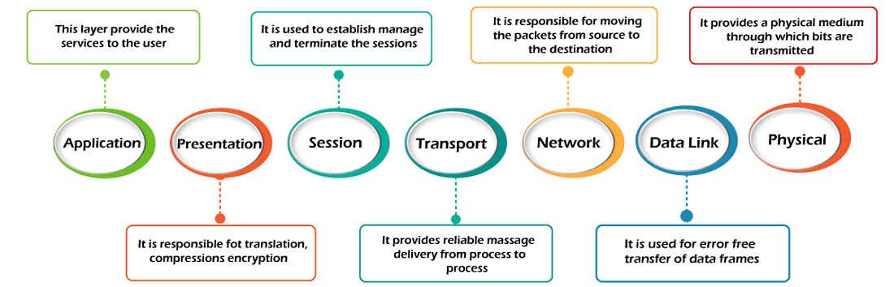
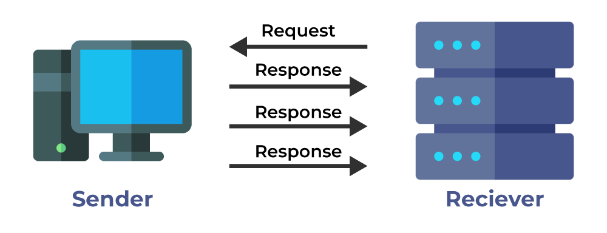

## Classification categories of the computer networks

A computer network is a cluster of computers over a shared communication path that works to share resources from one computer to another, provided by or located on the network nodes.

### Types of Computer Networks

#### Personal Area Network (PAN)

**PAN** is the most basic type of computer network. This network is restrained to a single person, that is, communication between the computer devices is centered only on an individual’s workspace. PAN offers a network range of 1 to 100 meters from person to device providing communication. Its transmission speed is very high with very easy maintenance and very low cost.

This uses **Bluetooth, IrDA,** and **Zigbee** as technology.

Examples of PAN are USB, computer, phone, tablet, printer, PDA, etc.

#### Local Area Network (LAN)

LAN is the most frequently used network. A **LAN** is a computer network that connects computers through a common communication path, contained within a limited area, that is, locally. A LAN encompasses two or more computers connected over a server. The two important technologies involved in this network are **Ethernet** and **Wi-fi**.  It ranges up to 2km & transmission speed is very high with easy maintenance and low cost.

Examples of LAN are networking in a home, school, library, laboratory, college, office, etc.

#### Campus Area Network (CAN)

CAN is bigger than a LAN but smaller than a MAN. This is a type of computer network that is usually used in places like a school or colleges. This network covers a limited geographical area that is, it spreads across several buildings within the campus. **CAN** mainly use Ethernet technology with a range from 1km to 5km.

Its transmission speed is very high with a moderate maintenance cost and moderate cost.

Examples of CAN are networks that cover schools, colleges, buildings, etc.

#### Metropolitan Area Network (MAN)

A **MAN** is larger than a LAN but smaller than a WAN. This is the type of computer network that connects computers over a geographical distance through a shared communication path over a city, town, or metropolitan area. This network mainly uses FDDI, CDDI, and ATM as the technology with a range from 5km to 50km. Its transmission speed is average. It is difficult to maintain and it comes with a high cost.

Examples of MAN are networking in towns, cities, a single large city, a large area within multiple buildings, etc.

#### Wide Area Network (WAN)

WAN is a type of computer network that connects computers over a large geographical distance through a shared communication path. It is not restrained to a single location but extends over many locations. **WAN** can also be defined as a group of local area networks that communicate with each other with a range above 50km.

Here we use Leased-Line & Dial-up technology. Its transmission speed is very low and it comes with very high maintenance and very high cost.

The most common example of WAN is the Internet.

### **Comparison between Different Computer Networks**

| Parameters | PAN  | LAN    | CAN    | MAN | WAN |
| --- | --- | --- | --- | --- | --- |
| Full Name | Personal Area Network | Local Area Network | Campus Area Network | Metropolitan Area Network | Wide Area Network |
| Technology | Bluetooth, IrDA,Zigbee | Ethernet & Wifi | Ethernet | FDDI, CDDi. ATM | Leased Line, Dial-Up |
| Range | 1-100 m | Upto 2km | 1 – 5 km | 5-50 km | Above 50 km |
| Transmission Speed | Very High | Very High | High | Average | Low |
| Ownership | Private | Private | Private | Private or Public | Private or Public |
| Maintenance | Very Easy | Easy | Moderate | Difficult | Very Difficult |
| Cost | Very Low | Low | Moderate | High | Very High |

## Layered Network Models

### Basic Notions

- The main aim of the layered architecture is to divide the design into small pieces.
- Each lower layer adds its services to the higher layer to provide a full set of services to manage communications and run the applications.
- It provides modularity and clear interfaces, i.e., provides interaction between subsystems.
- It ensures the independence between layers by providing the services from lower to higher layer without defining how the services are implemented. Therefore, any modification in a layer will not affect the other layers.
- The number of layers, functions, contents of each layer will vary from network to network. However, the purpose of each layer is to provide the service from lower to a higher layer and hiding the details from the layers of how the services are implemented.
- The basic elements of layered architecture are services, protocols, and interfaces.
- In a layer n architecture, layer n on one machine will have a communication with the layer n on another machine and the rules used in a conversation are known as a layer-n protocol.

### Why do we need a layered architecture?

1. **Divide-and-conquer approach**
2. **Modularity**
3. **Easy to modify**
4. **Easy to test**

**There are two layered models that are often applied to networking: the seven-layer OSI model and the four-layer TCP/IP model. The TCP/IP layers envelop the OSI ones.**

## OSI Model

- OSI stands for **Open System Interconnection** is a reference model that describes how information from a software application in one computer moves through a physical medium to the software application in another computer.
- OSI consists of seven layers, and each layer performs a particular network function.
- OSI model was developed by the International Organization for Standardization (ISO) in 1984, and it is now considered as an architectural model for the inter-computer communications.
- OSI model divides the whole task into seven smaller and manageable tasks. Each layer is assigned a particular task.
- Each layer is self-contained, so that task assigned to each layer can be performed independently.

## Layers of of OSI Model

### Physical Layer

- The main functionality of the physical layer is to transmit the individual bits from one node to another node.
- It is the lowest layer of the OSI model.
- It establishes, maintains and deactivates the physical connection.
- It specifies the mechanical, electrical and procedural network interface specifications.

### Data Link Layer

- This layer is responsible for the error-free transfer of data frames.
- It defines the format of the data on the network.
- It provides a reliable and efficient communication between two or more devices.
- It is mainly responsible for the unique identification of each device that resides on a local network.
- It contains two sub-layers: logical link control layer and media access control layer.

### Network Layer

- It is a layer 3 that manages device addressing, tracks the location of devices on the network.
- It determines the best path to move data from source to the destination based on the network conditions, the priority of service, and other factors.
- The network layer is responsible for routing and forwarding the packets.
- Routers are the layer 3 devices, they are specified in this layer and used to provide the routing services within an internetwork.
- The protocols used to route the network traffic are known as Network layer protocols. Examples of protocols are IP and Ipv6.

### Transport Layer

- The Transport layer is a Layer 4 ensures that messages are transmitted in the order in which they are sent and there is no duplication of data.
- The main responsibility of the transport layer is to transfer the data completely.
- It receives the data from the upper layer and converts them into smaller units known as segments.
- This layer can be termed as an end-to-end layer as it provides a point-to-point connection between source and destination to deliver the data reliably.
- The protocols used in this layer are : TCP and UDP.

### Session Layer

- It is a layer 3 in the OSI model.
- The Session layer is used to establish, maintain and synchronizes the interaction between communicating devices
- Session layer acts as a dialog controller that creates a dialog between two processes or we can say that it allows the communication between two processes which can be either half-duplex or full-duplex.
- Session layer adds some checkpoints when transmitting the data in a sequence. If some error occurs in the middle of the transmission of data, then the transmission will take place again from the checkpoint. This process is known as synchronization and recovery.

### Presentation Layer

- A Presentation layer is mainly concerned with the syntax and semantics of the information exchanged between the two systems.
- It acts as a data translator for a network.
- This layer is a part of the operating system that converts the data from one presentation format to another format.
- The Presentation layer is also known as the syntax layer.

### Application Layer

- An application layer serves as a window for users and application processes to access network service.
- It handles issues such as network transparency, resource allocation, etc.
- An application layer is not an application, but it performs the application layer functions.
- This layer provides the network services to the end-users.

## TCP/IP Model

- The TCP/IP model was developed prior to the OSI model.
- The TCP/IP model consists of five layers: the application layer, transport layer, network layer, data link layer and physical layer.
- TCP/IP is a hierarchical protocol made up of interactive modules, and each of them provides specific functionality.

### Network Access Layer

- A network layer is the lowest layer of the TCP/IP model.
- A network layer is the combination of the Physical layer and Data Link layer defined in the OSI reference model.
- It defines how the data should be sent physically through the network.
- This layer is mainly responsible for the transmission of the data between two devices on the same network.
- The functions carried out by this layer are encapsulating the IP datagram into frames transmitted by the network and mapping of IP addresses into physical addresses.
- The protocols used by this layer are ethernet, token ring, FDDI, X.25, frame relay.

### Network Layer

- It is the second layer of the TCP/IP model.
- It is also known as the internet layer.
- The main responsibility of the network layer is to send the packets from any network, and they arrive at the destination irrespective of the route they take.

**The protocols used in this layer are:**

1. IP Protocol
    
    Responsibilities of this protocol:
    
    1. IP Addressing
    2. Host-to-host communication
    3. Data encapsulation and formatting
    4. Fragmentation and reassembly
    5. Routing
2. ARP (Address Resolution Protocol)
3. ICMP (Internet Control Message Protocol)
    1. The core responsibility of the ICMP protocol is to report the problems, not correct them. The responsibility of the correction lies with the sender.
    2. ICMP can send the messages only to the source, but not to the intermediate routers because the IP datagram carries the addresses of the source and destination but not of the router that it is passed to.

### Transport Layer

The transport layer is responsible for the reliability, flow control, and correction of data which is being sent over the network.

The two protocols used in the transport layer are **User Datagram protocol (UDP) and Transmission control protocol (TCP)**.

### Application Layer

- An application layer is the topmost layer in the TCP/IP model.
- It is responsible for handling high-level protocols, issues of representation.
- This layer allows the user to interact with the application.
- When one application layer protocol wants to communicate with another application layer, it forwards its data to the transport layer.
- There is an ambiguity occurs in the application layer. Every application cannot be placed inside the application layer except those who interact with the communication system. For example: text editor cannot be considered in application layer while web browser using **HTTP** protocol to interact with the network where **HTTP** protocol is an application layer protocol.

**The main protocols used in the application layer:**

1. HTTP (Hypertext Transfer Protocol): This protocol allows us to access the data over the world wide web. It transfers the data in the form of plain text, audio, video.
2. SNMP (Simple Network Management Protocol): It is a framework used for managing the devices on the internet by using the TCP/IP protocol suite.
3. SMTP (Simple Mail Transfer Protocol): This protocol is used to send the data to another e-mail address.
4. DNS (Domain Name System): An IP address is used to identify the connection of a host to the internet uniquely. But, people prefer to use the names instead of addresses. Therefore, the system that maps the name to the address is known as Domain Name System.
5. TELNET: It establishes the connection between the local computer and remote computer in such a way that the local terminal appears to be a terminal at the remote system.
6. FTP (File Transfer Protocol): A standard internet protocol used for transmitting the files from one computer to another computer.

## **Differences between the TCP/IP and OSI model**

The biggest difference between the two models is that the OSI model segments multiple functions that the TCP/IP model groups into single layers. This is true of both the application and network access layers of the TCP/IP model, which contain multiple layers outlined within the OSI model.

This is a significant difference because it can make it more difficult to troubleshoot issues or enhance performance when you are using the TCP/IP model. With the OSI model, for example, you can focus specifically on the application layer, presentation layer, or session layer to figure out why data is not coming out the way you expect.

With the TCP/IP model, on the other hand, the functions of these three layers are all combined in the application layer. In other words, while someone may say, “There is a problem in the application layer,” someone thinking in terms of the OSI model may get confused, wondering, “OK, but which *part* of the application layer?”

## Basic aspects of the routing

### What is routing?

Network routing is the process of selecting a path across one or more networks. The principles of routing can apply to any type of network, from telephone networks to public transportation. In packet-switching networks, such as the Internet, routing selects the paths for Internet Protocol (IP) packets to travel from their origin to their destination. These Internet routing decisions are made by specialized pieces of network hardware called routers.

### How does routing work?

Routers refer to internal routing tables to make decisions about how to route packets along network paths. A routing table records the paths that packets should take to reach every destination that the router is responsible for.

Routers work in the following way: when a router receives a packet, it reads the headers of the packet to see its intended destination, like the way a train conductor may check a passenger's tickets to determine which train they should go on. It then determines where to route the packet based on information in its routing tables.

Routing tables can either be static or dynamic. Static routing tables do not change. A network administrator manually sets up static routing tables. This essentially sets in stone the routes data packets take across the network, unless the administrator manually updates the tables.

Dynamic routing tables update automatically. Dynamic routers use various routing protocols to determine the shortest and fastest paths. They also make this determination based on how long it takes packets to reach their destination.

### Main Routing Protocols

1. IP
2. BGP (Border Gateway Protoco)
3. OSPF (Open Shortest Path First)
4. RIP (Routing Information Protocol )

## Characterization of the routing categories

### Static Routing

Static routing is a process in which we have to manually add routes to the routing table. 

**Advantages:**

- No routing overhead for the router CPU which means a cheaper router can be used to do routing.
- It adds security because only an only administrator can allow routing to particular networks only.
- No bandwidth usage between routers.

**Disadvantages:**

- For a large network, it is a hectic task for administrators to manually add each route for the network in the routing table on each router.
- The administrator should have good knowledge of the topology. If a new administrator comes, then he has to manually add each route so he should have very good knowledge of the routes of the topology.

### Dynamic Routing

Dynamic routing makes automatic adjustments of the routes according to the current state of the route in the routing table. Dynamic routing uses protocols to discover network destinations and the routes to reach them. **RIP** and **OSPF** are the best examples of dynamic routing protocols. Automatic adjustments will be made to reach the network destination if one route goes down.

A dynamic protocol has the following features:

- The routers should have the same dynamic protocol running in order to exchange routes.
- When a router finds a change in the topology then the router advertises it to all other routers.

**Advantages:**

- Easy to configure.
- More effective at selecting the best route to a destination remote network and also for discovering remote networks.

**Disadvantage:**

- Consumes more bandwidth for communicating with other neighbors.
- Less secure than static routing.

### Default Routing

This is the method where the router is configured to send all packets toward a single router (next hop). It doesn’t matter to which network the packet belongs, it is forwarded out to the router which is configured for default routing. It is generally used with stub routers. A stub router is a router that has only one route to reach all other networks. 

## TCP and UDP mechanisms

### User Datagram Protocol (UDP)

- It provides connectionless service and end-to-end delivery of transmission.
- It is an unreliable protocol as it discovers the errors but not specify the error.
- User Datagram Protocol discovers the error, and ICMP protocol reports the error to the sender that user datagram has been damaged.
- **UDP consists of the following fields:**
    - **Source port address:** The source port address is the address of the application program that has created the message.
    - **Destination port address:** The destination port address is the address of the application program that receives the message.
    - **Total length:** It defines the total number of bytes of the user datagram in bytes.
    - **Checksum:** The checksum is a 16-bit field used in error detection.
- UDP does not specify which packet is lost. UDP contains only checksum; it does not contain any ID of a data segment.
    
    
    

**Where UDP is Used?**

- Gaming
- Video Streaming
- Online Video Chats

### Transmission Control Protocol (TCP)

- It provides a full transport layer services to applications.
- It creates a virtual circuit between the sender and receiver, and it is active for the duration of the transmission.
- TCP is a reliable protocol as it detects the error and retransmits the damaged frames. Therefore, it ensures all the segments must be received and acknowledged before the transmission is considered to be completed and a virtual circuit is discarded.
- At the sending end, TCP divides the whole message into smaller units known as segment, and each segment contains a sequence number which is required for reordering the frames to form an original message.
- At the receiving end, TCP collects all the segments and reorders them based on sequence numbers.
    
    
    

**Where TCP is Used?**

- Sending Emails
- Transferring Files
- Web Browsing
